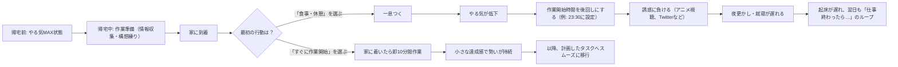

---
tags:
  - "#thinking"
  - "#productivity"
  - "#time-management"
  - "#motivation-sustainment"
---
[帰宅前の溢れるやる気を持続させる - Konifar's WIP](https://konifar.hatenablog.com/entry/2015/06/25/041721)

本文は、会社帰りに一気に燃え上がるやる気が、家着いたらすぐの「ちょっと一息」や、食事とかアニメ、Twitterみたいな気まぐれな誘惑であっという間に消えてまうんや。結果、作業始めるのがいつも後回しになって、翌日も「仕事終わったら…」っていう悪いループにハマる感じを綴っとるんや。著者はこの状況をなんとか打破しようと、以下の改善策を実践してるんやで。

- **帰宅中から作業準備：** 家着く前に携帯で必要な情報を集めたり、構想を練ったりするんや。
- **家に着いたら最初の行動を決める：** 何するかをあらかじめ具体的に決めて、すぐに取りかかるんやで。
- **即10分間の作業開始：** 家着いたらまず10分だけ作業して、一歩目を踏み出すんや。
- **悩まずできる作業の用意とタスクの洗い出し：** 途中でつまずかへんように、簡単な作業もあらかじめ用意して、やるべきことを全部リストアップしておくんやで。