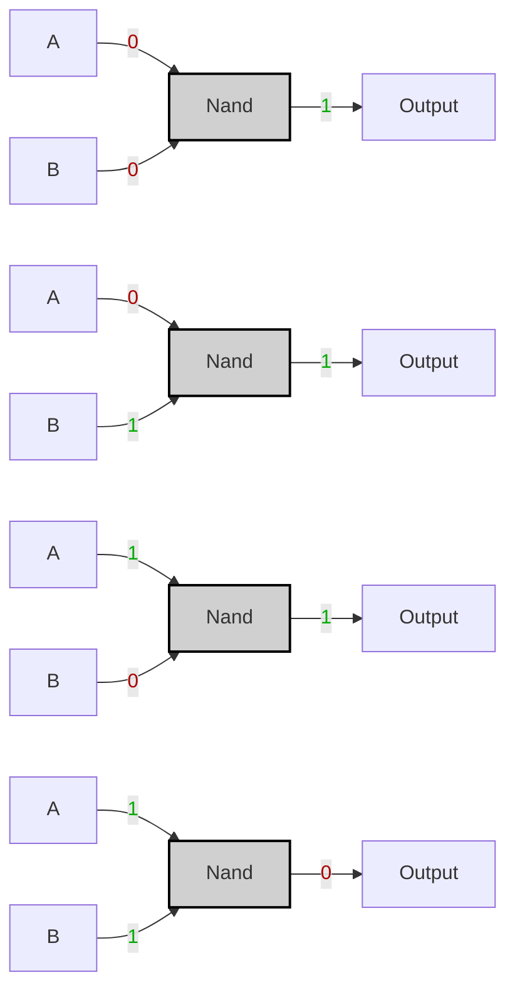
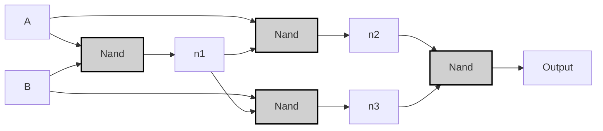

---
tags:
  - "#logic-gates"
  - "#logic-design"
  - "#boolean-algebra"
  - "#nand-gate"
  - "#truth-table"
  - "#digital-electronics"
  - "#hardware-design"
  - "#logic-circuit"
---

# Specification

|A|B|A NAND B|
|---|---|---|
|0|0|1|
|0|1|1|
|1|0|1|
|1|1|0|

