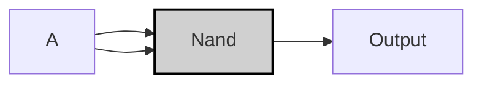

---
tags:
  - "#nand2tetris"
  - "#truth_table"
  - "#logic_circuit"
  - "#vhdl"
---

# Not $\neg$
## Specification

| A   | NOT A |
| --- | ----- |
| 0   | 1     |
| 1   | 0     |

>[!example]-
> ``` mermaid
> graph LR;
>     A0["A"] -->|<span style="color:#a00">0</span>| NAND0;
>     NAND0["Not"]:::gate -->|<span style="color:#0a0">1</span>| OUT0["Output"];
> 
>     A1["A"] -->|<span style="color:#0a0">1</span>| NAND1;
>     NAND1["Not"]:::gate -->|<span style="color:#a00">0</span>| OUT1["Output"];
> 
>     classDef gate fill:#d0d0d0,stroke:#000,stroke-width:2px;
> ```

---

## Imprementation

>[!tip]
> $$$
> A \text{ NAND } A = \neg (A \land A)
> $$$
> 
> Since,  $A \land A = A$
> $$$
> = \neg A
> $$$

```vhdl
CHIP Not {
    IN in;
    OUT out;
PARTS:
    Nand(a=in, b=in, out=out);
}
```



> [!example]-
> 
> ```mermaid
> graph LR;
>     A["A"] -->|<span style="color:#a00">0</span>| Nand0;
>     A["A"] -->|<span style="color:#a00">0</span>| Nand0;
>     Nand0["Nand"]:::gate -->|<span style="color:#0a0">1</span>| OUT0["Output"];
> 
>     A1["A"] -->|<span style="color:#0a0">1</span>| Nand1;
>     A1["A"] -->|<span style="color:#0a0">1</span>| Nand1;
>     Nand1["Nand"]:::gate -->|<span style="color:#a00">0</span>| OUT1["Output"];
> 
>     classDef gate fill:#d0d0d0,stroke:#000,stroke-width:2px;
> ```