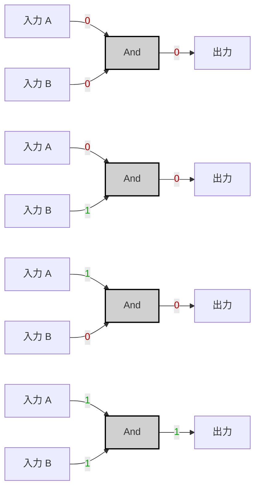
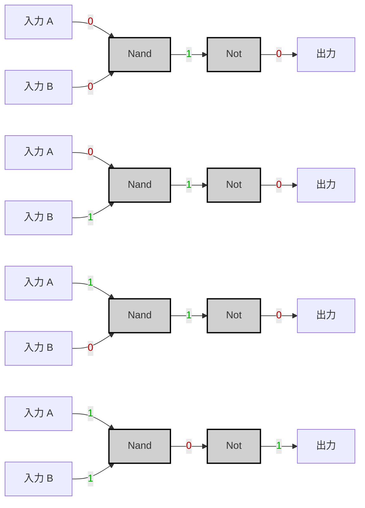

---
tags:
  - "#nand2tetris"
  - "#logic-gates"
  - "#nand-gate"
  - "#truth-table"
  - "#boolean-algebra"
  - "#logic-design"
  - "#hardware-description-language"
  - "#hardware-implementation"
---
# Specification

|A|B|A And B|
|---|---|---|
|0|0|0|
|0|1|0|
|1|0|0|
|1|1|1|




---
# Imprementation

>[!tip]
> $$$
> A  \text{ And } B = \neg(A \text{ Nand } B)
> $$$


```vhdl
CHIP And {
	IN a, b;
	OUT out;
PARTS:
	Nand(a=a, b=b, out=nandOut);
	Not(in=nandOut, out=notOut);
}
```

