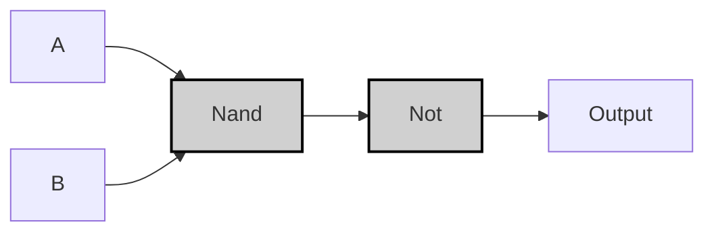
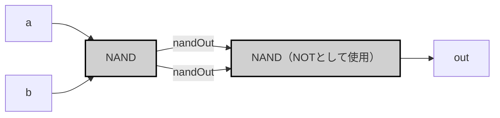

---
tags:
  - "#nand2tetris"
  - "#truth_table"
  - "#logic_circuit"
  - "#vhdl"
---

# And $\land$

## Specification

|A|B|A AND B|
|---|---|---|
|0|0|0|
|0|1|0|
|1|0|0|
|1|1|1|


>[!example]-
> ```mermaid
> graph LR;
>     A0["A"] -->|<span style="color:#a00">0</span>| And0;
>     B0["B"] -->|<span style="color:#a00">0</span>| And0;
>     And0["And"]:::gate -->|<span style="color:#a00">0</span>| OUT0["Output"];
> 
>     A1["A"] -->|<span style="color:#a00">0</span>| And1;
>     B1["B"] -->|<span style="color:#0a0">1</span>| And1;
>     And1["And"]:::gate -->|<span style="color:#a00">0</span>| OUT1["Output"];
> 
>     A2["A"] -->|<span style="color:#0a0">1</span>| And2;
>     B2["B"] -->|<span style="color:#a00">0</span>| And2;
>     And2["And"]:::gate -->|<span style="color:#a00">0</span>| OUT2["Output"];
> 
>     A3["A"] -->|<span style="color:#0a0">1</span>| And3;
>     B3["B"] -->|<span style="color:#0a0">1</span>| And3;
>     And3["And"]:::gate -->|<span style="color:#0a0">1</span>| OUT3["Output"];
> 
>     classDef gate fill:#d0d0d0,stroke:#000,stroke-width:2px;
> ```

---
## Imprementation

>[!tip]
> [[00_Nand]]
> $$
> \neg(A \text{ NAND } B) = A  \text{ AND } B 
> $$

```vhdl
CHIP And {
	IN a, b;
	OUT out;
PARTS:
	Nand(a=a, b=b, out=nandOut);
	Not(in=nandOut, out=notOut);
}
```



> [!example]-
> ```mermaid
> graph LR;
>     A["A"] -->|<span style="color:#a00">0</span>| Nand0;
>     B["B"] -->|<span style="color:#a00">0</span>| Nand0;
>     Nand0["Nand"]:::gate -->|<span style="color:#0a0">1</span>| Not0["Not"]:::gate;
>     Not0 -->|<span style="color:#a00">0</span>| OUT0["Output"];
> 
>     A1["A"] -->|<span style="color:#a00">0</span>| Nand1;
>     B1["B"] -->|<span style="color:#0a0">1</span>| Nand1;
>     Nand1["Nand"]:::gate -->|<span style="color:#0a0">1</span>| Not1["Not"]:::gate;
>     Not1 -->|<span style="color:#a00">0</span>| OUT1["Output"];
> 
>     A2["A"] -->|<span style="color:#0a0">1</span>| Nand2;
>     B2["B"] -->|<span style="color:#a00">0</span>| Nand2;
>     Nand2["Nand"]:::gate -->|<span style="color:#0a0">1</span>| Not2["Not"]:::gate;
>     Not2 -->|<span style="color:#a00">0</span>| OUT2["Output"];
> 
>     A3["A"] -->|<span style="color:#0a0">1</span>| Nand3;
>     B3["B"] -->|<span style="color:#0a0">1</span>| Nand3;
>     Nand3["Nand"]:::gate -->|<span style="color:#a00">0</span>| Not3["Not"]:::gate;
>     Not3 -->|<span style="color:#0a0">1</span>| OUT3["Output"];
> 
>     classDef gate fill:#d0d0d0,stroke:#000,stroke-width:2px;
> ```

---
### Nand Version

```vhdl
CHIP And {
	IN a, b;
	OUT out;
PARTS:
	Nand(a=a, b=b, out=nandOut);
	Nand(a=nandOut,b=nandOut, out=nandOut);
}
```


