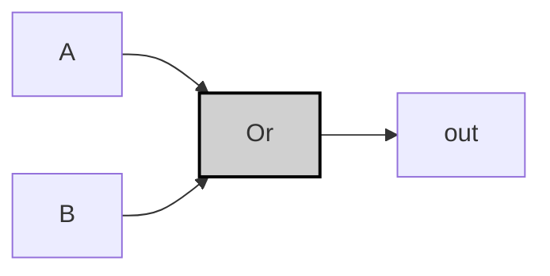
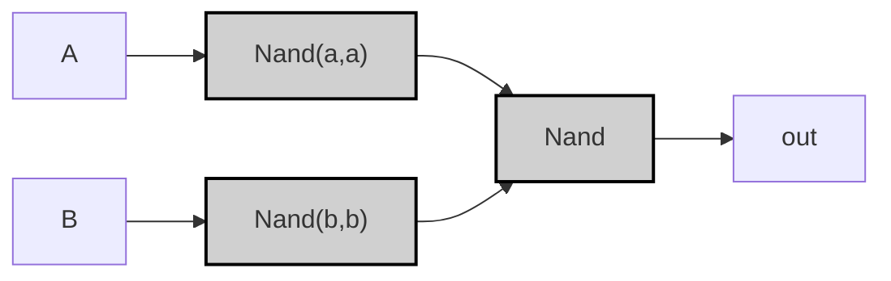

---

tags:

- "#logic-design"
- "#vhdl"
- "#hardware-design"
- "#or-gate"
- "#digital-electronics"

---

## Specification

|A|B|A OR B|
|---|---|---|
|0|0|0|
|0|1|1|
|1|0|1|
|1|1|1|

> [!example]-
> 
> ```mermaid
> graph LR;
>     %% パターン0: A=0, B=0
>     A0["A"] -->|<span style="color:#ff9999">0</span>| Or0_0["Or"]:::gate;
>     B0["B"] -->|<span style="color:#ff9999">0</span>| Or0_0;
>     Or0_0 -->|<span style="color:#ff9999">0</span>| OUT0["Output"];
> 
>     %% パターン1: A=0, B=1
>     A1["A"] -->|<span style="color:#ff9999">0</span>| Or0_1["Or"]:::gate;
>     B1["B"] -->|<span style="color:#99ff99">1</span>| Or0_1;
>     Or0_1 -->|<span style="color:#99ff99">1</span>| OUT1["Output"];
> 
>     %% パターン2: A=1, B=0
>     A2["A"] -->|<span style="color:#99ff99">1</span>| Or0_2["Or"]:::gate;
>     B2["B"] -->|<span style="color:#ff9999">0</span>| Or0_2;
>     Or0_2 -->|<span style="color:#99ff99">1</span>| OUT2["Output"];
> 
>     %% パターン3: A=1, B=1
>     A3["A"] -->|<span style="color:#99ff99">1</span>| Or0_3["Or"]:::gate;
>     B3["B"] -->|<span style="color:#99ff99">1</span>| Or0_3;
>     Or0_3 -->|<span style="color:#99ff99">1</span>| OUT3["Output"];
> 
>     classDef gate fill:#d0d0d0,stroke:#000,stroke-width:2px;
>     style A0 fill:#aa0000,stroke:#000,stroke-width:1px;
>     style B0 fill:#aa0000,stroke:#000,stroke-width:1px;
>     style A1 fill:#aa0000,stroke:#000,stroke-width:1px;
>     style B1 fill:#00aa00,stroke:#000,stroke-width:1px;
>     style A2 fill:#00aa00,stroke:#000,stroke-width:1px;
>     style B2 fill:#aa0000,stroke:#000,stroke-width:1px;
>     style A3 fill:#00aa00,stroke:#000,stroke-width:1px;
>     style B3 fill:#00aa00,stroke:#000,stroke-width:1px;
> ```

## Implementation

### Basic Version

> [!tip]
> 
> ((¬A∧B)∨(A∧¬B)∨(A∧B))=A∨B\bigl((\lnot A \land B) \lor (A \land \lnot B) \lor (A \land B)\bigr) = A \lor B

```vhdl
CHIP Or {
    IN a, b;
    OUT out;
PARTS:
    Or(a=a, b=b, out=out);
}
```



> [!example]-
> 
> ```mermaid
> graph LR;
>     %% パターン0: A=0, B=0
>     A0["A"] -->|<span style="color:#ff9999">0</span>| OrGate0["Or"]:::gate;
>     B0["B"] -->|<span style="color:#ff9999">0</span>| OrGate0;
>     OrGate0 -->|<span style="color:#ff9999">0</span>| OUT0["out"];
>     
>     %% パターン1: A=0, B=1
>     A1["A"] -->|<span style="color:#ff9999">0</span>| OrGate1["Or"]:::gate;
>     B1["B"] -->|<span style="color:#99ff99">1</span>| OrGate1;
>     OrGate1 -->|<span style="color:#99ff99">1</span>| OUT1["out"];
>     
>     %% パターン2: A=1, B=0
>     A2["A"] -->|<span style="color:#99ff99">1</span>| OrGate2["Or"]:::gate;
>     B2["B"] -->|<span style="color:#ff9999">0</span>| OrGate2;
>     OrGate2 -->|<span style="color:#99ff99">1</span>| OUT2["out"];
>     
>     %% パターン3: A=1, B=1
>     A3["A"] -->|<span style="color:#99ff99">1</span>| OrGate3["Or"]:::gate;
>     B3["B"] -->|<span style="color:#99ff99">1</span>| OrGate3;
>     OrGate3 -->|<span style="color:#99ff99">1</span>| OUT3["out"];
>     
>     classDef gate fill:#d0d0d0,stroke:#000,stroke-width:2px;
>     style A0 fill:#aa0000,stroke:#000,stroke-width:1px;
>     style B0 fill:#aa0000,stroke:#000,stroke-width:1px;
>     style A1 fill:#aa0000,stroke:#000,stroke-width:1px;
>     style B1 fill:#00aa00,stroke:#000,stroke-width:1px;
>     style A2 fill:#00aa00,stroke:#000,stroke-width:1px;
>     style B2 fill:#aa0000,stroke:#000,stroke-width:1px;
>     style A3 fill:#00aa00,stroke:#000,stroke-width:1px;
>     style B3 fill:#00aa00,stroke:#000,stroke-width:1px;
> ```

### Optimized (NAND-only) Version

```vhdl
CHIP Or {
    IN a, b;
    OUT out;
PARTS:
    Nand(a=a, b=a, out=nota);
    Nand(a=b, b=b, out=notb);
    Nand(a=nota, b=notb, out=out);
}
```



> [!example]-
> 
> ```mermaid
> graph LR;
>     %% パターン0: A=0, B=0
>     A0["A"] -->|<span style="color:#ff9999">0</span>| NandA0["Nand(a,a)"]:::gate;
>     B0["B"] -->|<span style="color:#ff9999">0</span>| NandB0["Nand(b,b)"]:::gate;
>     NandA0 --> NandOr0["Nand"]:::gate;
>     NandB0 --> NandOr0;
>     NandOr0 -->|<span style="color:#ff9999">0</span>| OUT0["out"];
>     
>     %% パターン1: A=0, B=1
>     A1["A"] -->|<span style="color:#ff9999">0</span>| NandA1["Nand(a,a)"]:::gate;
>     B1["B"] -->|<span style="color:#99ff99">1</span>| NandB1["Nand(b,b)"]:::gate;
>     NandA1 --> NandOr1["Nand"]:::gate;
>     NandB1 --> NandOr1;
>     NandOr1 -->|<span style="color:#99ff99">1</span>| OUT1["out"];
>     
>     %% パターン2: A=1, B=0
>     A2["A"] -->|<span style="color:#99ff99">1</span>| NandA2["Nand(a,a)"]:::gate;
>     B2["B"] -->|<span style="color:#ff9999">0</span>| NandB2["Nand(b,b)"]:::gate;
>     NandA2 --> NandOr2["Nand"]:::gate;
>     NandB2 --> NandOr2;
>     NandOr2 -->|<span style="color:#99ff99">1</span>| OUT2["out"];
>     
>     %% パターン3: A=1, B=1
>     A3["A"] -->|<span style="color:#99ff99">1</span>| NandA3["Nand(a,a)"]:::gate;
>     B3["B"] -->|<span style="color:#99ff99">1</span>| NandB3["Nand(b,b)"]:::gate;
>     NandA3 --> NandOr3["Nand"]:::gate;
>     NandB3 --> NandOr3;
>     NandOr3 -->|<span style="color:#99ff99">1</span>| OUT3["out"];
>     
>     classDef gate fill:#d0d0d0,stroke:#000,stroke-width:2px;
>     style A0 fill:#aa0000,stroke:#000,stroke-width:1px;
>     style B0 fill:#aa0000,stroke:#000,stroke-width:1px;
>     style A1 fill:#aa0000,stroke:#000,stroke-width:1px;
>     style B1 fill:#00aa00,stroke:#000,stroke-width:1px;
>     style A2 fill:#00aa00,stroke:#000,stroke-width:1px;
>     style B2 fill:#aa0000,stroke:#000,stroke-width:1px;
>     style A3 fill:#00aa00,stroke:#000,stroke-width:1px;
>     style B3 fill:#00aa00,stroke:#000,stroke-width:1px;
> ```

> [!prove]- 以下、ORゲートの最適化手順を **ステップバイステップで図解** します。
> 
> ---
> 
> ### ステップ 1: 標準形の表現
> 
> ORゲートはそのまま A∨BA \lor B と表現されます。
> 
> ```mermaid
> graph LR;
>     A["A"] --> Or["Or"];
>     B["B"] --> Or;
>     Or --> OUT["out"];
> 
>     classDef gate fill:#ddd,stroke:#000;
> ```
> 
> ---
> 
> ### ステップ 2: De Morganの法則の適用
> 
> De Morganの法則により、ORは次のように書き換えられます。 A∨B=¬(¬A∧¬B)A \lor B = \lnot (\lnot A \land \lnot B)
> 
> ```mermaid
> graph LR;
>     A["A"] --> NotA["Not"];
>     B["B"] --> NotB["Not"];
>     NotA --> And["And"];
>     NotB --> And;
>     And --> NotOut["Not"];
>     NotOut --> OUT["out"];
> 
>     classDef gate fill:#ddd,stroke:#000;
> ```
> 
> ---
> 
> ### ステップ 3: NOTをNANDで実装
> 
> NOTゲートは自己接続のNANDで実現できます。 ¬A=A↑A,¬B=B↑B\lnot A = A \uparrow A,\quad \lnot B = B \uparrow B
> 
> ```mermaid
> graph LR;
>     A["A"] --> NandA["Nand(A,A)"];
>     B["B"] --> NandB["Nand(B,B)"];
>     NandA --> And["And"];
>     NandB --> And;
>     And --> NotOut["Not"];
>     NotOut --> OUT["out"];
> 
>     classDef gate fill:#ddd,stroke:#000;
> ```
> 
> ---
> 
> ### ステップ 4: ANDとNOTの置換によるNANDのみでの実装
> 
> 最終的に以下の形にまとめられます。 A∨B=NAND(NAND(A,A),NAND(B,B))A \lor B = \text{NAND}(\text{NAND}(A,A), \text{NAND}(B,B))
> 
> ```mermaid
> graph LR;
>     A["A"] --> NandA["Nand(A,A)"];
>     B["B"] --> NandB["Nand(B,B)"];
>     NandA --> NandOr["Nand"];
>     NandB --> NandOr;
>     NandOr --> OUT["out"];
> 
>     classDef gate fill:#ddd,stroke:#000;
> ```
> 
> ---
> 
> この最適化により、**2つのNANDゲート**でORゲートの機能を実現できます。  
> すなわち、論理回路の構成がシンプルになり、部品点数の削減や伝搬遅延の改善が期待できます。