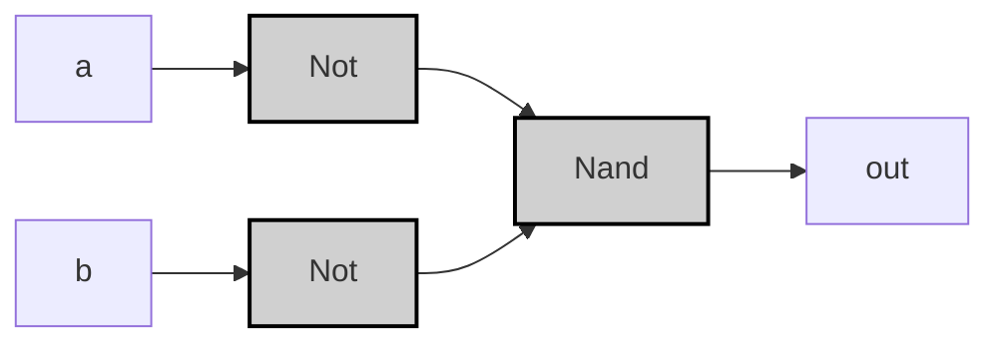

---
---
tags:
  - "#logic-design"
  - "#vhdl"
  - "#hardware-design"
  - "#or-gate"
  - "#digital-electronics"
  
## Specification

| A | B | A OR B |
|---|---|--------|
| 0 | 0 | 0      |
| 0 | 1 | 1      |
| 1 | 0 | 1      |
| 1 | 1 | 1      |

>[!example]-
> ```mermaid
> graph LR;
>     %% パターン0: A=0, B=0 -> 出力0
>     A0["A"] -->|<span style="color:#aa0000">0</span>| Or0["OR"]:::gate;
>     B0["B"] -->|<span style="color:#aa0000">0</span>| Or0;
>     Or0 -->|<span style="color:#aa0000">0</span>| OUT0["Output"];
> 
>     %% パターン1: A=0, B=1 -> 出力1
>     A1["A"] -->|<span style="color:#aa0000">0</span>| Or1["OR"]:::gate;
>     B1["B"] -->|<span style="color:#00aa00">1</span>| Or1;
>     Or1 -->|<span style="color:#00aa00">1</span>| OUT1["Output"];
> 
>     %% パターン2: A=1, B=0 -> 出力1
>     A2["A"] -->|<span style="color:#00aa00">1</span>| Or2["OR"]:::gate;
>     B2["B"] -->|<span style="color:#aa0000">0</span>| Or2;
>     Or2 -->|<span style="color:#00aa00">1</span>| OUT2["Output"];
> 
>     %% パターン3: A=1, B=1 -> 出力1
>     A3["A"] -->|<span style="color:#00aa00">1</span>| Or3["OR"]:::gate;
>     B3["B"] -->|<span style="color:#00aa00">1</span>| Or3;
>     Or3 -->|<span style="color:#00aa00">1</span>| OUT3["Output"];
> 
>     classDef gate fill:#d0d0d0,stroke:#000,stroke-width:2px;
>     style A0 fill:#ff9999
>     style B0 fill:#ff9999
>     style A1 fill:#ff9999
>     style B1 fill:#99ff99
>     style A2 fill:#99ff99
>     style B2 fill:#ff9999
>     style A3 fill:#99ff99
>     style B3 fill:#99ff99
>     style OUT0 fill:#ff9999
>     style OUT1 fill:#99ff99
>     style OUT2 fill:#99ff99
>     style OUT3 fill:#99ff99;
> ```

## Implementation

### Basic Implementation

>[!tip]
>$$
>(\lnot A \land B) \lor (A \land \lnot B) \lor (A \land B) = A \lor B
>$$
>
>また、De Morganの法則を用いると、
>$$
>A \lor B = \lnot (\lnot A \land \lnot B)
>$$

```vhdl
CHIP Or {
    IN a, b;
    OUT out;
PARTS:
    Not(in=a, out=nota);
    Not(in=b, out=notb);
    Nand(a=nota, b=notb, out=out);
}
```



>[!example]-
> ```mermaid
>graph LR;
>    %% パターン0: A=0, B=0 -> NotA=1, NotB=1, NAND=0
>    A0["A"] -->|<span style="color:#aa0000">0</span>| NotA0["NOT"];
>    NotA0 -->|<span style="color:#00aa00">1</span>| Nand0_0["NAND"];
>    B0["B"] -->|<span style="color:#aa0000">0</span>| NotB0["NOT"];
>    NotB0 -->|<span style="color:#00aa00">1</span>| Nand0_0;
>    Nand0_0 -->|<span style="color:#aa0000">0</span>| OUT0["Output"];
>
>    %% パターン1: A=0, B=1 -> NotA=1, NotB=0, NAND=1
>    A1["A"] -->|<span style="color:#aa0000">0</span>| NotA1["NOT"];
>    NotA1 -->|<span style="color:#00aa00">1</span>| Nand0_1["NAND"];
>    B1["B"] -->|<span style="color:#00aa00">1</span>| NotB1["NOT"];
>    NotB1 -->|<span style="color:#aa0000">0</span>| Nand0_1;
>    Nand0_1 -->|<span style="color:#00aa00">1</span>| OUT1["Output"];
>
>    %% パターン2: A=1, B=0 -> NotA=0, NotB=1, NAND=1
>    A2["A"] -->|<span style="color:#00aa00">1</span>| NotA2["NOT"];
>    NotA2 -->|<span style="color:#aa0000">0</span>| Nand0_2["NAND"];
>    B2["B"] -->|<span style="color:#aa0000">0</span>| NotB2["NOT"];
>    NotB2 -->|<span style="color:#00aa00">1</span>| Nand0_2;
>    Nand0_2 -->|<span style="color:#00aa00">1</span>| OUT2["Output"];
>
>    %% パターン3: A=1, B=1 -> NotA=0, NotB=0, NAND=1
>    A3["A"] -->|<span style="color:#00aa00">1</span>| NotA3["NOT"];
>    NotA3 -->|<span style="color:#aa0000">0</span>| Nand0_3["NAND"];
>    B3["B"] -->|<span style="color:#00aa00">1</span>| NotB3["NOT"];
>    NotB3 -->|<span style="color:#aa0000">0</span>| Nand0_3;
>    Nand0_3 -->|<span style="color:#00aa00">1</span>| OUT3["Output"];
>
>    classDef gate fill:#d0d0d0,stroke:#000,stroke-width:2px;
>    style A0 fill:#ff9999
>    style B0 fill:#ff9999
>    style A1 fill:#ff9999
>    style B1 fill:#99ff99
>    style A2 fill:#99ff99
>    style B2 fill:#ff9999
>    style A3 fill:#99ff99
>    style B3 fill:#99ff99
>    style OUT0 fill:#ff9999
>    style OUT1 fill:#99ff99
>    style OUT2 fill:#99ff99
>    style OUT3 fill:#99ff99;
> ```