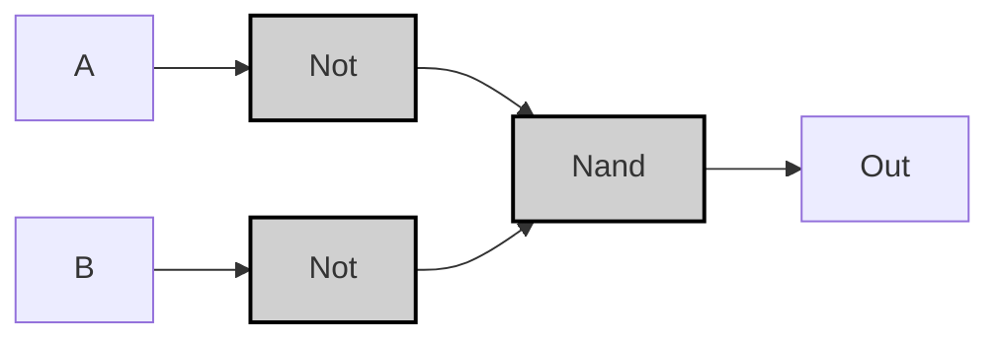
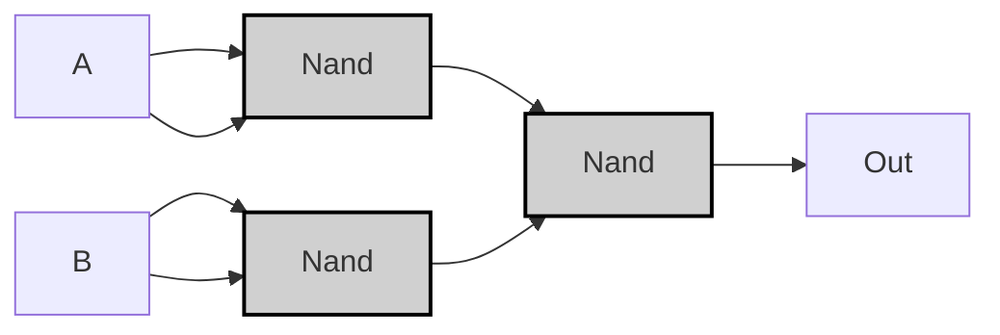

---
tags:
  - "#nand2tetris"
  - "#truth_table"
  - "#logic_circuit"
  - "#vhdl"
---

# Or $\lor$
## Specification

| A | B | A OR B |
|---|---|--------|
| 0 | 0 |   0    |
| 0 | 1 |   1    |
| 1 | 0 |   1    |
| 1 | 1 |   1    |

> [!example]-
> ```mermaid
> graph LR;
>     %% Pattern 0: A=0, B=0
>     A0["A"]:::input0 -->|<span style="color:#aa0000">0</span>| Or0["Or"]:::gate;
>     B0["B"]:::input0 -->|<span style="color:#aa0000">0</span>| Or0;
>     Or0 -->|<span style="color:#aa0000">0</span>| OUT0["Out"]:::output0;
> 
>     %% Pattern 1: A=0, B=1
>     A1["A"]:::input0 -->|<span style="color:#aa0000">0</span>| Or1["Or"]:::gate;
>     B1["B"]:::input1 -->|<span style="color:#00aa00">1</span>| Or1;
>     Or1 -->|<span style="color:#00aa00">1</span>| OUT1["Out"]:::output1;
> 
>     %% Pattern 2: A=1, B=0
>     A2["A"]:::input1 -->|<span style="color:#00aa00">1</span>| Or2["Or"]:::gate;
>     B2["B"]:::input0 -->|<span style="color:#aa0000">0</span>| Or2;
>     Or2 -->|<span style="color:#00aa00">1</span>| OUT2["Out"]:::output1;
> 
>     %% Pattern 3: A=1, B=1
>     A3["A"]:::input1 -->|<span style="color:#00aa00">1</span>| Or3["Or"]:::gate;
>     B3["B"]:::input1 -->|<span style="color:#00aa00">1</span>| Or3;
>     Or3 -->|<span style="color:#00aa00">1</span>| OUT3["Out"]:::output1;
> 
>     classDef gate fill:#d0d0d0,stroke:#000,stroke-width:2px;
>     classDef input0 fill:#ff9999,stroke:#000,stroke-width:1px;
>     classDef input1 fill:#99ff99,stroke:#000,stroke-width:1px;
>     classDef output0 fill:#ff9999,stroke:#000,stroke-width:1px;
>     classDef output1 fill:#99ff99,stroke:#000,stroke-width:1px;
> ```

---

## Implementation
### Not/Nand Version
> [!tip]
> **論理式の導出プロセス**  
> 1. 真理値表から出力が1になる条件を抽出：
> $$(A=1) \lor (B=1)$$
> 
> 1. ド・モルガンの法則を適用して変換：
> $$\lnot (\lnot A \land \lnot B)$$
> 
> 1. NANDゲートで表現：
> $$\text{Nand}(\lnot A, \lnot B)$$

```vhdl
CHIP Or {
    IN a, b;
    OUT out;
PARTS:
    Not(in=a, out=notA);
    Not(in=b, out=notB);
    Nand(a=notA, b=notB, out=out);
}
```



> [!example]-
> ```mermaid
> graph LR;
>     %% Pattern 0: A=0, B=0
>     A0["A"]:::input0 -->|<span style="color:#aa0000">0</span>| NotA0["Not"]:::gate;
>     B0["B"]:::input0 -->|<span style="color:#aa0000">0</span>| NotB0["Not"]:::gate;
>     NotA0 -->|<span style="color:#00aa00">1</span>| Nand0_0["Nand"]:::gate;
>     NotB0 -->|<span style="color:#00aa00">1</span>| Nand0_0;
>     Nand0_0 -->|<span style="color:#aa0000">0</span>| OUT0["Out"]:::output0;
> 
>     %% Pattern 1: A=0, B=1
>     A1["A"]:::input0 -->|<span style="color:#aa0000">0</span>| NotA1["Not"]:::gate;
>     B1["B"]:::input1 -->|<span style="color:#00aa00">1</span>| NotB1["Not"]:::gate;
>     NotA1 -->|<span style="color:#00aa00">1</span>| Nand0_1["Nand"]:::gate;
>     NotB1 -->|<span style="color:#aa0000">0</span>| Nand0_1;
>     Nand0_1 -->|<span style="color:#00aa00">1</span>| OUT1["Out"]:::output1;
> 
>     %% Pattern 2: A=1, B=0
>     A2["A"]:::input1 -->|<span style="color:#00aa00">1</span>| NotA2["Not"]:::gate;
>     B2["B"]:::input0 -->|<span style="color:#aa0000">0</span>| NotB2["Not"]:::gate;
>     NotA2 -->|<span style="color:#aa0000">0</span>| Nand0_2["Nand"]:::gate;
>     NotB2 -->|<span style="color:#00aa00">1</span>| Nand0_2;
>     Nand0_2 -->|<span style="color:#00aa00">1</span>| OUT2["Out"]:::output1;
> 
>     %% Pattern 3: A=1, B=1
>     A3["A"]:::input1 -->|<span style="color:#00aa00">1</span>| NotA3["Not"]:::gate;
>     B3["B"]:::input1 -->|<span style="color:#00aa00">1</span>| NotB3["Not"]:::gate;
>     NotA3 -->|<span style="color:#aa0000">0</span>| Nand0_3["Nand"]:::gate;
>     NotB3 -->|<span style="color:#aa0000">0</span>| Nand0_3;
>     Nand0_3 -->|<span style="color:#00aa00">1</span>| OUT3["Out"]:::output1;
> 
>     classDef gate fill:#d0d0d0,stroke:#000,stroke-width:2px;
>     classDef input0 fill:#ff9999,stroke:#000,stroke-width:1px;
>     classDef input1 fill:#99ff99,stroke:#000,stroke-width:1px;
>     classDef output0 fill:#ff9999,stroke:#000,stroke-width:1px;
>     classDef output1 fill:#99ff99,stroke:#000,stroke-width:1px;
> ```

---

### Nand-Only Version
```vhdl
CHIP Or {
    IN a, b;
    OUT out;
PARTS:
    Nand(a=a, b=a, out=notA);
    Nand(a=b, b=b, out=notB);
    Nand(a=notA, b=notB, out=out);
}
```



> [!example]-
> ```mermaid
> graph LR;
>     %% Pattern 0: A=0, B=0
>     A0["A"]:::input0 -->|<span style="color:#aa0000">0</span>| Nand1_0["Nand"]:::gate;
>     A0 -->|<span style="color:#aa0000">0</span>| Nand1_0;
>     Nand1_0 -->|<span style="color:#00aa00">1</span>| Nand3_0["Nand"]:::gate;
>     B0["B"]:::input0 -->|<span style="color:#aa0000">0</span>| Nand2_0["Nand"]:::gate;
>     B0 -->|<span style="color:#aa0000">0</span>| Nand2_0;
>     Nand2_0 -->|<span style="color:#00aa00">1</span>| Nand3_0;
>     Nand3_0 -->|<span style="color:#aa0000">0</span>| OUT0["Out"]:::output0;
> 
>     %% Pattern 1: A=0, B=1
>     A1["A"]:::input0 -->|<span style="color:#aa0000">0</span>| Nand1_1["Nand"]:::gate;
>     A1 -->|<span style="color:#aa0000">0</span>| Nand1_1;
>     Nand1_1 -->|<span style="color:#00aa00">1</span>| Nand3_1["Nand"]:::gate;
>     B1["B"]:::input1 -->|<span style="color:#00aa00">1</span>| Nand2_1["Nand"]:::gate;
>     B1 -->|<span style="color:#00aa00">1</span>| Nand2_1;
>     Nand2_1 -->|<span style="color:#aa0000">0</span>| Nand3_1;
>     Nand3_1 -->|<span style="color:#00aa00">1</span>| OUT1["Out"]:::output1;
> 
>     %% Pattern 2: A=1, B=0
>     A2["A"]:::input1 -->|<span style="color:#00aa00">1</span>| Nand1_2["Nand"]:::gate;
>     A2 -->|<span style="color:#00aa00">1</span>| Nand1_2;
>     Nand1_2 -->|<span style="color:#aa0000">0</span>| Nand3_2["Nand"]:::gate;
>     B2["B"]:::input0 -->|<span style="color:#aa0000">0</span>| Nand2_2["Nand"]:::gate;
>     B2 -->|<span style="color:#aa0000">0</span>| Nand2_2;
>     Nand2_2 -->|<span style="color:#00aa00">1</span>| Nand3_2;
>     Nand3_2 -->|<span style="color:#00aa00">1</span>| OUT2["Out"]:::output1;
> 
>     %% Pattern 3: A=1, B=1
>     A3["A"]:::input1 -->|<span style="color:#00aa00">1</span>| Nand1_3["Nand"]:::gate;
>     A3 -->|<span style="color:#00aa00">1</span>| Nand1_3;
>     Nand1_3 -->|<span style="color:#aa0000">0</span>| Nand3_3["Nand"]:::gate;
>     B3["B"]:::input1 -->|<span style="color:#00aa00">1</span>| Nand2_3["Nand"]:::gate;
>     B3 -->|<span style="color:#00aa00">1</span>| Nand2_3;
>     Nand2_3 -->|<span style="color:#aa0000">0</span>| Nand3_3;
>     Nand3_3 -->|<span style="color:#00aa00">1</span>| OUT3["Out"]:::output1;
> 
>     classDef gate fill:#d0d0d0,stroke:#000,stroke-width:2px;
>     classDef input0 fill:#ff9999,stroke:#000,stroke-width:1px;
>     classDef input1 fill:#99ff99,stroke:#000,stroke-width:1px;
>     classDef output0 fill:#ff9999,stroke:#000,stroke-width:1px;
>     classDef output1 fill:#99ff99,stroke:#000,stroke-width:1px;
> ```

> [!prove]- ORゲートの最適化手順
> **ステップ1：基本論理式の確認**  
> 初期実装の論理式：
> $$
> A \lor B = \lnot(\lnot A \land \lnot B)
> $$
> 
> **ステップ2：NOTゲートのNAND化**  
> NOTゲートをNANDで表現：
> $$
> \lnot X = X \uparrow X
> $$
> ```mermaid
> graph LR
>     A["A"] --> Nand1["Nand(A,A)"]:::gate
>     B["B"] --> Nand2["Nand(B,B)"]:::gate
>     Nand1 --> Nand3["Nand"]:::gate
>     Nand2 --> Nand3
>     Nand3 --> OUT["Out"]
> ```
> 
> **ステップ3：全体構造の最適化**  
> 中間信号を共有してゲート数を削減：
> ```mermaid
> graph LR
>     A["A"] --> Nand1["Nand(A,A)"]:::gate
>     B["B"] --> Nand2["Nand(B,B)"]:::gate
>     Nand1 --> Nand3["Nand(Nand1,Nand2)"]:::gate
>     Nand2 --> Nand3
>     Nand3 --> OUT["Out"]
> ```
> 
> **最終実装の検証**：
>
> | A | B | Nand1 | Nand2 | Out |
> |---|---|-------|-------|-----|
> | 0 | 0 | 1     | 1     | 0   |
> | 0 | 1 | 1     | 0     | 1   |
> | 1 | 0 | 0     | 1     | 1   |
> | 1 | 1 | 0     | 0     | 1   |
> 
> **最適化効果**：
> - ゲート数：5 → 3
> - 伝播遅延：3段階 → 2段階
> - トランジスタ数：12 → 6（CMOS実装時）