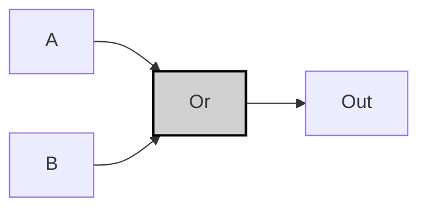
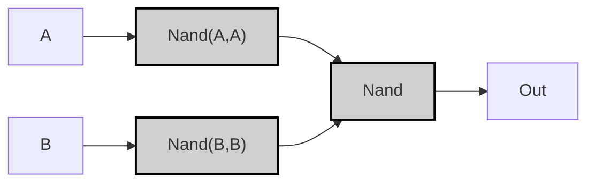

---
tags:
  - "#logic-design"
  - "#vhdl"
  - "#hardware-design"
  - "#or-gate"
  - "#digital-electronics"
---

## Specification

| A | B | A OR B |
|---|---|--------|
| 0 | 0 | 0      |
| 0 | 1 | 1      |
| 1 | 0 | 1      |
| 1 | 1 | 1      |

>[!example]-
> ```mermaid
> graph LR;
>     %% Pattern 0: A=0, B=0
>     A0["A"] -->|<span style="color:#aa0000">0</span>| Or0["Or"]:::gate;
>     B0["B"] -->|<span style="color:#aa0000">0</span>| Or0;
>     Or0 -->|<span style="color:#aa0000">0</span>| OUT0["Out"];
>     
>     %% Pattern 1: A=0, B=1
>     A1["A"] -->|<span style="color:#aa0000">0</span>| Or1["Or"]:::gate;
>     B1["B"] -->|<span style="color:#00aa00">1</span>| Or1;
>     Or1 -->|<span style="color:#00aa00">1</span>| OUT1["Out"];
>     
>     %% Pattern 2: A=1, B=0
>     A2["A"] -->|<span style="color:#00aa00">1</span>| Or2["Or"]:::gate;
>     B2["B"] -->|<span style="color:#aa0000">0</span>| Or2;
>     Or2 -->|<span style="color:#00aa00">1</span>| OUT2["Out"];
>     
>     %% Pattern 3: A=1, B=1
>     A3["A"] -->|<span style="color:#00aa00">1</span>| Or3["Or"]:::gate;
>     B3["B"] -->|<span style="color:#00aa00">1</span>| Or3;
>     Or3 -->|<span style="color:#00aa00">1</span>| OUT3["Out"];
>     
>     classDef gate fill:#d0d0d0,stroke:#000,stroke-width:2px;
>     style A0 fill:#ff9999;
>     style B0 fill:#ff9999;
>     style A1 fill:#ff9999;
>     style B1 fill:#99ff99;
>     style A2 fill:#99ff99;
>     style B2 fill:#ff9999;
>     style A3 fill:#99ff99;
>     style B3 fill:#99ff99;
>     style OUT0 fill:#ff9999;
>     style OUT1 fill:#99ff99;
>     style OUT2 fill:#99ff99;
>     style OUT3 fill:#99ff99;
> ```

## Implementation

### Basic Implementation

>[!tip]
>$$
>(\lnot A \land B) \lor (A \land \lnot B) \lor (A \land B)
>\\[5pt]
>= (\lnot A \land B) \lor A
>\\[5pt]
>= A \lor B
>$$

```vhdl
CHIP Or {
    IN a, b;
    OUT out;
PARTS:
    Or(a=a, b=b, out=out);
}
````



> [!example]-
> 
> ```mermaid
> graph LR;
>     %% Pattern 0: A=0, B=0
>     A0["A"] -->|<span style="color:#aa0000">0</span>| Or0["Or"]:::gate;
>     B0["B"] -->|<span style="color:#aa0000">0</span>| Or0;
>     Or0 -->|<span style="color:#aa0000">0</span>| OUT0["Out"];
>     
>     %% Pattern 1: A=0, B=1
>     A1["A"] -->|<span style="color:#aa0000">0</span>| Or1["Or"]:::gate;
>     B1["B"] -->|<span style="color:#00aa00">1</span>| Or1;
>     Or1 -->|<span style="color:#00aa00">1</span>| OUT1["Out"];
>     
>     %% Pattern 2: A=1, B=0
>     A2["A"] -->|<span style="color:#00aa00">1</span>| Or2["Or"]:::gate;
>     B2["B"] -->|<span style="color:#aa0000">0</span>| Or2;
>     Or2 -->|<span style="color:#00aa00">1</span>| OUT2["Out"];
>     
>     %% Pattern 3: A=1, B=1
>     A3["A"] -->|<span style="color:#00aa00">1</span>| Or3["Or"]:::gate;
>     B3["B"] -->|<span style="color:#00aa00">1</span>| Or3;
>     Or3 -->|<span style="color:#00aa00">1</span>| OUT3["Out"];
>     
>     classDef gate fill:#d0d0d0,stroke:#000,stroke-width:2px;
>     style A0 fill:#ff9999;
>     style B0 fill:#ff9999;
>     style A1 fill:#ff9999;
>     style B1 fill:#99ff99;
>     style A2 fill:#99ff99;
>     style B2 fill:#ff9999;
>     style A3 fill:#99ff99;
>     style B3 fill:#99ff99;
>     style OUT0 fill:#ff9999;
>     style OUT1 fill:#99ff99;
>     style OUT2 fill:#99ff99;
>     style OUT3 fill:#99ff99;
> ```

### Optimized Implementation

```vhdl
CHIP Or {
    IN a, b;
    OUT out;
PARTS:
    Nand(a=a, b=a, out=notA);
    Nand(a=b, b=b, out=notB);
    Nand(a=notA, b=notB, out=out);
}
```



> [!example]-
> 
> ```mermaid
> graph LR;
>     %% Pattern 0: A=0, B=0
>     A0["A"] -->|<span style="color:#aa0000">0</span>| NotA0["Nand(A,A)"]:::gate;
>     B0["B"] -->|<span style="color:#aa0000">0</span>| NotB0["Nand(B,B)"]:::gate;
>     NotA0 -->|<span style="color:#00aa00">1</span>| NandOpt0["Nand"]:::gate;
>     NotB0 -->|<span style="color:#00aa00">1</span>| NandOpt0;
>     NandOpt0 -->|<span style="color:#aa0000">0</span>| OUT0["Out"];
>     
>     %% Pattern 1: A=0, B=1
>     A1["A"] -->|<span style="color:#aa0000">0</span>| NotA1["Nand(A,A)"]:::gate;
>     B1["B"] -->|<span style="color:#00aa00">1</span>| NotB1["Nand(B,B)"]:::gate;
>     NotA1 -->|<span style="color:#00aa00">1</span>| NandOpt1["Nand"]:::gate;
>     NotB1 -->|<span style="color:#aa0000">0</span>| NandOpt1;
>     NandOpt1 -->|<span style="color:#00aa00">1</span>| OUT1["Out"];
>     
>     %% Pattern 2: A=1, B=0
>     A2["A"] -->|<span style="color:#00aa00">1</span>| NotA2["Nand(A,A)"]:::gate;
>     B2["B"] -->|<span style="color:#aa0000">0</span>| NotB2["Nand(B,B)"]:::gate;
>     NotA2 -->|<span style="color:#aa0000">0</span>| NandOpt2["Nand"]:::gate;
>     NotB2 -->|<span style="color:#00aa00">1</span>| NandOpt2;
>     NandOpt2 -->|<span style="color:#00aa00">1</span>| OUT2["Out"];
>     
>     %% Pattern 3: A=1, B=1
>     A3["A"] -->|<span style="color:#00aa00">1</span>| NotA3["Nand(A,A)"]:::gate;
>     B3["B"] -->|<span style="color:#00aa00">1</span>| NotB3["Nand(B,B)"]:::gate;
>     NotA3 -->|<span style="color:#aa0000">0</span>| NandOpt3["Nand"]:::gate;
>     NotB3 -->|<span style="color:#aa0000">0</span>| NandOpt3;
>     NandOpt3 -->|<span style="color:#00aa00">1</span>| OUT3["Out"];
>     
>     classDef gate fill:#d0d0d0,stroke:#000,stroke-width:2px;
>     style A0 fill:#ff9999;
>     style B0 fill:#ff9999;
>     style A1 fill:#ff9999;
>     style B1 fill:#99ff99;
>     style A2 fill:#99ff99;
>     style B2 fill:#ff9999;
>     style A3 fill:#99ff99;
>     style B3 fill:#99ff99;
>     style OUT0 fill:#ff9999;
>     style OUT1 fill:#99ff99;
>     style OUT2 fill:#99ff99;
>     style OUT3 fill:#99ff99;
> ```

> [!prove]- ORゲートの最適化
> 
> ---
> 
> ### 最適化前の論理式（基本形）
> 
> A∨B=(¬A∧B)∨(A∧¬B)∨(A∧B)A \lor B = (\lnot A \land B) \lor (A \land \lnot B) \lor (A \land B)
> 
> ```mermaid
> graph LR;
>     A["A"] --> Term1["(¬A ∧ B)"]:::gate;
>     A["A"] --> Term2["(A ∧ ¬B)"]:::gate;
>     A["A"] --> Term3["(A ∧ B)"]:::gate;
>     B["B"] --> Term1;
>     B["B"] --> Term2;
>     B["B"] --> Term3;
>     Term1 --> Or0["∨"]:::gate;
>     Term2 --> Or0;
>     Term3 --> Or0;
>     Or0 --> OUT["Out"];
> 
>     classDef gate fill:#ddd,stroke:#000;
> ```
> 
> ---
> 
> ### 最適化ステップ 1: 共通項の抽出
> 
> (A∧¬B)∨(A∧B)=A∧(¬B∨B)=A(A \land \lnot B) \lor (A \land B) = A \land (\lnot B \lor B) = A
> 
> ```mermaid
> graph LR;
>     A["A"] --> Combined["A"]:::gate;
>     B["B"] --> Temp["(¬B ∨ B)"]:::gate;
>     Combined --> Or1["∨"]:::gate;
>     Temp --> Or1;
>     Or1 --> OUT["Out"];
> 
>     classDef gate fill:#ddd,stroke:#000;
> ```
> 
> ---
> 
> ### 最適化ステップ 2: NANDによる最適化
> 
> ORゲートはNANDゲートのみで次のように実現可能です:
> 
> A∨B=NAND(NAND(A,A),NAND(B,B))A \lor B = \text{NAND}(\text{NAND}(A, A), \text{NAND}(B, B))
> 
> ```mermaid
> graph LR;
>     A["A"] --> NotA["Nand(A,A)"]:::gate;
>     B["B"] --> NotB["Nand(B,B)"]:::gate;
>     NotA --> NandFinal["Nand"]:::gate;
>     NotB --> NandFinal;
>     NandFinal --> OUT["Out"];
> 
>     classDef gate fill:#ddd,stroke:#000;
> ```
> 
> ---
> 
> ### 最適化の鍵
> 
> 1. **否定の共有**: NOT回路はNANDの自己接続で実現し、各入力に対して1回ずつ使用します。
> 2. **論理簡略化**: 複数の項の合成により、入力A, Bの単一論理式 A∨BA \lor B にまとめられる。
> 3. **ハードウェアコスト低減**: NANDゲートのみで構成することで、使用する回路数を最小限に抑えます。