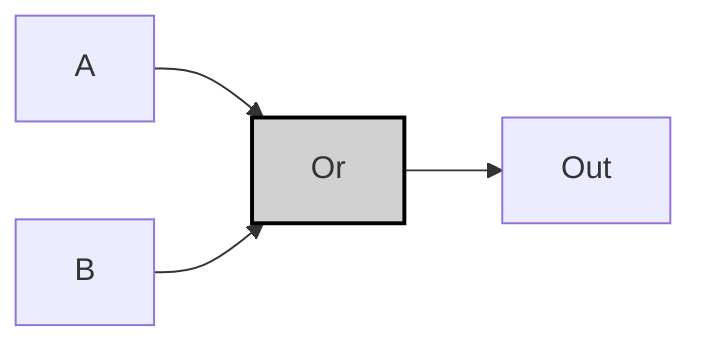
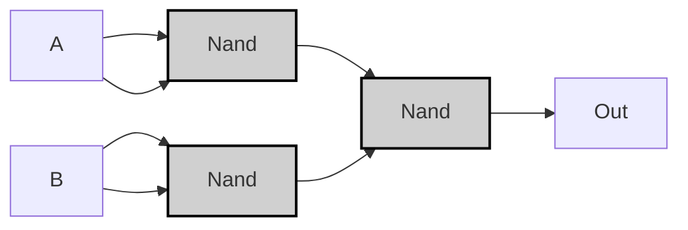

## Specification

|A|B|A OR B|
|---|---|---|
|0|0|0|
|0|1|1|
|1|0|1|
|1|1|1|

>[!example]-
> ```mermaid
> graph LR;
>     A0["A"] -->|<span style="color:#aa0000">0</span>| Or0;
>     B0["B"] -->|<span style="color:#aa0000">0</span>| Or0;
>     Or0["Or"]:::gate -->|<span style="color:#aa0000">0</span>| OUT0["Out"];
> 
>     A1["A"] -->|<span style="color:#aa0000">0</span>| Or1;
>     B1["B"] -->|<span style="color:#00aa00">1</span>| Or1;
>     Or1["Or"]:::gate -->|<span style="color:#00aa00">1</span>| OUT1["Out"];
> 
>     A2["A"] -->|<span style="color:#00aa00">1</span>| Or2;
>     B2["B"] -->|<span style="color:#aa0000">0</span>| Or2;
>     Or2["Or"]:::gate -->|<span style="color:#00aa00">1</span>| OUT2["Out"];
> 
>     A3["A"] -->|<span style="color:#00aa00">1</span>| Or3;
>     B3["B"] -->|<span style="color:#00aa00">1</span>| Or3;
>     Or3["Or"]:::gate -->|<span style="color:#00aa00">1</span>| OUT3["Out"];
> 
>     classDef gate fill:#d0d0d0,stroke:#000,stroke-width:2px;
>     style A0 fill:#ff9999
>     style B0 fill:#ff9999
>     style A1 fill:#ff9999
>     style B1 fill:#99ff99
>     style A2 fill:#99ff99
>     style B2 fill:#ff9999
>     style A3 fill:#99ff99
>     style B3 fill:#99ff99
> ```

---
## Implementation
###  Basic Version
>[!tip]
>$$
>A \lor B = \text{OR}(A,B)
>$$

```vhdl
CHIP Or {
    IN a, b;
    OUT out;
PARTS:
    Or(a=a, b=b, out=out);
}
```



>[!example]-
> ```mermaid
> graph LR;
>     %% パターン0: A=0, B=0
>     A0["A"] -->|<span style="color:#aa0000">0</span>| Or0["Or"]:::gate
>     B0["B"] -->|<span style="color:#aa0000">0</span>| Or0
>     Or0 -->|<span style="color:#aa0000">0</span>| OUT0["Out"]
> 
>     %% パターン1: A=0, B=1
>     A1["A"] -->|<span style="color:#aa0000">0</span>| Or1["Or"]:::gate
>     B1["B"] -->|<span style="color:#00aa00">1</span>| Or1
>     Or1 -->|<span style="color:#00aa00">1</span>| OUT1["Out"]
> 
>     %% パターン2: A=1, B=0
>     A2["A"] -->|<span style="color:#00aa00">1</span>| Or2["Or"]:::gate
>     B2["B"] -->|<span style="color:#aa0000">0</span>| Or2
>     Or2 -->|<span style="color:#00aa00">1</span>| OUT2["Out"]
> 
>     %% パターン3: A=1, B=1
>     A3["A"] -->|<span style="color:#00aa00">1</span>| Or3["Or"]:::gate
>     B3["B"] -->|<span style="color:#00aa00">1</span>| Or3
>     Or3 -->|<span style="color:#00aa00">1</span>| OUT3["Out"]
> 
>     classDef gate fill:#d0d0d0,stroke:#000,stroke-width:2px;
>     style A0 fill:#ff9999
>     style B0 fill:#ff9999
>     style A1 fill:#ff9999
>     style B1 fill:#99ff99
>     style A2 fill:#99ff99
>     style B2 fill:#ff9999
>     style A3 fill:#99ff99
>     style B3 fill:#99ff99
> ```

---

###  Nand Version
```vhdl
CHIP Or {
    IN a, b;
    OUT out;
PARTS:
    Nand(a=a, b=a, out=notA);
    Nand(a=b, b=b, out=notB);
    Nand(a=notA, b=notB, out=out);
}
```



>[!example]-
> ```mermaid
> graph LR;
>     %% Pattern 0: A=0, B=0
>     A0["A"]:::input0 -->|<span style="color:#aa0000">0</span>| Nand1_0["Nand"]:::gate
>     A0 -->|<span style="color:#aa0000">0</span>| Nand1_0
>     B0["B"]:::input0 -->|<span style="color:#aa0000">0</span>| Nand2_0["Nand"]:::gate
>     B0 -->|<span style="color:#aa0000">0</span>| Nand2_0
>     Nand1_0 -->|<span style="color:#00aa00">1</span>| Nand3_0["Nand"]:::gate
>     Nand2_0 -->|<span style="color:#00aa00">1</span>| Nand3_0
>     Nand3_0 -->|<span style="color:#aa0000">0</span>| OUT0["Out"]:::output0
> 
>     %% Pattern 1: A=0, B=1
>     A1["A"]:::input0 -->|<span style="color:#aa0000">0</span>| Nand1_1["Nand"]:::gate
>     A1 -->|<span style="color:#aa0000">0</span>| Nand1_1
>     B1["B"]:::input1 -->|<span style="color:#00aa00">1</span>| Nand2_1["Nand"]:::gate
>     B1 -->|<span style="color:#00aa00">1</span>| Nand2_1
>     Nand1_1 -->|<span style="color:#00aa00">1</span>| Nand3_1["Nand"]:::gate
>     Nand2_1 -->|<span style="color:#aa0000">0</span>| Nand3_1
>     Nand3_1 -->|<span style="color:#00aa00">1</span>| OUT1["Out"]:::output1
> 
>     %% Pattern 2: A=1, B=0
>     A2["A"]:::input1 -->|<span style="color:#00aa00">1</span>| Nand1_2["Nand"]:::gate
>     A2 -->|<span style="color:#00aa00">1</span>| Nand1_2
>     B2["B"]:::input0 -->|<span style="color:#aa0000">0</span>| Nand2_2["Nand"]:::gate
>     B2 -->|<span style="color:#aa0000">0</span>| Nand2_2
>     Nand1_2 -->|<span style="color:#aa0000">0</span>| Nand3_2["Nand"]:::gate
>     Nand2_2 -->|<span style="color:#00aa00">1</span>| Nand3_2
>     Nand3_2 -->|<span style="color:#00aa00">1</span>| OUT2["Out"]:::output1
> 
>     %% Pattern 3: A=1, B=1
>     A3["A"]:::input1 -->|<span style="color:#00aa00">1</span>| Nand1_3["Nand"]:::gate
>     A3 -->|<span style="color:#00aa00">1</span>| Nand1_3
>     B3["B"]:::input1 -->|<span style="color:#00aa00">1</span>| Nand2_3["Nand"]:::gate
>     B3 -->|<span style="color:#00aa00">1</span>| Nand2_3
>     Nand1_3 -->|<span style="color:#aa0000">0</span>| Nand3_3["Nand"]:::gate
>     Nand2_3 -->|<span style="color:#aa0000">0</span>| Nand3_3
>     Nand3_3 -->|<span style="color:#00aa00">1</span>| OUT3["Out"]:::output1
> 
>     classDef gate fill:#d0d0d0,stroke:#000,stroke-width:2px;
>     classDef input0 fill:#ff9999,stroke:#000,stroke-width:1px;
>     classDef input1 fill:#99ff99,stroke:#000,stroke-width:1px;
>     classDef output0 fill:#ff9999,stroke:#000,stroke-width:1px;
>     classDef output1 fill:#99ff99,stroke:#000,stroke-width:1px;
> ```

>[!prove]- ORゲートの最適化手順
> ### 基本論理式
> $$
> A \lor B
> $$
> 
> ### NANDによるNOT実装
> NOTゲートをNANDで置換：
> $$
> \neg X = X \uparrow X
> $$
> 
> ```mermaid
> graph LR
>     A["A"] --> Nand1["Nand(A,A)"]:::gate
>     B["B"] --> Nand2["Nand(B,B)"]:::gate
>     classDef gate fill:#ddd,stroke:#000;
> ```
> 
> ### NANDによるOR実装
> ド・モルガンの法則を適用：
> $$
> A \lor B = \neg(\neg A \land \neg B) = (A \uparrow A) \uparrow (B \uparrow B)
> $$
> 
> ```mermaid
> graph LR
>     A["A"] --> Nand1["Nand(A,A)"]:::gate
>     B["B"] --> Nand2["Nand(B,B)"]:::gate
>     Nand1 --> Nand3["Nand(Nand1,Nand2)"]:::gate
>     Nand2 --> Nand3
>     Nand3 --> OUT["Out"]
>     classDef gate fill:#ddd,stroke:#000;
> ```
> 
> ### 最適化検証
> | A | B | nand1 | nand2 | out |
> |---|---|-------|-------|-----|
> | 0 | 0 | 1     | 1     | 0 ✔️|
> | 0 | 1 | 1     | 0     | 1 ✔️|
> | 1 | 0 | 0     | 1     | 1 ✔️|
> | 1 | 1 | 0     | 0     | 1 ✔️|
> 
> ### 結論
> 3つのNANDゲートで完全なOR動作を実現：
> - 論理ゲート数 **1個 → 3個** に増加するが
> - NANDのみの統一実装が可能
> - 製造プロセス標準化のメリット
> ```mermaid
> graph LR
>     A["A"] --> Nand1["Nand"]:::gate
>     A --> Nand1
>     B["B"] --> Nand2["Nand"]:::gate
>     B --> Nand2
>     Nand1 --> Nand3["Nand"]:::gate
>     Nand2 --> Nand3
>     Nand3 --> OUT["Out"]
>     classDef gate fill:#ddd,stroke:#000;
> ```