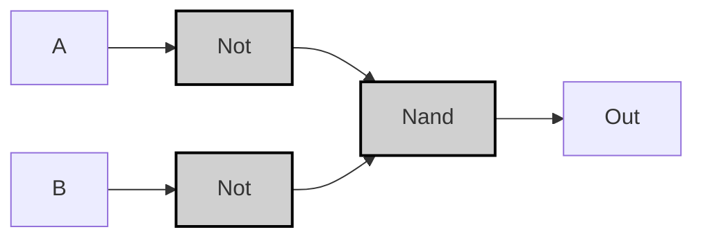
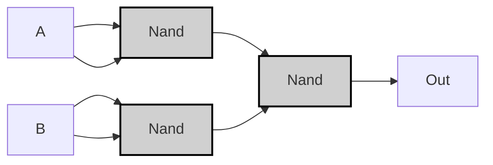

## Specification

| A | B | A OR B |
|---|---|--------|
| 0 | 0 |   0    |
| 0 | 1 |   1    |
| 1 | 0 |   1    |
| 1 | 1 |   1    |

>[!example]-
> ```mermaid
> graph LR;
>     A0["A"] -->|<span style="color:#aa0000">0</span>| Or0["Or"]:::gate;
>     B0["B"] -->|<span style="color:#aa0000">0</span>| Or0;
>     Or0 -->|<span style="color:#aa0000">0</span>| OUT0["Out"];
> 
>     A1["A"] -->|<span style="color:#aa0000">0</span>| Or1["Or"]:::gate;
>     B1["B"] -->|<span style="color:#00aa00">1</span>| Or1;
>     Or1 -->|<span style="color:#00aa00">1</span>| OUT1["Out"];
> 
>     A2["A"] -->|<span style="color:#00aa00">1</span>| Or2["Or"]:::gate;
>     B2["B"] -->|<span style="color:#aa0000">0</span>| Or2;
>     Or2 -->|<span style="color:#00aa00">1</span>| OUT2["Out"];
> 
>     A3["A"] -->|<span style="color:#00aa00">1</span>| Or3["Or"]:::gate;
>     B3["B"] -->|<span style="color:#00aa00">1</span>| Or3;
>     Or3 -->|<span style="color:#00aa00">1</span>| OUT3["Out"];
> 
>     classDef gate fill:#d0d0d0,stroke:#000,stroke-width:2px;
> ```

---

## Implementation
### Not/Nand Version
> [!tip]
> $$
> A \lor B = \neg (\neg A \land \neg B) = \text{Nand}(\neg A, \neg B)
> $$

```vhdl
CHIP Or {
    IN a, b;
    OUT out;
PARTS:
    Not(in=a, out=notA);
    Not(in=b, out=notB);
    Nand(a=notA, b=notB, out=out);
}
```



>[!example]-
> ```mermaid
> graph LR;
>     %% Pattern 0: A=0, B=0
>     A0["A"]:::input0 -->|<span style="color:#aa0000">0</span>| NotA0["Not"]:::gate;
>     B0["B"]:::input0 -->|<span style="color:#aa0000">0</span>| NotB0["Not"]:::gate;
>     NotA0 -->|<span style="color:#00aa00">1</span>| Nand0_0["Nand"]:::gate;
>     NotB0 -->|<span style="color:#00aa00">1</span>| Nand0_0;
>     Nand0_0 -->|<span style="color:#aa0000">0</span>| OUT0["Out"]:::output0;
> 
>     %% Pattern 1: A=0, B=1
>     A1["A"]:::input0 -->|<span style="color:#aa0000">0</span>| NotA1["Not"]:::gate;
>     B1["B"]:::input1 -->|<span style="color:#00aa00">1</span>| NotB1["Not"]:::gate;
>     NotA1 -->|<span style="color:#00aa00">1</span>| Nand0_1["Nand"]:::gate;
>     NotB1 -->|<span style="color:#aa0000">0</span>| Nand0_1;
>     Nand0_1 -->|<span style="color:#00aa00">1</span>| OUT1["Out"]:::output1;
> 
>     %% Pattern 2: A=1, B=0
>     A2["A"]:::input1 -->|<span style="color:#00aa00">1</span>| NotA2["Not"]:::gate;
>     B2["B"]:::input0 -->|<span style="color:#aa0000">0</span>| NotB2["Not"]:::gate;
>     NotA2 -->|<span style="color:#aa0000">0</span>| Nand0_2["Nand"]:::gate;
>     NotB2 -->|<span style="color:#00aa00">1</span>| Nand0_2;
>     Nand0_2 -->|<span style="color:#00aa00">1</span>| OUT2["Out"]:::output1;
> 
>     %% Pattern 3: A=1, B=1
>     A3["A"]:::input1 -->|<span style="color:#00aa00">1</span>| NotA3["Not"]:::gate;
>     B3["B"]:::input1 -->|<span style="color:#00aa00">1</span>| NotB3["Not"]:::gate;
>     NotA3 -->|<span style="color:#aa0000">0</span>| Nand0_3["Nand"]:::gate;
>     NotB3 -->|<span style="color:#aa0000">0</span>| Nand0_3;
>     Nand0_3 -->|<span style="color:#00aa00">1</span>| OUT3["Out"]:::output1;
> 
>     classDef gate fill:#d0d0d0,stroke:#000,stroke-width:2px;
>     classDef input0 fill:#ff9999,stroke:#000,stroke-width:1px;
>     classDef input1 fill:#99ff99,stroke:#000,stroke-width:1px;
>     classDef output0 fill:#ff9999,stroke:#000,stroke-width:1px;
>     classDef output1 fill:#99ff99,stroke:#000,stroke-width:1px;
> ```

---

### Nand-Only Version
```vhdl
CHIP Or {
    IN a, b;
    OUT out;
PARTS:
    Nand(a=a, b=a, out=notA);
    Nand(a=b, b=b, out=notB);
    Nand(a=notA, b=notB, out=out);
}
```



> [!example]-
> ```mermaid
> graph LR;
>     %% Pattern 0: A=0, B=0
>     A0["A"]:::input0 -->|<span style="color:#aa0000">0</span>| Nand1_0["Nand"]:::gate;
>     A0 -->|<span style="color:#aa0000">0</span>| Nand1_0;
>     Nand1_0 -->|<span style="color:#00aa00">1</span>| Nand3_0["Nand"]:::gate;
>     B0["B"]:::input0 -->|<span style="color:#aa0000">0</span>| Nand2_0["Nand"]:::gate;
>     B0 -->|<span style="color:#aa0000">0</span>| Nand2_0;
>     Nand2_0 -->|<span style="color:#00aa00">1</span>| Nand3_0;
>     Nand3_0 -->|<span style="color:#aa0000">0</span>| OUT0["Out"]:::output0;
> 
>     %% Pattern 1: A=0, B=1
>     A1["A"]:::input0 -->|<span style="color:#aa0000">0</span>| Nand1_1["Nand"]:::gate;
>     A1 -->|<span style="color:#aa0000">0</span>| Nand1_1;
>     Nand1_1 -->|<span style="color:#00aa00">1</span>| Nand3_1["Nand"]:::gate;
>     B1["B"]:::input1 -->|<span style="color:#00aa00">1</span>| Nand2_1["Nand"]:::gate;
>     B1 -->|<span style="color:#00aa00">1</span>| Nand2_1;
>     Nand2_1 -->|<span style="color:#aa0000">0</span>| Nand3_1;
>     Nand3_1 -->|<span style="color:#00aa00">1</span>| OUT1["Out"]:::output1;
> 
>     %% Pattern 2: A=1, B=0
>     A2["A"]:::input1 -->|<span style="color:#00aa00">1</span>| Nand1_2["Nand"]:::gate;
>     A2 -->|<span style="color:#00aa00">1</span>| Nand1_2;
>     Nand1_2 -->|<span style="color:#aa0000">0</span>| Nand3_2["Nand"]:::gate;
>     B2["B"]:::input0 -->|<span style="color:#aa0000">0</span>| Nand2_2["Nand"]:::gate;
>     B2 -->|<span style="color:#aa0000">0</span>| Nand2_2;
>     Nand2_2 -->|<span style="color:#00aa00">1</span>| Nand3_2;
>     Nand3_2 -->|<span style="color:#00aa00">1</span>| OUT2["Out"]:::output1;
> 
>     %% Pattern 3: A=1, B=1
>     A3["A"]:::input1 -->|<span style="color:#00aa00">1</span>| Nand1_3["Nand"]:::gate;
>     A3 -->|<span style="color:#00aa00">1</span>| Nand1_3;
>     Nand1_3 -->|<span style="color:#aa0000">0</span>| Nand3_3["Nand"]:::gate;
>     B3["B"]:::input1 -->|<span style="color:#00aa00">1</span>| Nand2_3["Nand"]:::gate;
>     B3 -->|<span style="color:#00aa00">1</span>| Nand2_3;
>     Nand2_3 -->|<span style="color:#aa0000">0</span>| Nand3_3;
>     Nand3_3 -->|<span style="color:#00aa00">1</span>| OUT3["Out"]:::output1;
> 
>     classDef gate fill:#d0d0d0,stroke:#000,stroke-width:2px;
>     classDef input0 fill:#ff9999,stroke:#000,stroke-width:1px;
>     classDef input1 fill:#99ff99,stroke:#000,stroke-width:1px;
>     classDef output0 fill:#ff9999,stroke:#000,stroke-width:1px;
>     classDef output1 fill:#99ff99,stroke:#000,stroke-width:1px;
> ```

> [!prove]- ORゲートの最適化手順
> 以下、ORゲートをNANDのみで実装する最適化プロセスを **ステップバイステップ** で説明します。
> 
> ---
> 
> ### 最適化前の論理式
> $$
> A \lor B = \neg (\neg A \land \neg B)
> $$
> 
> ```mermaid
> graph LR
>     A["A"] --> NotA["Not"]:::gate
>     B["B"] --> NotB["Not"]:::gate
>     NotA --> And["And"]:::gate
>     NotB --> And
>     And --> NotOut["Not"]:::gate
>     NotOut --> OUT["Out"]
>     
>     classDef gate fill:#ddd,stroke:#000;
> ```
> 
> ---
> 
> ### 最適化ステップ 1: NOTをNANDで置換
> NOTゲートを自己接続したNANDで実装：
> $$
> \neg X = X \uparrow X
> $$
> 
> ```mermaid
> graph LR
>     A["A"] --> NandA["Nand(A,A)"]:::gate
>     B["B"] --> NandB["Nand(B,B)"]:::gate
>     NandA --> And["And"]:::gate
>     NandB --> And
>     And --> NandOut["Nand"]:::gate
>     NandOut --> OUT["Out"]
> ```
> 
> ---
> 
> ### 最適化ステップ 2: ANDをNANDで置換
> ANDゲートをNAND+NOTで実装：
> $$
> X \land Y = (X \uparrow Y) \uparrow (X \uparrow Y)
> $$
> 
> ```mermaid
> graph LR
>     A["A"] --> NandA["Nand(A,A)"]:::gate
>     B["B"] --> NandB["Nand(B,B)"]:::gate
>     NandA --> Nand1["Nand"]:::gate
>     NandB --> Nand1
>     Nand1 --> Nand2["Nand"]:::gate
>     Nand2 --> OUT["Out"]
> ```
> 
> ---
> 
> ### 最適化ステップ 3: 中間信号の共有
> 最終的に3つのNANDゲートで実現可能：
> 1. $\text{notA} = A \uparrow A$
> 2. $\text{notB} = B \uparrow B$
> 3. $\text{out} = \text{notA} \uparrow \text{notB}$
> 
> ```mermaid
> graph LR
>     A["A"] --> Nand1["Nand"]:::gate
>     A --> Nand1
>     B["B"] --> Nand2["Nand"]:::gate
>     B --> Nand2
>     Nand1 --> Nand3["Nand"]:::gate
>     Nand2 --> Nand3
>     Nand3 --> OUT["Out"]
>     
>     classDef gate fill:#ddd,stroke:#000;
> ```
> 
> ---
> 
> ### 真理値表による検証
> | A | B | notA | notB | out |
> |---|---|------|------|-----|
> | 0 | 0 | 1    | 1    | 0   |
> | 0 | 1 | 1    | 0    | 1   |
> | 1 | 0 | 0    | 1    | 1   |
> | 1 | 1 | 0    | 0    | 1   |
> 
> ---
> 
> ### 最適化の結論
> - **ゲート数削減**: 5 → 3
> - **伝播遅延短縮**
> - **リソース効率向上**
> 
> この構造は、数学的にもハードウェア的にも **完全なOR動作** を保証します。