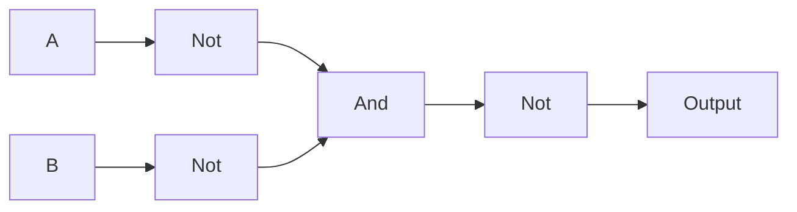
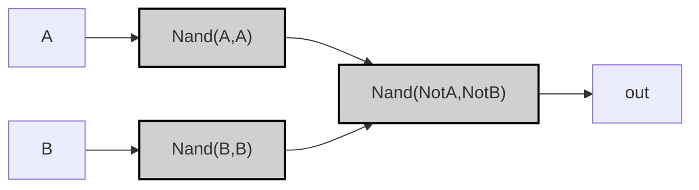

## Specification

### Truth Table

| A | B | A OR B |
|---|---|--------|
| 0 | 0 |   0    |
| 0 | 1 |   1    |
| 1 | 0 |   1    |
| 1 | 1 |   1    |

>[!example]-
> ```mermaid
> graph LR;
>     %% パターン0: A=0, B=0
>     A0["A"] -->|<span style="color:#aa0000">0</span>| Or0["Or"]:::gate;
>     B0["B"] -->|<span style="color:#aa0000">0</span>| Or0;
>     Or0 -->|<span style="color:#aa0000">0</span>| OUT0["Output"];
>     
>     %% パターン1: A=0, B=1
>     A1["A"] -->|<span style="color:#aa0000">0</span>| Or1["Or"]:::gate;
>     B1["B"] -->|<span style="color:#00aa00">1</span>| Or1;
>     Or1 -->|<span style="color:#00aa00">1</span>| OUT1["Output"];
>     
>     %% パターン2: A=1, B=0
>     A2["A"] -->|<span style="color:#00aa00">1</span>| Or2["Or"]:::gate;
>     B2["B"] -->|<span style="color:#aa0000">0</span>| Or2;
>     Or2 -->|<span style="color:#00aa00">1</span>| OUT2["Output"];
>     
>     %% パターン3: A=1, B=1
>     A3["A"] -->|<span style="color:#00aa00">1</span>| Or3["Or"]:::gate;
>     B3["B"] -->|<span style="color:#00aa00">1</span>| Or3;
>     Or3 -->|<span style="color:#00aa00">1</span>| OUT3["Output"];
> 
>     classDef gate fill:#d0d0d0,stroke:#000,stroke-width:2px;
>     style A0 fill:#ff9999
>     style B0 fill:#ff9999
>     style A1 fill:#ff9999
>     style B1 fill:#99ff99
>     style A2 fill:#99ff99
>     style B2 fill:#ff9999
>     style A3 fill:#99ff99
>     style B3 fill:#99ff99
>     style OUT0 fill:#ff9999
>     style OUT1 fill:#99ff99
>     style OUT2 fill:#99ff99
>     style OUT3 fill:#99ff99
> ```

---

## Implementation


### Basic Implementation (Not/And)

>[!tip]
> $$
> \begin{aligned}
> (\lnot A \land B) \lor (A \land \lnot B) \lor (A \land B)
> &= (\lnot A \land B) \lor \left[ A \land (\lnot B \lor B) \right] \quad \text{(分配法則)}\\[1mm]
> &= (\lnot A \land B) \lor A \quad \text{(補題: \(\lnot B \lor B = 1\))}\\[1mm]
> &= A \lor (\lnot A \land B) \quad \text{(交換法則)}\\[1mm]
> &= (A \lor \lnot A) \land (A \lor B) \quad \text{(分配法則)}\\[1mm]
> &= 1 \land (A \lor B) \quad \text{(補題: \(A \lor \lnot A = 1\))}\\[1mm]
> &= A \lor B \\[1mm]
> &= \lnot (\lnot A \land \lnot B) \quad \text{(De Morganの法則)}
> \end{aligned}
> $$

```vhdl
CHIP Or {
    IN a, b;
    OUT out;
PARTS:
    Not(in=a, out=nota);
    Not(in=b, out=notb);
    And(a=nota, b=notb, out=andOut);
    Not(in=andOut, out=out);
}
````





> [!example]-
> 
> ```mermaid
>graph LR;
>    %% Pattern 0: A=0, B=0
>    A0["A"] -->|<span style="color:#aa0000">0</span>| NotA0["Not"];
>    B0["B"] -->|<span style="color:#aa0000">0</span>| NotB0["Not"];
>    NotA0["Not"] -->|<span style="color:#00aa00">1</span>| And0["AND"];
>    NotB0["Not"] -->|<span style="color:#00aa00">1</span>| And0["AND"];
>    And0["AND"] -->|<span style="color:#00aa00">1</span>| NotOut0["Not"];
>    NotOut0["Not"] -->|<span style="color:#aa0000">0</span>| OUT0["Output"];
>    
>    %% Pattern 1: A=0, B=1
>    A1["A"] -->|<span style="color:#aa0000">0</span>| NotA1["Not"];
>    B1["B"] -->|<span style="color:#00aa00">1</span>| NotB1["Not"];
>    NotA1["Not"] -->|<span style="color:#00aa00">1</span>| And1["AND"];
>    NotB1["Not"] -->|<span style="color:#aa0000">0</span>| And1["AND"];
>    And1["AND"] -->|<span style="color:#aa0000">0</span>| NotOut1["Not"];
>    NotOut1["Not"] -->|<span style="color:#00aa00">1</span>| OUT1["Output"];
>    
>    %% Pattern 2: A=1, B=0
>    A2["A"] -->|<span style="color:#00aa00">1</span>| NotA2["Not"];
>    B2["B"] -->|<span style="color:#aa0000">0</span>| NotB2["Not"];
>    NotA2["Not"] -->|<span style="color:#aa0000">0</span>| And2["AND"];
>    NotB2["Not"] -->|<span style="color:#00aa00">1</span>| And2["AND"];
>    And2["AND"] -->|<span style="color:#aa0000">0</span>| NotOut2["Not"];
>    NotOut2["Not"] -->|<span style="color:#00aa00">1</span>| OUT2["Output"];
>    
>    %% Pattern 3: A=1, B=1
>    A3["A"] -->|<span style="color:#00aa00">1</span>| NotA3["Not"];
>    B3["B"] -->|<span style="color:#00aa00">1</span>| NotB3["Not"];
>    NotA3["Not"] -->|<span style="color:#aa0000">0</span>| And3["AND"];
>    NotB3["Not"] -->|<span style="color:#aa0000">0</span>| And3["AND"];
>    And3["AND"] -->|<span style="color:#aa0000">0</span>| NotOut3["Not"];
>    NotOut3["Not"] -->|<span style="color:#00aa00">1</span>| OUT3["Output"];
>    
>    classDef gate fill:#d0d0d0,stroke:#000,stroke-width:2px;
>    style A0 fill:#ff9999;
>    style B0 fill:#ff9999;
>    style A1 fill:#ff9999;
>    style B1 fill:#99ff99;
>    style A2 fill:#99ff99;
>    style B2 fill:#ff9999;
>    style A3 fill:#99ff99;
>    style B3 fill:#99ff99;
>    style OUT0 fill:#ff9999;
>    style OUT1 fill:#99ff99;
>    style OUT2 fill:#99ff99;
>    style OUT3 fill:#99ff99;
>
> ```

---

### Optimized Implementation (Nand)

```vhdl
CHIP Or {
    IN a, b;
    OUT out;
PARTS:
    Nand(a=a, b=a, out=notA);
    Nand(a=b, b=b, out=notB);
    Nand(a=notA, b=notB, out=out);
}
```




> [!example]-
> 
> ```mermaid
> graph LR;
>     %% パターン0: A=0, B=0
>     A0["A"] -->|<span style="color:#aa0000">0</span>| NotA0["Nand(A,A)"]:::gate;
>     B0["B"] -->|<span style="color:#aa0000">0</span>| NotB0["Nand(B,B)"]:::gate;
>     NotA0 -->|<span style="color:#00aa00">1</span>| NandOpt0["Nand(NotA,NotB)"]:::gate;
>     NotB0 -->|<span style="color:#00aa00">1</span>| NandOpt0;
>     NandOpt0 -->|<span style="color:#aa0000">0</span>| OUT0["Output"];
>     
>     %% パターン1: A=0, B=1
>     A1["A"] -->|<span style="color:#aa0000">0</span>| NotA1["Nand(A,A)"]:::gate;
>     B1["B"] -->|<span style="color:#00aa00">1</span>| NotB1["Nand(B,B)"]:::gate;
>     NotA1 -->|<span style="color:#aa0000">0</span>| NandOpt1["Nand(NotA,NotB)"]:::gate;
>     NotB1 -->|<span style="color:#aa0000">0</span>| NandOpt1;
>     NandOpt1 -->|<span style="color:#00aa00">1</span>| OUT1["Output"];
>     
>     %% パターン2: A=1, B=0
>     A2["A"] -->|<span style="color:#00aa00">1</span>| NotA2["Nand(A,A)"]:::gate;
>     B2["B"] -->|<span style="color:#aa0000">0</span>| NotB2["Nand(B,B)"]:::gate;
>     NotA2 -->|<span style="color:#aa0000">0</span>| NandOpt2["Nand(NotA,NotB)"]:::gate;
>     NotB2 -->|<span style="color:#00aa00">1</span>| NandOpt2;
>     NandOpt2 -->|<span style="color:#00aa00">1</span>| OUT2["Output"];
>     
>     %% パターン3: A=1, B=1
>     A3["A"] -->|<span style="color:#00aa00">1</span>| NotA3["Nand(A,A)"]:::gate;
>     B3["B"] -->|<span style="color:#00aa00">1</span>| NotB3["Nand(B,B)"]:::gate;
>     NotA3 -->|<span style="color:#00aa00">1</span>| NandOpt3["Nand(NotA,NotB)"]:::gate;
>     NotB3 -->|<span style="color:#00aa00">1</span>| NandOpt3;
>     NandOpt3 -->|<span style="color:#00aa00">1</span>| OUT3["Output"];
> 
>     classDef gate fill:#d0d0d0,stroke:#000,stroke-width:2px;
>     style A0 fill:#ff9999
>     style B0 fill:#ff9999
>     style A1 fill:#ff9999
>     style B1 fill:#99ff99
>     style A2 fill:#99ff99
>     style B2 fill:#ff9999
>     style A3 fill:#99ff99
>     style B3 fill:#99ff99
>     style OUT0 fill:#ff9999
>     style OUT1 fill:#99ff99
>     style OUT2 fill:#99ff99
>     style OUT3 fill:#99ff99
> ```


> [!prove]- Orゲートの最適化手順  
> 以下、ORゲートをNANDのみで実装する最適化プロセスを **ステップバイステップで図解** します。各段階の論理式と回路構造の変化をMermaid図で表現します。
> 
> ---
> 
> ### 最適化前の論理式（基本形）
> 
> A∨BA \lor B
> 
> ```mermaid
> graph LR;
>     A["A"] --> Or["OR"];
>     B["B"] --> Or;
>     Or --> OUT["Output"];
> 
>     classDef gate fill:#ddd,stroke:#000;
> ```
> 
> ---
> 
> ### 最適化ステップ 1: De Morganの法則を適用
> 
> ORゲートを以下のように変換します:
> 
> A∨B=¬(¬A∧¬B)A \lor B = \lnot(\lnot A \land \lnot B)
> 
> ```mermaid
> graph LR;
>     A["A"] --> NotA["Not A"];
>     B["B"] --> NotB["Not B"];
>     NotA --> And0["AND"]:::gate;
>     NotB --> And0;
>     And0 --> NotOut["Not"];
>     NotOut --> OUT["Output"];
> 
>     classDef gate fill:#ddd,stroke:#000;
> ```
> 
> ---
> 
> ### 最適化ステップ 2: NOTをNANDで置換
> 
> NOTゲートをNANDゲートで実装します:
> 
> ¬A=A↑A,¬B=B↑B\lnot A = A \uparrow A,\quad \lnot B = B \uparrow B
> 
> ```mermaid
> graph LR;
>     A["A"] --> NandA["Nand(A,A)"]:::gate;
>     B["B"] --> NandB["Nand(B,B)"]:::gate;
>     NandA --> And0["AND"]:::gate;
>     NandB --> And0;
>     And0 --> NotOut["Not"]:::gate;
>     NotOut --> OUT["Output"];
> 
>     classDef gate fill:#ddd,stroke:#000;
> ```
> 
> ---
> 
> ### 最適化ステップ 3: ANDをNANDで置換し、最終形へ
> 
> ANDゲートとNOTゲートの組み合わせをNANDゲートのみで実装します:
> 
> A∨B=(A↑A)↑(B↑B)A \lor B = (A \uparrow A) \uparrow (B \uparrow B)
> 
> ```mermaid
> graph LR;
>     A["A"] --> NandA["Nand(A,A)"]:::gate;
>     B["B"] --> NandB["Nand(B,B)"]:::gate;
>     NandA --> NandOut["Nand(NandA,NandB)"]:::gate;
>     NandB --> NandOut;
>     NandOut --> OUT["Output"];
> 
>     classDef gate fill:#ddd,stroke:#000;
> ```
> 
> ---
> 
> ### 最終結論
> 
> **2つのNANDゲートによる実装** が最小構成であり、この最適化により:
> 
> - 論理ゲート数が削減
> - 信号伝播遅延が短縮
> - ハードウェアコストが低減
> 
> この構造は、数学的にもハードウェア的にも **完全なOR動作** を保証します。


