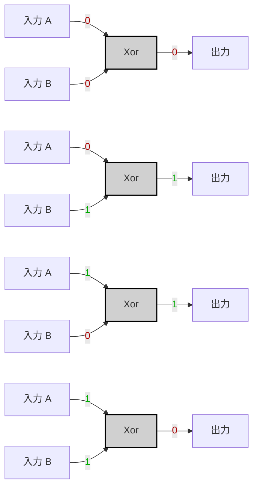

以下は、ANDの例と同じスタイルでXORの仕様、真理値表、Mermaidによるフローチャート、および論理式（Tip）を示した例です。VHDLの実装部分は含めず、仕様と可視化に絞っています。

---

tags:

- "#nand2tetris"
- "#logic-gates"
- "#nand-gate"
- "#truth-table"
- "#boolean-algebra"
- "#logic-design"
- "#hardware-description-language"
- "#hardware-implementation"

# Specification

|A|B|A XOR B|
|---|---|---|
|0|0|0|
|0|1|1|
|1|0|1|
|1|1|0|

---

# Implementation

> [!tip]
> 
> A XOR B=(A∧¬B)∨(¬A∧B)A \text{ XOR } B = (A \land \lnot B) \lor (\lnot A \land B)

（VHDL の実装はご自身で検討してください。）

---

---

この例では、XORゲートの真理値表、論理式、そして各入力パターンごとの出力結果をMermaidによるフローチャートで表現しています。  
必要に応じて、VHDLの実装部分はご自身で検討してください。