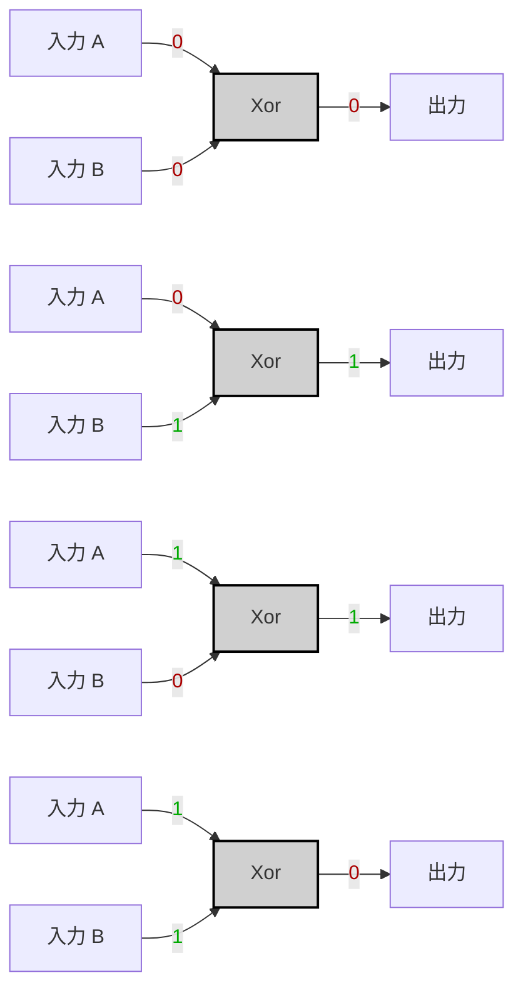

# Specification

|A|B|A XOR B|
|---|---|---|
|0|0|0|
|0|1|1|
|1|0|1|
|1|1|0|

---

# Implementation

> [!tip]
> 

$$
A \text{ XOR } B = (A \land \lnot B) \lor (\lnot A \land B)
$$

（VHDL の実装はご自身で検討してください。）

---

