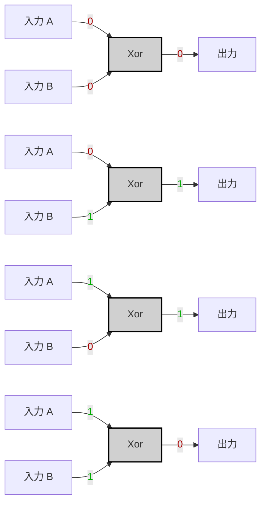
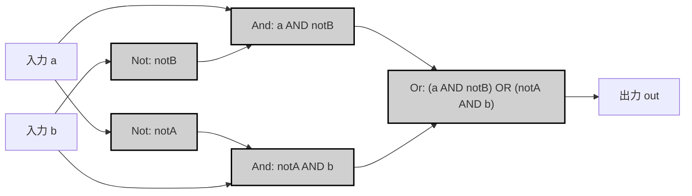

---
tags:
  - "#logic-gates"
  - "#logic-design"
  - "#boolean-algebra"
  - "#xor-gate"
  - "#vhdl"
  - "#hardware-design"
---
# Specification

|A|B|A XOR B|
|---|---|---|
|0|0|0|
|0|1|1|
|1|0|1|
|1|1|0|



---

# Implementation

> [!tip]
> 
> $$
> (\lnot A \land B) 
> \lor 
> (A \land \lnot B) 
> = A \text{ XOR } B
> $$


```vhdl
CHIP Xor {
    IN a, b;
    OUT out;

    PARTS:
    Not(in=a, out=notA);
    Not(in=b, out=notB);

    And(a=a,   b=notB, out=aAndNotB);
    And(a=notA, b=b,   out=notAAndB);

    Or(a=aAndNotB, b=notAAndB, out=out);
}
```

```mermaid
graph TD;
    %% Case 1: A=0, B=0 → XOR = 0
    subgraph Case1_A0B0
      A0["A = 0"]
      B0["B = 0"]
      NotA0["NotA = 1"]
      NotB0["NotB = 1"]
      And0["aAndNotB = 0"]
      And0b["notAAndB = 0"]
      Or0["XOR = 0"]
      
      A0 --> NotA0;
      B0 --> NotB0;
      A0 --> And0;
      NotB0 --> And0;
      NotA0 --> And0b;
      B0 --> And0b;
      And0 --> Or0;
      And0b --> Or0;
    end

    %% Case 2: A=0, B=1 → XOR = 1
    subgraph Case2_A0B1
      A1["A = 0"]
      B1["B = 1"]
      NotA1["NotA = 1"]
      NotB1["NotB = 0"]
      And1["aAndNotB = 0"]
      And1b["notAAndB = 1"]
      Or1["XOR = 1"]

      A1 --> NotA1;
      B1 --> NotB1;
      A1 --> And1;
      NotB1 --> And1;
      NotA1 --> And1b;
      B1 --> And1b;
      And1 --> Or1;
      And1b --> Or1;
    end

    %% Case 3: A=1, B=0 → XOR = 1
    subgraph Case3_A1B0
      A2["A = 1"]
      B2["B = 0"]
      NotA2["NotA = 0"]
      NotB2["NotB = 1"]
      And2["aAndNotB = 1"]
      And2b["notAAndB = 0"]
      Or2["XOR = 1"]

      A2 --> NotA2;
      B2 --> NotB2;
      A2 --> And2;
      NotB2 --> And2;
      NotA2 --> And2b;
      B2 --> And2b;
      And2 --> Or2;
      And2b --> Or2;
    end

    %% Case 4: A=1, B=1 → XOR = 0
    subgraph Case4_A1B1
      A3["A = 1"]
      B3["B = 1"]
      NotA3["NotA = 0"]
      NotB3["NotB = 0"]
      And3["aAndNotB = 0"]
      And3b["notAAndB = 0"]
      Or3["XOR = 0"]

      A3 --> NotA3;
      B3 --> NotB3;
      A3 --> And3;
      NotB3 --> And3;
      NotA3 --> And3b;
      B3 --> And3b;
      And3 --> Or3;
      And3b --> Or3;
    end

    classDef gate fill:#d0d0d0,stroke:#000,stroke-width:2px;

```




