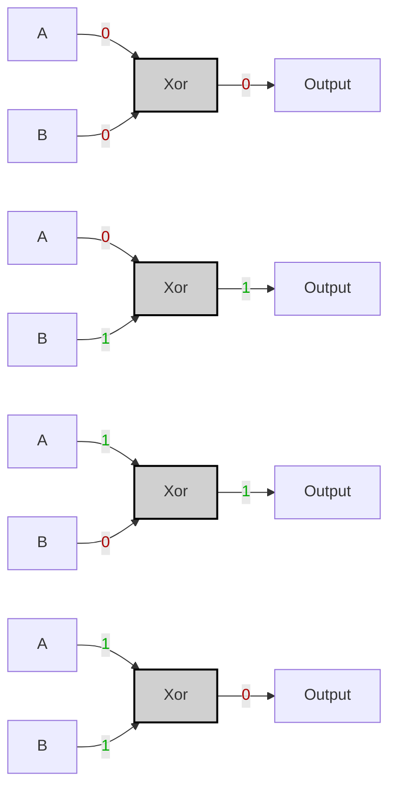
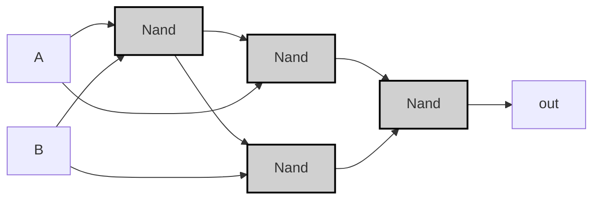

---
tags:
  - "#logic-design"
  - "#vhdl"
  - "#hardware-design"
  - "#nand-gate"
  - "#digital-electronics"
---

# Specification

|A|B|A XOR B|
|---|---|---|
|0|0|0|
|0|1|1|
|1|0|1|
|1|1|0|



---
# Implementation

>[!tip]
>$$
>A \oplus B = \left( A \uparrow (A \uparrow B) \right) \uparrow \left( B \uparrow (A \uparrow B) \right)
>$$
>Where \( \uparrow \) denotes the NAND operation.

```vhdl
CHIP Xor {
    IN a, b;
    OUT out;
PARTS:
    Nand(a=a, b=b, out=nand1);
    Nand(a=a, b=nand1, out=nand2);
    Nand(a=b, b=nand1, out=nand3);
    Nand(a=nand2, b=nand3, out=out);
}
```



> [!example]-
> ```mermaid
> graph LR;
>     A0["A"] -->|<span style="color:#a00">0</span>| Nand1_0;
>     B0["B"] -->|<span style="color:#a00">0</span>| Nand1_0;
>     Nand1_0["Nand"]:::gate -->|<span style="color:#0a0">1</span>| Nand2_0["Nand"]:::gate;
>     A0 -->|<span style="color:#a00">0</span>| Nand2_0;
>     Nand1_0 -->|<span style="color:#0a0">1</span>| Nand3_0["Nand"]:::gate;
>     B0 -->|<span style="color:#a00">0</span>| Nand3_0;
>     Nand2_0 -->|<span style="color:#0a0">1</span>| Nand4_0["Nand"]:::gate;
>     Nand3_0 -->|<span style="color:#0a0">1</span>| Nand4_0;
>     Nand4_0 -->|<span style="color:#a00">0</span>| OUT0["Output"];
> 
>     A1["A"] -->|<span style="color:#a00">0</span>| Nand1_1;
>     B1["B"] -->|<span style="color:#0a0">1</span>| Nand1_1;
>     Nand1_1["Nand"]:::gate -->|<span style="color:#0a0">1</span>| Nand2_1["Nand"]:::gate;
>     A1 -->|<span style="color:#a00">0</span>| Nand2_1;
>     Nand1_1 -->|<span style="color:#0a0">1</span>| Nand3_1["Nand"]:::gate;
>     B1 -->|<span style="color:#0a0">1</span>| Nand3_1;
>     Nand2_1 -->|<span style="color:#0a0">1</span>| Nand4_1["Nand"]:::gate;
>     Nand3_1 -->|<span style="color:#a00">0</span>| Nand4_1;
>     Nand4_1 -->|<span style="color:#0a0">1</span>| OUT1["Output"];
> 
>     A2["A"] -->|<span style="color:#0a0">1</span>| Nand1_2;
>     B2["B"] -->|<span style="color:#a00">0</span>| Nand1_2;
>     Nand1_2["Nand"]:::gate -->|<span style="color:#0a0">1</span>| Nand2_2["Nand"]:::gate;
>     A2 -->|<span style="color:#0a0">1</span>| Nand2_2;
>     Nand1_2 -->|<span style="color:#0a0">1</span>| Nand3_2["Nand"]:::gate;
>     B2 -->|<span style="color:#a00">0</span>| Nand3_2;
>     Nand2_2 -->|<span style="color:#a00">0</span>| Nand4_2["Nand"]:::gate;
>     Nand3_2 -->|<span style="color:#0a0">1</span>| Nand4_2;
>     Nand4_2 -->|<span style="color:#0a0">1</span>| OUT2["Output"];
> 
>     A3["A"] -->|<span style="color:#0a0">1</span>| Nand1_3;
>     B3["B"] -->|<span style="color:#0a0">1</span>| Nand1_3;
>     Nand1_3["Nand"]:::gate -->|<span style="color:#a00">0</span>| Nand2_3["Nand"]:::gate;
>     A3 -->|<span style="color:#0a0">1</span>| Nand2_3;
>     Nand1_3 -->|<span style="color:#a00">0</span>| Nand3_3["Nand"]:::gate;
>     B3 -->|<span style="color:#0a0">1</span>| Nand3_3;
>     Nand2_3 -->|<span style="color:#0a0">1</span>| Nand4_3["Nand"]:::gate;
>     Nand3_3 -->|<span style="color:#0a0">1</span>| Nand4_3;
>     Nand4_3 -->|<span style="color:#a00">0</span>| OUT3["Output"];
> 
>     classDef gate fill:#d0d0d0,stroke:#000,stroke-width:2px;
> ```