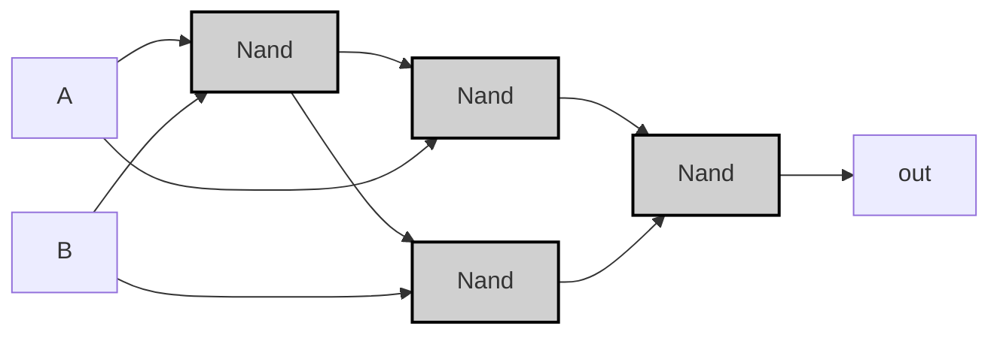
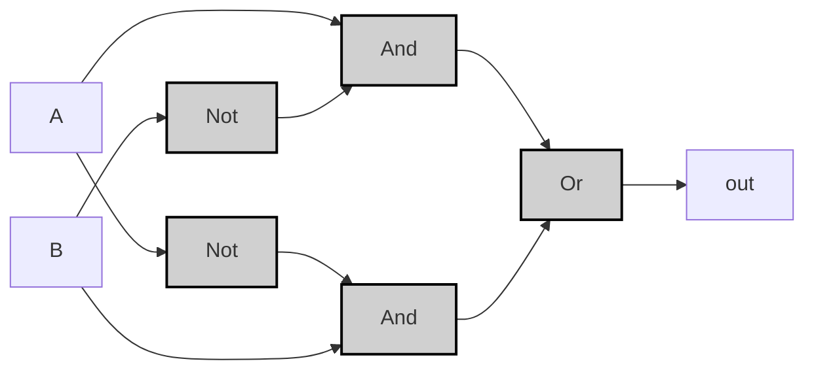

---
tags:
  - "#logic-design"
  - "#vhdl"
  - "#hardware-design"
  - "#nand-gate"
  - "#digital-electronics"
---

## Specification

|A|B|A XOR B|
|---|---|---|
|0|0|0|
|0|1|1|
|1|0|1|
|1|1|0|

>[!example]-
> ```mermaid
> graph LR;
>     A0["A"] -->|<span style="color:#a00">0</span>| Xor0;
>     B0["B"] -->|<span style="color:#a00">0</span>| Xor0;
>     Xor0["Xor"]:::gate -->|<span style="color:#a00">0</span>| OUT0["Output"];
> 
>     A1["A"] -->|<span style="color:#a00">0</span>| Xor1;
>     B1["B"] -->|<span style="color:#0a0">1</span>| Xor1;
>     Xor1["Xor"]:::gate -->|<span style="color:#0a0">1</span>| OUT1["Output"];
> 
>     A2["A"] -->|<span style="color:#0a0">1</span>| Xor2;
>     B2["B"] -->|<span style="color:#a00">0</span>| Xor2;
>     Xor2["Xor"]:::gate -->|<span style="color:#0a0">1</span>| OUT2["Output"];
> 
>     A3["A"] -->|<span style="color:#0a0">1</span>| Xor3;
>     B3["B"] -->|<span style="color:#0a0">1</span>| Xor3;
>     Xor3["Xor"]:::gate -->|<span style="color:#a00">0</span>| OUT3["Output"];
> 
>     classDef gate fill:#d0d0d0,stroke:#000,stroke-width:2px;
> ```

---
## Implementation

>[!tip]
> 
> $$A \text{ XOR } B $$
> According to Truth Table, 
> $$= (\neg A \land B)\lor(A \land \neg B)$$
>

###  And/Or/Not Version
###  Nand Version


```vhdl
CHIP Xor {
    IN a, b;
    OUT out;
PARTS:
    Nand(a=a, b=b, out=nand1);
    Nand(a=a, b=nand1, out=nand2);
    Nand(a=b, b=nand1, out=nand3);
    Nand(a=nand2, b=nand3, out=out);
}
```



> [!example]-
> ```mermaid
> graph LR;
>     A0["A"] -->|<span style="color:#a00">0</span>| Nand1_0;
>     B0["B"] -->|<span style="color:#a00">0</span>| Nand1_0;
>     Nand1_0["Nand"]:::gate -->|<span style="color:#0a0">1</span>| Nand2_0["Nand"]:::gate;
>     A0 -->|<span style="color:#a00">0</span>| Nand2_0;
>     Nand1_0 -->|<span style="color:#0a0">1</span>| Nand3_0["Nand"]:::gate;
>     B0 -->|<span style="color:#a00">0</span>| Nand3_0;
>     Nand2_0 -->|<span style="color:#0a0">1</span>| Nand4_0["Nand"]:::gate;
>     Nand3_0 -->|<span style="color:#0a0">1</span>| Nand4_0;
>     Nand4_0 -->|<span style="color:#a00">0</span>| OUT0["Output"];
> 
>     A1["A"] -->|<span style="color:#a00">0</span>| Nand1_1;
>     B1["B"] -->|<span style="color:#0a0">1</span>| Nand1_1;
>     Nand1_1["Nand"]:::gate -->|<span style="color:#0a0">1</span>| Nand2_1["Nand"]:::gate;
>     A1 -->|<span style="color:#a00">0</span>| Nand2_1;
>     Nand1_1 -->|<span style="color:#0a0">1</span>| Nand3_1["Nand"]:::gate;
>     B1 -->|<span style="color:#0a0">1</span>| Nand3_1;
>     Nand2_1 -->|<span style="color:#0a0">1</span>| Nand4_1["Nand"]:::gate;
>     Nand3_1 -->|<span style="color:#a00">0</span>| Nand4_1;
>     Nand4_1 -->|<span style="color:#0a0">1</span>| OUT1["Output"];
> 
>     A2["A"] -->|<span style="color:#0a0">1</span>| Nand1_2;
>     B2["B"] -->|<span style="color:#a00">0</span>| Nand1_2;
>     Nand1_2["Nand"]:::gate -->|<span style="color:#0a0">1</span>| Nand2_2["Nand"]:::gate;
>     A2 -->|<span style="color:#0a0">1</span>| Nand2_2;
>     Nand1_2 -->|<span style="color:#0a0">1</span>| Nand3_2["Nand"]:::gate;
>     B2 -->|<span style="color:#a00">0</span>| Nand3_2;
>     Nand2_2 -->|<span style="color:#a00">0</span>| Nand4_2["Nand"]:::gate;
>     Nand3_2 -->|<span style="color:#0a0">1</span>| Nand4_2;
>     Nand4_2 -->|<span style="color:#0a0">1</span>| OUT2["Output"];
> 
>     A3["A"] -->|<span style="color:#0a0">1</span>| Nand1_3;
>     B3["B"] -->|<span style="color:#0a0">1</span>| Nand1_3;
>     Nand1_3["Nand"]:::gate -->|<span style="color:#a00">0</span>| Nand2_3["Nand"]:::gate;
>     A3 -->|<span style="color:#0a0">1</span>| Nand2_3;
>     Nand1_3 -->|<span style="color:#a00">0</span>| Nand3_3["Nand"]:::gate;
>     B3 -->|<span style="color:#0a0">1</span>| Nand3_3;
>     Nand2_3 -->|<span style="color:#0a0">1</span>| Nand4_3["Nand"]:::gate;
>     Nand3_3 -->|<span style="color:#0a0">1</span>| Nand4_3;
>     Nand4_3 -->|<span style="color:#a00">0</span>| OUT3["Output"];
> 
>     classDef gate fill:#d0d0d0,stroke:#000,stroke-width:2px;
> ```


# Implementation (And/Or/Not Version)

>[!tip]
>$$
>A \oplus B = (A \land \neg B) \lor (\neg A \land B)
>$$

```vhdl
CHIP Xor {
    IN a, b;
    OUT out;
PARTS:
    Not(in=a, out=notA);
    Not(in=b, out=notB);
    And(a=a, b=notB, out=and1);
    And(a=notA, b=b, out=and2);
    Or(a=and1, b=and2, out=out);
}
```



> [!example]-
> ```mermaid
> graph LR
>     %% A=0, B=0
>     subgraph Case1[A=0, B=0]
>     A0["A"] -->|<span style="color:#a00">0</span>| NotA0["Not"]:::gate
>     B0["B"] -->|<span style="color:#a00">0</span>| NotB0["Not"]:::gate
>     NotA0 -->|<span style="color:#0a0">1</span>| And20["And"]:::gate
>     NotB0 -->|<span style="color:#0a0">1</span>| And10["And"]:::gate
>     A0 --> And10
>     B0 --> And20
>     And10 -->|<span style="color:#a00">0</span>| Or0["Or"]:::gate
>     And20 -->|<span style="color:#a00">0</span>| Or0
>     Or0 -->|<span style="color:#a00">0</span>| OUT0["Output"]
>     end
> 
>     %% A=0, B=1
>     subgraph Case2[A=0, B=1]
>     A1["A"] -->|<span style="color:#a00">0</span>| NotA1["Not"]:::gate
>     B1["B"] -->|<span style="color:#0a0">1</span>| NotB1["Not"]:::gate
>     NotA1 -->|<span style="color:#0a0">1</span>| And21["And"]:::gate
>     NotB1 -->|<span style="color:#a00">0</span>| And11["And"]:::gate
>     A1 --> And11
>     B1 --> And21
>     And11 -->|<span style="color:#a00">0</span>| Or1["Or"]:::gate
>     And21 -->|<span style="color:#0a0">1</span>| Or1
>     Or1 -->|<span style="color:#0a0">1</span>| OUT1["Output"]
>     end
> 
>     %% A=1, B=0
>     subgraph Case3[A=1, B=0]
>     A2["A"] -->|<span style="color:#0a0">1</span>| NotA2["Not"]:::gate
>     B2["B"] -->|<span style="color:#a00">0</span>| NotB2["Not"]:::gate
>     NotA2 -->|<span style="color:#a00">0</span>| And22["And"]:::gate
>     NotB2 -->|<span style="color:#0a0">1</span>| And12["And"]:::gate
>     A2 --> And12
>     B2 --> And22
>     And12 -->|<span style="color:#0a0">1</span>| Or2["Or"]:::gate
>     And22 -->|<span style="color:#a00">0</span>| Or2
>     Or2 -->|<span style="color:#0a0">1</span>| OUT2["Output"]
>     end
> 
>     %% A=1, B=1
>     subgraph Case4[A=1, B=1]
>     A3["A"] -->|<span style="color:#0a0">1</span>| NotA3["Not"]:::gate
>     B3["B"] -->|<span style="color:#0a0">1</span>| NotB3["Not"]:::gate
>     NotA3 -->|<span style="color:#a00">0</span>| And23["And"]:::gate
>     NotB3 -->|<span style="color:#a00">0</span>| And13["And"]:::gate
>     A3 --> And13
>     B3 --> And23
>     And13 -->|<span style="color:#a00">0</span>| Or3["Or"]:::gate
>     And23 -->|<span style="color:#a00">0</span>| Or3
>     Or3 -->|<span style="color:#a00">0</span>| OUT3["Output"]
>     end
> 
>     classDef gate fill:#d0d0d0,stroke:#000,stroke-width:2px;
> ```