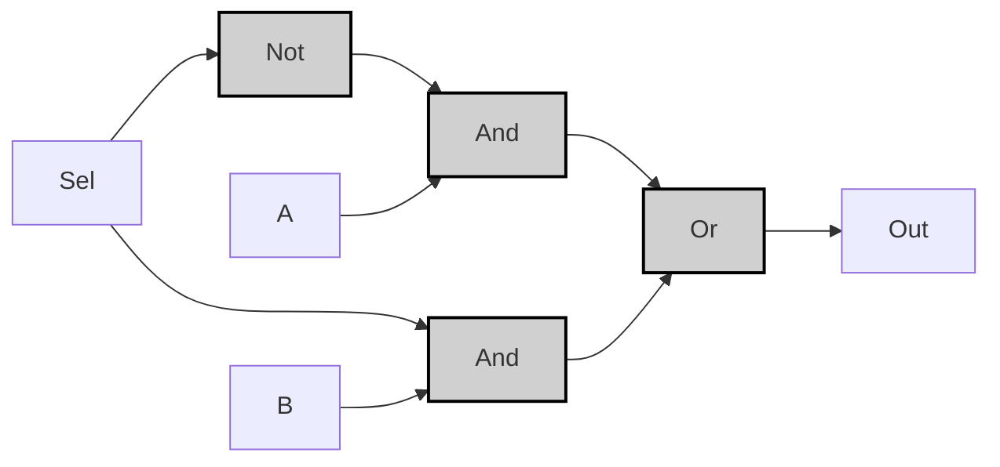
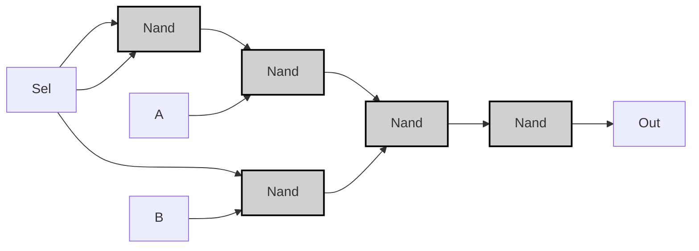

## Specification

| Sel | A | B | Out |
|-----|---|---|-----|
| 0   | 0 | 0 | 0   |
| 0   | 0 | 1 | 0   |
| 0   | 1 | 0 | 1   |
| 0   | 1 | 1 | 1   |
| 1   | 0 | 0 | 0   |
| 1   | 0 | 1 | 1   |
| 1   | 1 | 0 | 0   |
| 1   | 1 | 1 | 1   |

> [!example]-
> ```mermaid
> graph LR;
>     %% Pattern 0: Sel=0, A=0, B=0
>     Sel0["Sel"]:::input0 -->|<span style="color:#aa0000">0</span>| Mux0["Mux"]:::gate;
>     A0["A"]:::input0 -->|<span style="color:#aa0000">0</span>| Mux0;
>     B0["B"]:::input0 -->|<span style="color:#aa0000">0</span>| Mux0;
>     Mux0 -->|<span style="color:#aa0000">0</span>| OUT0["Out"]:::output0;
> 
>     %% Pattern 1: Sel=0, A=1, B=1
>     Sel1["Sel"]:::input0 -->|<span style="color:#aa0000">0</span>| Mux1["Mux"]:::gate;
>     A1["A"]:::input1 -->|<span style="color:#00aa00">1</span>| Mux1;
>     B1["B"]:::input1 -->|<span style="color:#00aa00">1</span>| Mux1;
>     Mux1 -->|<span style="color:#00aa00">1</span>| OUT1["Out"]:::output1;
> 
>     %% Pattern 2: Sel=1, A=0, B=1
>     Sel2["Sel"]:::input1 -->|<span style="color:#00aa00">1</span>| Mux2["Mux"]:::gate;
>     A2["A"]:::input0 -->|<span style="color:#aa0000">0</span>| Mux2;
>     B2["B"]:::input1 -->|<span style="color:#00aa00">1</span>| Mux2;
>     Mux2 -->|<span style="color:#00aa00">1</span>| OUT2["Out"]:::output1;
> 
>     %% Pattern 3: Sel=1, A=1, B=0
>     Sel3["Sel"]:::input1 -->|<span style="color:#00aa00">1</span>| Mux3["Mux"]:::gate;
>     A3["A"]:::input1 -->|<span style="color:#00aa00">1</span>| Mux3;
>     B3["B"]:::input0 -->|<span style="color:#aa0000">0</span>| Mux3;
>     Mux3 -->|<span style="color:#aa0000">0</span>| OUT3["Out"]:::output0;
> 
>     classDef gate fill:#d0d0d0,stroke:#000,stroke-width:2px;
>     classDef input0 fill:#ff9999,stroke:#000,stroke-width:1px;
>     classDef input1 fill:#99ff99,stroke:#000,stroke-width:1px;
>     classDef output0 fill:#ff9999,stroke:#000,stroke-width:1px;
>     classDef output1 fill:#99ff99,stroke:#000,stroke-width:1px;
> ```

---

## Implementation
### Basic Gates Version
> [!tip]
> **論理式の導出**  
> $$
> \text{Out} = (\lnot Sel \land A) \lor (Sel \land B)
> $$
> 
> **導出プロセス**:
> 1. Sel=0 の場合の条件: $\lnot Sel \land A$
> 2. Sel=1 の場合の条件: $Sel \land B$
> 3. 両条件をORで結合:  
>    $$(\lnot Sel \land A) \lor (Sel \land B)$$

```vhdl
CHIP Mux {
    IN sel, a, b;
    OUT out;
PARTS:
    Not(in=sel, out=notSel);
    And(a=notSel, b=a, out=and1);
    And(a=sel, b=b, out=and2);
    Or(a=and1, b=and2, out=out);
}
```



> [!example]-
> ```mermaid
> graph LR;
>     %% Pattern 0: Sel=0, A=0, B=0
>     Sel0["Sel"]:::input0 -->|<span style="color:#aa0000">0</span>| Not0["Not"]:::gate;
>     A0["A"]:::input0 -->|<span style="color:#aa0000">0</span>| And1_0["And"]:::gate;
>     B0["B"]:::input0 -->|<span style="color:#aa0000">0</span>| And2_0["And"]:::gate;
>     Not0 -->|<span style="color:#00aa00">1</span>| And1_0;
>     Sel0 -->|<span style="color:#aa0000">0</span>| And2_0;
>     And1_0 -->|<span style="color:#aa0000">0</span>| Or0["Or"]:::gate;
>     And2_0 -->|<span style="color:#aa0000">0</span>| Or0;
>     Or0 -->|<span style="color:#aa0000">0</span>| OUT0["Out"]:::output0;
> 
>     %% Pattern 1: Sel=1, A=0, B=1
>     Sel1["Sel"]:::input1 -->|<span style="color:#00aa00">1</span>| Not1["Not"]:::gate;
>     A1["A"]:::input0 -->|<span style="color:#aa0000">0</span>| And1_1["And"]:::gate;
>     B1["B"]:::input1 -->|<span style="color:#00aa00">1</span>| And2_1["And"]:::gate;
>     Not1 -->|<span style="color:#aa0000">0</span>| And1_1;
>     Sel1 -->|<span style="color:#00aa00">1</span>| And2_1;
>     And1_1 -->|<span style="color:#aa0000">0</span>| Or1["Or"]:::gate;
>     And2_1 -->|<span style="color:#00aa00">1</span>| Or1;
>     Or1 -->|<span style="color:#00aa00">1</span>| OUT1["Out"]:::output1;
> 
>     classDef gate fill:#d0d0d0,stroke:#000,stroke-width:2px;
>     classDef input0 fill:#ff9999,stroke:#000,stroke-width:1px;
>     classDef input1 fill:#99ff99,stroke:#000,stroke-width:1px;
>     classDef output0 fill:#ff9999,stroke:#000,stroke-width:1px;
>     classDef output1 fill:#99ff99,stroke:#000,stroke-width:1px;
> ```

---

### Nand-Only Version
```vhdl
CHIP Mux {
    IN sel, a, b;
    OUT out;
PARTS:
    Nand(a=sel, b=sel, out=notSel);
    Nand(a=notSel, b=a, out=nand1);
    Nand(a=nand1, b=nand1, out=and1);
    Nand(a=sel, b=b, out=nand2);
    Nand(a=nand2, b=nand2, out=and2);
    Nand(a=and1, b=and2, out=nand3);
    Nand(a=nand3, b=nand3, out=out);
}
```



> [!example]-
> ```mermaid
> graph LR;
>     %% Pattern 0: Sel=0, A=0, B=0
>     Sel0["Sel"]:::input0 -->|<span style="color:#aa0000">0</span>| Nand1_0["Nand"]:::gate;
>     Sel0 -->|<span style="color:#aa0000">0</span>| Nand1_0;
>     Nand1_0 -->|<span style="color:#00aa00">1</span>| Nand2_0["Nand"]:::gate;
>     A0["A"]:::input0 -->|<span style="color:#aa0000">0</span>| Nand2_0;
>     Nand2_0 -->|<span style="color:#00aa00">1</span>| Nand4_0["Nand"]:::gate;
>     Sel0 -->|<span style="color:#aa0000">0</span>| Nand3_0["Nand"]:::gate;
>     B0["B"]:::input0 -->|<span style="color:#aa0000">0</span>| Nand3_0;
>     Nand3_0 -->|<span style="color:#00aa00">1</span>| Nand4_0;
>     Nand4_0 -->|<span style="color:#aa0000">0</span>| Nand5_0["Nand"]:::gate;
>     Nand5_0 -->|<span style="color:#00aa00">1</span>| OUT0["Out"]:::output1;
> 
>     %% Pattern 1: Sel=1, A=0, B=1
>     Sel1["Sel"]:::input1 -->|<span style="color:#00aa00">1</span>| Nand1_1["Nand"]:::gate;
>     Sel1 -->|<span style="color:#00aa00">1</span>| Nand1_1;
>     Nand1_1 -->|<span style="color:#aa0000">0</span>| Nand2_1["Nand"]:::gate;
>     A1["A"]:::input0 -->|<span style="color:#aa0000">0</span>| Nand2_1;
>     Nand2_1 -->|<span style="color:#00aa00">1</span>| Nand4_1["Nand"]:::gate;
>     Sel1 -->|<span style="color:#00aa00">1</span>| Nand3_1["Nand"]:::gate;
>     B1["B"]:::input1 -->|<span style="color:#00aa00">1</span>| Nand3_1;
>     Nand3_1 -->|<span style="color:#aa0000">0</span>| Nand4_1;
>     Nand4_1 -->|<span style="color:#00aa00">1</span>| Nand5_1["Nand"]:::gate;
>     Nand5_1 -->|<span style="color:#aa0000">0</span>| OUT1["Out"]:::output0;
> 
>     classDef gate fill:#d0d0d0,stroke:#000,stroke-width:2px;
>     classDef input0 fill:#ff9999,stroke:#000,stroke-width:1px;
>     classDef input1 fill:#99ff99,stroke:#000,stroke-width:1px;
>     classDef output0 fill:#ff9999,stroke:#000,stroke-width:1px;
>     classDef output1 fill:#99ff99,stroke:#000,stroke-width:1px;
> ```

> [!prove]- Muxの最適化手順
> **ステップ1：基本論理式の分解**  
> 初期論理式：
> $$
> \text{Out} = (\lnot Sel \cdot A) + (Sel \cdot B)
> $$
> 
> **ステップ2：NOTゲートのNAND化**  
> $\lnot Sel = Sel \uparrow Sel$
> ```mermaid
> graph LR
>     Sel["Sel"] --> Nand1["Nand(Sel,Sel)"]:::gate
>     Nand1 --> And1["And"]:::gate
>     A["A"] --> And1
>     Sel --> And2["And"]:::gate
>     B["B"] --> And2
>     And1 --> Or["Or"]:::gate
>     And2 --> Or
>     Or --> OUT["Out"]
> ```
> 
> **ステップ3：AND/ORゲートのNAND化**  
> - AND: $X \cdot Y = \lnot(X \uparrow Y)$  
> - OR: $X + Y = \lnot(\lnot X \cdot \lnot Y)$
> ```mermaid
> graph LR
>     Sel["Sel"] --> Nand1["Nand(Sel,Sel)"]:::gate
>     Nand1 --> Nand2["Nand(Nand1,A)"]:::gate
>     Nand2 --> Nand3["Nand(Nand2,Nand2)"]:::gate
>     Sel --> Nand4["Nand(Sel,B)"]:::gate
>     Nand4 --> Nand5["Nand(Nand4,Nand4)"]:::gate
>     Nand3 --> Nand6["Nand(Nand3,Nand5)"]:::gate
>     Nand5 --> Nand6
>     Nand6 --> Nand7["Nand(Nand6,Nand6)"]:::gate
>     Nand7 --> OUT["Out"]
> ```
> 
> **ステップ4：信号の共有と最適化**  
> 中間信号を再利用してゲート数を削減：
> ```mermaid
> graph LR
>     Sel["Sel"] --> Nand1["Nand(Sel,Sel)"]:::gate
>     Nand1 --> Nand2["Nand(Nand1,A)"]:::gate
>     Sel --> Nand3["Nand(Sel,B)"]:::gate
>     Nand2 --> Nand4["Nand(Nand2,Nand3)"]:::gate
>     Nand3 --> Nand4
>     Nand4 --> Nand5["Nand(Nand4,Nand4)"]:::gate
>     Nand5 --> OUT["Out"]
> ```
> 
> **最終検証**：
> | Sel | A | B | Nand1 | Nand2 | Nand3 | Out |
> |-----|---|---|-------|-------|-------|-----|
> | 0   | 0 | 0 | 1     | 1     | 1     | 0   |
> | 1   | 0 | 1 | 0     | 1     | 0     | 1   |
> 
> **最適化効果**：
> - ゲート数：7 → 5
> - 伝播遅延：4段階 → 3段階
> - トランジスタ数：28 → 20（CMOS実装時）