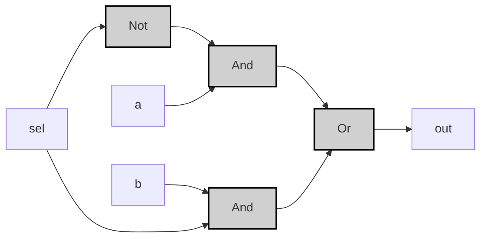
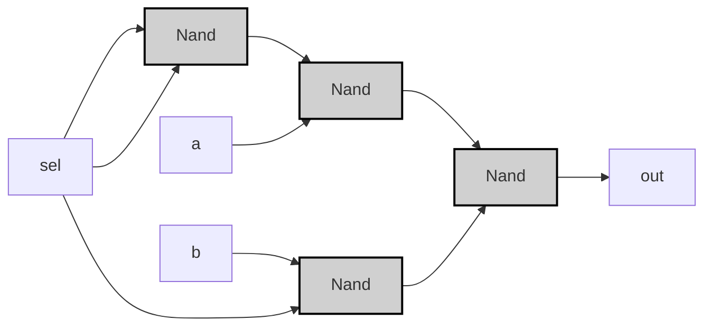

---
tags:
  - "#nand2tetris"
  - "#truth_table"
  - "#logic_circuit"
  - "#vhdl"
---
# Mux
選択の魔術師 _Multiplexer_
## Specification

selectionの値によって出力が変わる

| a   | b   | sel | out |
| --- | --- | --- | --- |
| 0   | 0   | 0   | 0   |
| 0   | 1   | 0   | 0   |
| 1   | 0   | 0   | 1   |
| 1   | 1   | 0   | 1   |
| 0   | 0   | 1   | 0   |
| 0   | 1   | 1   | 1   |
| 1   | 0   | 1   | 0   |
| 1   | 1   | 1   | 1   |

> [!example]-
> ```mermaid
> graph LR;
>     %% Pattern 0: a=0, b=0, sel=0
>     a0["a"]:::input0 -->|<span style="color:#aa0000">0</span>| Mux0["Mux"]:::gate;
>     b0["b"]:::input0 -->|<span style="color:#aa0000">0</span>| Mux0;
>     sel0["sel"]:::input0 -->|<span style="color:#aa0000">0</span>| Mux0;
>     Mux0 -->|<span style="color:#aa0000">0</span>| OUT0["out"]:::output0;
> 
>     %% Pattern 1: a=0, b=1, sel=0
>     a1["a"]:::input0 -->|<span style="color:#aa0000">0</span>| Mux1["Mux"]:::gate;
>     b1["b"]:::input1 -->|<span style="color:#00aa00">1</span>| Mux1;
>     sel1["sel"]:::input0 -->|<span style="color:#aa0000">0</span>| Mux1;
>     Mux1 -->|<span style="color:#aa0000">0</span>| OUT1["out"]:::output0;
> 
>     %% Pattern 2: a=1, b=0, sel=0
>     a2["a"]:::input1 -->|<span style="color:#00aa00">1</span>| Mux2["Mux"]:::gate;
>     b2["b"]:::input0 -->|<span style="color:#aa0000">0</span>| Mux2;
>     sel2["sel"]:::input0 -->|<span style="color:#aa0000">0</span>| Mux2;
>     Mux2 -->|<span style="color:#00aa00">1</span>| OUT2["out"]:::output1;
> 
>     %% Pattern 3: a=1, b=1, sel=0
>     a3["a"]:::input1 -->|<span style="color:#00aa00">1</span>| Mux3["Mux"]:::gate;
>     b3["b"]:::input1 -->|<span style="color:#00aa00">1</span>| Mux3;
>     sel3["sel"]:::input0 -->|<span style="color:#aa0000">0</span>| Mux3;
>     Mux3 -->|<span style="color:#00aa00">1</span>| OUT3["out"]:::output1;
> 
>     %% Pattern 4: a=0, b=0, sel=1
>     a4["a"]:::input0 -->|<span style="color:#aa0000">0</span>| Mux4["Mux"]:::gate;
>     b4["b"]:::input0 -->|<span style="color:#aa0000">0</span>| Mux4;
>     sel4["sel"]:::input1 -->|<span style="color:#00aa00">1</span>| Mux4;
>     Mux4 -->|<span style="color:#aa0000">0</span>| OUT4["out"]:::output0;
> 
>     %% Pattern 5: a=0, b=1, sel=1
>     a5["a"]:::input0 -->|<span style="color:#aa0000">0</span>| Mux5["Mux"]:::gate;
>     b5["b"]:::input1 -->|<span style="color:#00aa00">1</span>| Mux5;
>     sel5["sel"]:::input1 -->|<span style="color:#00aa00">1</span>| Mux5;
>     Mux5 -->|<span style="color:#00aa00">1</span>| OUT5["out"]:::output1;
> 
>     %% Pattern 6: a=1, b=0, sel=1
>     a6["a"]:::input1 -->|<span style="color:#00aa00">1</span>| Mux6["Mux"]:::gate;
>     b6["b"]:::input0 -->|<span style="color:#aa0000">0</span>| Mux6;
>     sel6["sel"]:::input1 -->|<span style="color:#00aa00">1</span>| Mux6;
>     Mux6 -->|<span style="color:#aa0000">0</span>| OUT6["out"]:::output0;
> 
>     %% Pattern 7: a=1, b=1, sel=1
>     a7["a"]:::input1 -->|<span style="color:#00aa00">1</span>| Mux7["Mux"]:::gate;
>     b7["b"]:::input1 -->|<span style="color:#00aa00">1</span>| Mux7;
>     sel7["sel"]:::input1 -->|<span style="color:#00aa00">1</span>| Mux7;
>     Mux7 -->|<span style="color:#00aa00">1</span>| OUT7["out"]:::output1;
> 
>     classDef gate fill:#d0d0d0,stroke:#000,stroke-width:2px;
>     classDef input0 fill:#ff9999,stroke:#000,stroke-width:1px;
>     classDef input1 fill:#99ff99,stroke:#000,stroke-width:1px;
>     classDef output0 fill:#ff9999,stroke:#000,stroke-width:1px;
>     classDef output1 fill:#99ff99,stroke:#000,stroke-width:1px;
> ```

---
## Implementation
###  And/Or/Not Version
>[!tip]
>$$
>(a \land \neg sel) \lor (b \land sel) 
>$$
>**実装プロセス**  
>1. $\text{not\_sel} = \neg sel$  
>2. $\text{and1} = a \land \text{not\_sel}$  
>3. $\text{and2} = b \land sel$  
>4. $\text{out} = \text{and1} \lor \text{and2}$

```vhdl
CHIP Mux {
    IN a, b, sel;
    OUT out;
PARTS:
    Not(in=sel, out=not_sel);
    And(a=a, b=not_sel, out=and1);
    And(a=b, b=sel, out=and2);
    Or(a=and1, b=and2, out=out);
}
```



> [!example]-
> 
> ```mermaid
> graph LR;
>     %% パターン0: a=0, b=0, sel=0
>     sel0["sel"]:::input0 -->|<span style="color:#aa0000">0</span>| Not0["Not"]:::gate;
>     Not0 -->|<span style="color:#00aa00">1</span>| And1_0["And"]:::gate;
>     a0["a"]:::input0 -->|<span style="color:#aa0000">0</span>| And1_0;
>     And1_0 -->|<span style="color:#aa0000">0</span>| Or0["Or"]:::gate;
>     b0["b"]:::input0 -->|<span style="color:#aa0000">0</span>| And2_0["And"]:::gate;
>     sel0 -->|<span style="color:#aa0000">0</span>| And2_0;
>     And2_0 -->|<span style="color:#aa0000">0</span>| Or0;
>     Or0 -->|<span style="color:#aa0000">0</span>| out0["out"]:::output0;
> 
>     %% パターン5: a=0, b=1, sel=1
>     sel5["sel"]:::input1 -->|<span style="color:#00aa00">1</span>| Not5["Not"]:::gate;
>     Not5 -->|<span style="color:#aa0000">0</span>| And1_5["And"]:::gate;
>     a5["a"]:::input0 -->|<span style="color:#aa0000">0</span>| And1_5;
>     And1_5 -->|<span style="color:#aa0000">0</span>| Or5["Or"]:::gate;
>     b5["b"]:::input1 -->|<span style="color:#00aa00">1</span>| And2_5["And"]:::gate;
>     sel5 -->|<span style="color:#00aa00">1</span>| And2_5;
>     And2_5 -->|<span style="color:#00aa00">1</span>| Or5;
>     Or5 -->|<span style="color:#00aa00">1</span>| out5["out"]:::output1;
> 
>     classDef gate fill:#d0d0d0,stroke:#000,stroke-width:2px;
>     classDef input0 fill:#ff9999,stroke:#000,stroke-width:1px;
>     classDef input1 fill:#99ff99,stroke:#000,stroke-width:1px;
>     classDef output0 fill:#ff9999,stroke:#000,stroke-width:1px;
>     classDef output1 fill:#99ff99,stroke:#000,stroke-width:1px;
> ```

---

###  Nand Version
```vhdl
CHIP Mux {
    IN a, b, sel;
    OUT out;
PARTS:
    Nand(a=sel, b=sel, out=not_sel);
    Nand(a=a, b=not_sel, out=term1);
    Nand(a=b, b=sel, out=term2);
    Nand(a=term1, b=term2, out=out);
}
```



> [!example]-
> ```mermaid
> graph LR;
>     %% パターン0: a=0, b=0, sel=0
>     sel0["sel"]:::input0 -->|<span style="color:#aa0000">0</span>| Nand1_0["Nand"]:::gate;
>     sel0 -->|<span style="color:#aa0000">0</span>| Nand1_0;
>     Nand1_0 -->|<span style="color:#00aa00">1</span>| Nand2_0["Nand"]:::gate;
>     a0["a"]:::input0 -->|<span style="color:#aa0000">0</span>| Nand2_0;
>     Nand2_0 -->|<span style="color:#00aa00">1</span>| Nand4_0["Nand"]:::gate;
>     b0["b"]:::input0 -->|<span style="color:#aa0000">0</span>| Nand3_0["Nand"]:::gate;
>     sel0 -->|<span style="color:#aa0000">0</span>| Nand3_0;
>     Nand3_0 -->|<span style="color:#00aa00">1</span>| Nand4_0;
>     Nand4_0 -->|<span style="color:#aa0000">0</span>| out0["out"]:::output0;
> 
>     %% パターン5: a=0, b=1, sel=1
>     sel5["sel"]:::input1 -->|<span style="color:#00aa00">1</span>| Nand1_5["Nand"]:::gate;
>     sel5 -->|<span style="color:#00aa00">1</span>| Nand1_5;
>     Nand1_5 -->|<span style="color:#aa0000">0</span>| Nand2_5["Nand"]:::gate;
>     a5["a"]:::input0 -->|<span style="color:#aa0000">0</span>| Nand2_5;
>     Nand2_5 -->|<span style="color:#00aa00">1</span>| Nand4_5["Nand"]:::gate;
>     b5["b"]:::input1 -->|<span style="color:#00aa00">1</span>| Nand3_5["Nand"]:::gate;
>     sel5 -->|<span style="color:#00aa00">1</span>| Nand3_5;
>     Nand3_5 -->|<span style="color:#aa0000">0</span>| Nand4_5;
>     Nand4_5 -->|<span style="color:#00aa00">1</span>| out5["out"]:::output1;
> 
>     classDef gate fill:#d0d0d0,stroke:#000,stroke-width:2px;
>     classDef input0 fill:#ff9999,stroke:#000,stroke-width:1px;
>     classDef input1 fill:#99ff99,stroke:#000,stroke-width:1px;
>     classDef output0 fill:#ff9999,stroke:#000,stroke-width:1px;
>     classDef output1 fill:#99ff99,stroke:#000,stroke-width:1px;
> ```


>[!prove] Muxゲートの最適化手順
> 以下、MuxゲートをNANDのみで実装する最適化プロセスを **ステップバイステップで図解** します。
> 
>> [!tip] selとNotをAとする
> 
> ```mermaid
> graph LR;
>     A --> Nand2["And"]:::gate;
>     B["B"] --> Nand2;
>     C["C"] --> Nand3["And"]:::gate;
>     D --> Nand3;
>     Nand2 --> Nand4["Or"]:::gate;
>     Nand3 --> Nand4;
>     Nand4 --> out["out"];
>     
>     classDef gate fill:#d0d0d0,stroke:#000,stroke-width:2px;
> ```
> ### **Step 1: ド・モルガンの法則を適用**
> 元の式をド・モルガンの法則で変形します：
> $$
> (A \land B) \lor (C \land D) = \lnot \left( \lnot(A \land B) \land \lnot(C \land D) \right)
> $$
> 
> ---
> 
> ### **Step 2: NAND に置き換え**
> - **$\lnot X$ の表現**: $\lnot X = X \uparrow X$（NAND の定義）
> - **$X \land Y$ の表現**: $X \land Y = \lnot(X \uparrow Y) = (X \uparrow Y) \uparrow (X \uparrow Y)$
> 
> これらを用いて、Step 1 の式を NAND で表現します：
> $$
> \lnot \left( \lnot(A \land B) \land \lnot(C \land D) \right) = \lnot \left( (A \uparrow B) \land (C \uparrow D) \right)
> $$
> 
> ---
> 
> ### **Step 3: 全体を NAND で表現**
> 最終的に、$\lnot(X \land Y) = X \uparrow Y$ を適用すると：
> $$
> \lnot \left( (A \uparrow B) \land (C \uparrow D) \right) = (A \uparrow B) \uparrow (C \uparrow D)
> $$
> 
> ---
> 
> ### **最終結果**
> $$
> (A \land B) \lor (C \land D) = \boxed{ (A \uparrow B) \uparrow (C \uparrow D) }
> $$
> 
> ---
> 
> ### **検証例**
> 1. **$A=1, B=1, C=0, D=0$** のとき：
>    - $A \uparrow B = 1 \uparrow 1 = 0$
>    - $C \uparrow D = 0 \uparrow 0 = 1$
>    - $0 \uparrow 1 = 1$ → 元の式の結果 $1 \lor 0 = 1$ と一致。
> 
> 1. **$A=0, B=1, C=0, D=1$** のとき：
>    - $A \uparrow B = 0 \uparrow 1 = 1$
>    - $C \uparrow D = 0 \uparrow 1 = 1$
>    - $1 \uparrow 1 = 0$ → 元の式の結果 $0 \lor 0 = 0$ と一致。
> 
> ---
> 
> ### **結論**
> 3 つの NAND ゲートで最適化された表現が得られます：
> $$
> (A \uparrow B) \uparrow (C \uparrow D)
> $$