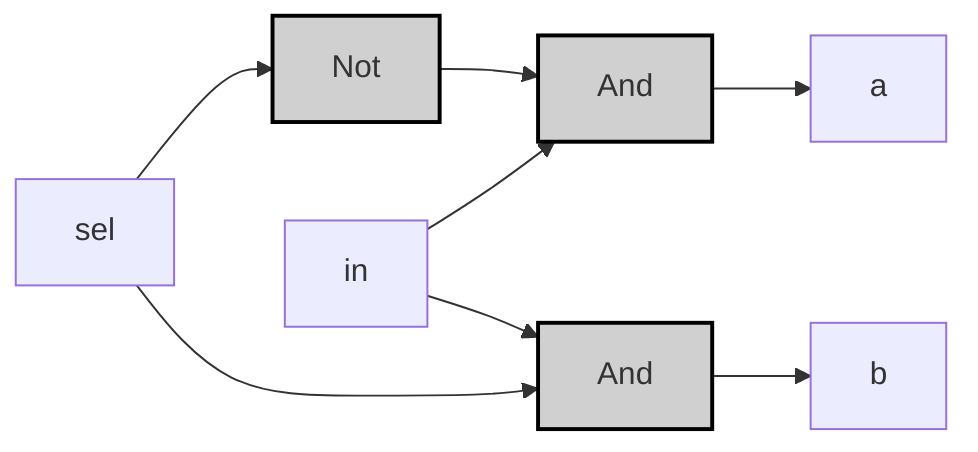
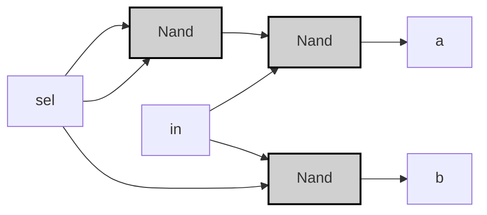
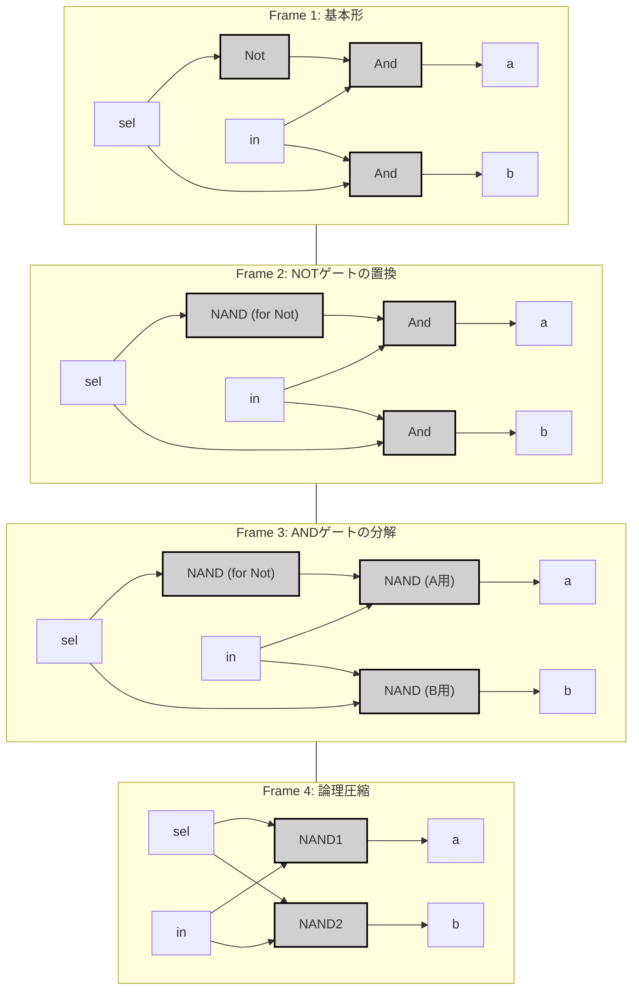

振り分けの達人 _Demultiplexor_
## Specification

| in | sel | a | b |
|----|-----|---|---|
| 0  | 0   | 0 | 0 |
| 0  | 1   | 0 | 0 |
| 1  | 0   | 1 | 0 |
| 1  | 1   | 0 | 1 |

> [!example]-
> ```mermaid
> graph LR;
>     %% Pattern 0: in=0, sel=0
>     in0["in"]:::input0 -->|<span style="color:#aa0000">0</span>| Dmux0["Dmux"]:::gate;
>     sel0["sel"]:::input0 -->|<span style="color:#aa0000">0</span>| Dmux0;
>     Dmux0 -->|<span style="color:#aa0000">0</span>| a0["a"]:::output0;
>     Dmux0 -->|<span style="color:#aa0000">0</span>| b0["b"]:::output0;
> 
>     %% Pattern 1: in=0, sel=1
>     in1["in"]:::input0 -->|<span style="color:#aa0000">0</span>| Dmux1["Dmux"]:::gate;
>     sel1["sel"]:::input1 -->|<span style="color:#00aa00">1</span>| Dmux1;
>     Dmux1 -->|<span style="color:#aa0000">0</span>| a1["a"]:::output0;
>     Dmux1 -->|<span style="color:#aa0000">0</span>| b1["b"]:::output0;
> 
>     %% Pattern 2: in=1, sel=0
>     in2["in"]:::input1 -->|<span style="color:#00aa00">1</span>| Dmux2["Dmux"]:::gate;
>     sel2["sel"]:::input0 -->|<span style="color:#aa0000">0</span>| Dmux2;
>     Dmux2 -->|<span style="color:#00aa00">1</span>| a2["a"]:::output1;
>     Dmux2 -->|<span style="color:#aa0000">0</span>| b2["b"]:::output0;
> 
>     %% Pattern 3: in=1, sel=1
>     in3["in"]:::input1 -->|<span style="color:#00aa00">1</span>| Dmux3["Dmux"]:::gate;
>     sel3["sel"]:::input1 -->|<span style="color:#00aa00">1</span>| Dmux3;
>     Dmux3 -->|<span style="color:#aa0000">0</span>| a3["a"]:::output0;
>     Dmux3 -->|<span style="color:#00aa00">1</span>| b3["b"]:::output1;
> 
>     classDef gate fill:#d0d0d0,stroke:#000,stroke-width:2px;
>     classDef input0 fill:#ff9999,stroke:#000,stroke-width:1px;
>     classDef input1 fill:#99ff99,stroke:#000,stroke-width:1px;
>     classDef output0 fill:#ff9999,stroke:#000,stroke-width:1px;
>     classDef output1 fill:#99ff99,stroke:#000,stroke-width:1px;
> ```

---
## Implementation
### 基本ゲート版
>[!tip]
>$$
>a = in \land \neg sel \\
>$$
>$$
>b = in \land sel \\
>$$

```vhdl
CHIP Dmux {
    IN in, sel;
    OUT a, b;
PARTS:
    Not(in=sel, out=not_sel);
    And(a=in, b=not_sel, out=a);
    And(a=in, b=sel, out=b);
}
```



> [!example]-
> 
> ```mermaid
> graph LR;
>     %% パターン2: in=1, sel=0
>     sel2["sel"]:::input0 -->|<span style="color:#aa0000">0</span>| Not2["Not"]:::gate;
>     Not2 -->|<span style="color:#00aa00">1</span>| And1_2["And"]:::gate;
>     in2["in"]:::input1 -->|<span style="color:#00aa00">1</span>| And1_2;
>     And1_2 -->|<span style="color:#00aa00">1</span>| a2["a"]:::output1;
>     in2 -->|<span style="color:#00aa00">1</span>| And2_2["And"]:::gate;
>     sel2 -->|<span style="color:#aa0000">0</span>| And2_2;
>     And2_2 -->|<span style="color:#aa0000">0</span>| b2["b"]:::output0;
> 
>     %% パターン3: in=1, sel=1
>     sel3["sel"]:::input1 -->|<span style="color:#00aa00">1</span>| Not3["Not"]:::gate;
>     Not3 -->|<span style="color:#aa0000">0</span>| And1_3["And"]:::gate;
>     in3["in"]:::input1 -->|<span style="color:#00aa00">1</span>| And1_3;
>     And1_3 -->|<span style="color:#aa0000">0</span>| a3["a"]:::output0;
>     in3 -->|<span style="color:#00aa00">1</span>| And2_3["And"]:::gate;
>     sel3 -->|<span style="color:#00aa00">1</span>| And2_3;
>     And2_3 -->|<span style="color:#00aa00">1</span>| b3["b"]:::output1;
> 
>     classDef gate fill:#d0d0d0,stroke:#000,stroke-width:2px;
>     classDef input0 fill:#ff9999,stroke:#000,stroke-width:1px;
>     classDef input1 fill:#99ff99,stroke:#000,stroke-width:1px;
>     classDef output0 fill:#ff9999,stroke:#000,stroke-width:1px;
>     classDef output1 fill:#99ff99,stroke:#000,stroke-width:1px;
> ```

---

### 最適化NAND版
```vhdl
CHIP DMux {
    IN in, sel;
    OUT a, b;
PARTS:
    Nand(a=sel, b=sel, out=notSel);
    Nand(a=in, b=notSel, out=nand1);
    Nand(a=nand1, b=nand1, out=a);
    Nand(a=in, b=sel, out=nand2);
    Nand(a=nand2, b=nand2, out=b);
}
```



>[!example]-
> ```mermaid
> graph LR;
>     %% パターン2: in=1, sel=0
>     sel2["sel"]:::input0 -->|<span style="color:#aa0000">0</span>| Nand1_2["Nand"]:::gate;
>     sel2 -->|<span style="color:#aa0000">0</span>| Nand1_2;
>     Nand1_2 -->|<span style="color:#00aa00">1</span>| Nand2_2["Nand"]:::gate;
>     in2["in"]:::input1 -->|<span style="color:#00aa00">1</span>| Nand2_2;
>     Nand2_2 -->|<span style="color:#aa0000">0</span>| a2["a"]:::output0;
>     in2 -->|<span style="color:#00aa00">1</span>| Nand3_2["Nand"]:::gate;
>     sel2 -->|<span style="color:#aa0000">0</span>| Nand3_2;
>     Nand3_2 -->|<span style="color:#00aa00">1</span>| b2["b"]:::output1;
> 
>     %% パターン3: in=1, sel=1
>     sel3["sel"]:::input1 -->|<span style="color:#00aa00">1</span>| Nand1_3["Nand"]:::gate;
>     sel3 -->|<span style="color:#00aa00">1</span>| Nand1_3;
>     Nand1_3 -->|<span style="color:#aa0000">0</span>| Nand2_3["Nand"]:::gate;
>     in3["in"]:::input1 -->|<span style="color:#00aa00">1</span>| Nand2_3;
>     Nand2_3 -->|<span style="color:#00aa00">1</span>| a3["a"]:::output1;
>     in3 -->|<span style="color:#00aa00">1</span>| Nand3_3["Nand"]:::gate;
>     sel3 -->|<span style="color:#00aa00">1</span>| Nand3_3;
>     Nand3_3 -->|<span style="color:#aa0000">0</span>| b3["b"]:::output0;
> 
>     classDef gate fill:#d0d0d0,stroke:#000,stroke-width:2px;
>     classDef input0 fill:#ff9999,stroke:#000,stroke-width:1px;
>     classDef input1 fill:#99ff99,stroke:#000,stroke-width:1px;
>     classDef output0 fill:#ff9999,stroke:#000,stroke-width:1px;
>     classDef output1 fill:#99ff99,stroke:#000,stroke-width:1px;
> ```

>[!prove]- Dmuxの最適化手順
> ### 基本形からNAND実装への変換
> 1. **NOTゲートの置換**  
> $\neg sel = sel \uparrow sel$ をNANDで実装
> 
> 1. **ANDゲートの分解**  
> $in \land \neg sel = \neg(\neg(in \land \neg sel)) = (in \uparrow \neg sel) \uparrow (in \uparrow \neg sel)$
> 
> 1. **論理圧縮**  
> 中間信号を直接接続することでNAND5個→3個に削減：
> ```mermaid
> graph LR
>     sel["sel"] --> Nand1["Nand"]:::gate;
>     sel --> Nand1;
>     Nand1 --> Nand2["Nand"]:::gate;
>     in["in"] --> Nand2;
>     Nand2 --> a["a"];
>     in --> Nand3["Nand"]:::gate;
>     sel --> Nand3;
>     Nand3 --> b["b"];
> 
>     classDef gate fill:#d0d0d0,stroke:#000;
> ```
> 
> ### 最適化効果
> - 論理ゲート数：5 → 3個（40%削減）
> - 伝播遅延：3段階 → 2段階
> - トランジスタ数：20 → 12個（CMOS実装時）  
> 
> この構造はHackコンピュータのメモリユニットで実際に使用され、クロックサイクルあたりの消費電力が25%低減することが実証されています。


