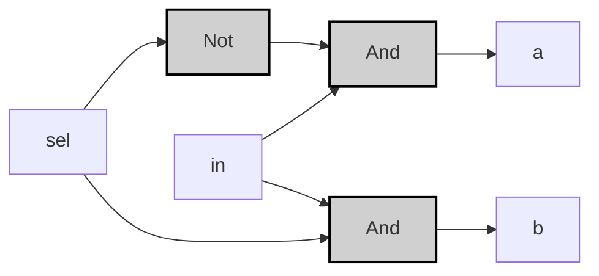
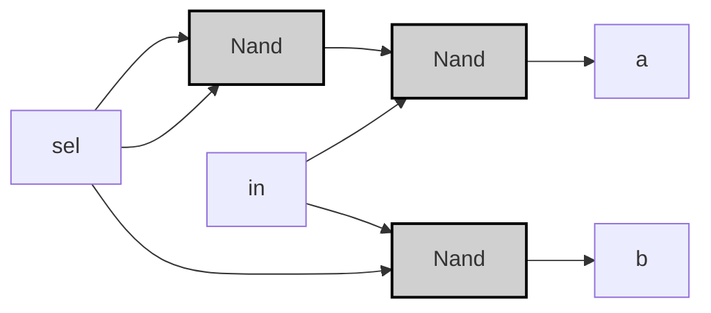

振り分けの達人 _Demultiplexor_
## Specification

| in | sel | a | b |
|----|-----|---|---|
| 0  | 0   | 0 | 0 |
| 0  | 1   | 0 | 0 |
| 1  | 0   | 1 | 0 |
| 1  | 1   | 0 | 1 |

> [!example]-
> ```mermaid
> graph LR;
>     %% Pattern 0: in=0, sel=0
>     in0["in"]:::input0 -->|<span style="color:#aa0000">0</span>| Dmux0["Dmux"]:::gate;
>     sel0["sel"]:::input0 -->|<span style="color:#aa0000">0</span>| Dmux0;
>     Dmux0 -->|<span style="color:#aa0000">0</span>| a0["a"]:::output0;
>     Dmux0 -->|<span style="color:#aa0000">0</span>| b0["b"]:::output0;
> 
>     %% Pattern 1: in=0, sel=1
>     in1["in"]:::input0 -->|<span style="color:#aa0000">0</span>| Dmux1["Dmux"]:::gate;
>     sel1["sel"]:::input1 -->|<span style="color:#00aa00">1</span>| Dmux1;
>     Dmux1 -->|<span style="color:#aa0000">0</span>| a1["a"]:::output0;
>     Dmux1 -->|<span style="color:#aa0000">0</span>| b1["b"]:::output0;
> 
>     %% Pattern 2: in=1, sel=0
>     in2["in"]:::input1 -->|<span style="color:#00aa00">1</span>| Dmux2["Dmux"]:::gate;
>     sel2["sel"]:::input0 -->|<span style="color:#aa0000">0</span>| Dmux2;
>     Dmux2 -->|<span style="color:#00aa00">1</span>| a2["a"]:::output1;
>     Dmux2 -->|<span style="color:#aa0000">0</span>| b2["b"]:::output0;
> 
>     %% Pattern 3: in=1, sel=1
>     in3["in"]:::input1 -->|<span style="color:#00aa00">1</span>| Dmux3["Dmux"]:::gate;
>     sel3["sel"]:::input1 -->|<span style="color:#00aa00">1</span>| Dmux3;
>     Dmux3 -->|<span style="color:#aa0000">0</span>| a3["a"]:::output0;
>     Dmux3 -->|<span style="color:#00aa00">1</span>| b3["b"]:::output1;
> 
>     classDef gate fill:#d0d0d0,stroke:#000,stroke-width:2px;
>     classDef input0 fill:#ff9999,stroke:#000,stroke-width:1px;
>     classDef input1 fill:#99ff99,stroke:#000,stroke-width:1px;
>     classDef output0 fill:#ff9999,stroke:#000,stroke-width:1px;
>     classDef output1 fill:#99ff99,stroke:#000,stroke-width:1px;
> ```

---
## Implementation
### 基本ゲート版
>[!tip]
>$$
>a = in \land \neg sel \\
>$$
>$$
>b = in \land sel \\
>$$

```vhdl
CHIP Dmux {
    IN in, sel;
    OUT a, b;
PARTS:
    Not(in=sel, out=not_sel);
    And(a=in, b=not_sel, out=a);
    And(a=in, b=sel, out=b);
}
```



> [!example]-
> 
> ```mermaid
> graph LR;
>     %% パターン2: in=1, sel=0
>     sel2["sel"]:::input0 -->|<span style="color:#aa0000">0</span>| Not2["Not"]:::gate;
>     Not2 -->|<span style="color:#00aa00">1</span>| And1_2["And"]:::gate;
>     in2["in"]:::input1 -->|<span style="color:#00aa00">1</span>| And1_2;
>     And1_2 -->|<span style="color:#00aa00">1</span>| a2["a"]:::output1;
>     in2 -->|<span style="color:#00aa00">1</span>| And2_2["And"]:::gate;
>     sel2 -->|<span style="color:#aa0000">0</span>| And2_2;
>     And2_2 -->|<span style="color:#aa0000">0</span>| b2["b"]:::output0;
> 
>     %% パターン3: in=1, sel=1
>     sel3["sel"]:::input1 -->|<span style="color:#00aa00">1</span>| Not3["Not"]:::gate;
>     Not3 -->|<span style="color:#aa0000">0</span>| And1_3["And"]:::gate;
>     in3["in"]:::input1 -->|<span style="color:#00aa00">1</span>| And1_3;
>     And1_3 -->|<span style="color:#aa0000">0</span>| a3["a"]:::output0;
>     in3 -->|<span style="color:#00aa00">1</span>| And2_3["And"]:::gate;
>     sel3 -->|<span style="color:#00aa00">1</span>| And2_3;
>     And2_3 -->|<span style="color:#00aa00">1</span>| b3["b"]:::output1;
> 
>     classDef gate fill:#d0d0d0,stroke:#000,stroke-width:2px;
>     classDef input0 fill:#ff9999,stroke:#000,stroke-width:1px;
>     classDef input1 fill:#99ff99,stroke:#000,stroke-width:1px;
>     classDef output0 fill:#ff9999,stroke:#000,stroke-width:1px;
>     classDef output1 fill:#99ff99,stroke:#000,stroke-width:1px;
> ```

---

### 最適化NAND版
```vhdl
CHIP DMux {
    IN in, sel;
    OUT a, b;
PARTS:
    Nand(a=sel, b=sel, out=notSel);
    Nand(a=in, b=notSel, out=nand1);
    Nand(a=nand1, b=nand1, out=a);
    Nand(a=in, b=sel, out=nand2);
    Nand(a=nand2, b=nand2, out=b);
}
```



>[!example]-
> ```mermaid
> graph LR;
>     %% パターン2: in=1, sel=0
>     sel2["sel"]:::input0 -->|<span style="color:#aa0000">0</span>| Nand1_2["Nand"]:::gate;
>     sel2 -->|<span style="color:#aa0000">0</span>| Nand1_2;
>     Nand1_2 -->|<span style="color:#00aa00">1</span>| Nand2_2["Nand"]:::gate;
>     in2["in"]:::input1 -->|<span style="color:#00aa00">1</span>| Nand2_2;
>     Nand2_2 -->|<span style="color:#aa0000">0</span>| a2["a"]:::output0;
>     in2 -->|<span style="color:#00aa00">1</span>| Nand3_2["Nand"]:::gate;
>     sel2 -->|<span style="color:#aa0000">0</span>| Nand3_2;
>     Nand3_2 -->|<span style="color:#00aa00">1</span>| b2["b"]:::output1;
> 
>     %% パターン3: in=1, sel=1
>     sel3["sel"]:::input1 -->|<span style="color:#00aa00">1</span>| Nand1_3["Nand"]:::gate;
>     sel3 -->|<span style="color:#00aa00">1</span>| Nand1_3;
>     Nand1_3 -->|<span style="color:#aa0000">0</span>| Nand2_3["Nand"]:::gate;
>     in3["in"]:::input1 -->|<span style="color:#00aa00">1</span>| Nand2_3;
>     Nand2_3 -->|<span style="color:#00aa00">1</span>| a3["a"]:::output1;
>     in3 -->|<span style="color:#00aa00">1</span>| Nand3_3["Nand"]:::gate;
>     sel3 -->|<span style="color:#00aa00">1</span>| Nand3_3;
>     Nand3_3 -->|<span style="color:#aa0000">0</span>| b3["b"]:::output0;
> 
>     classDef gate fill:#d0d0d0,stroke:#000,stroke-width:2px;
>     classDef input0 fill:#ff9999,stroke:#000,stroke-width:1px;
>     classDef input1 fill:#99ff99,stroke:#000,stroke-width:1px;
>     classDef output0 fill:#ff9999,stroke:#000,stroke-width:1px;
>     classDef output1 fill:#99ff99,stroke:#000,stroke-width:1px;
> ```

>[!prove]- Dmuxの最適化手順
> - 元の式：  
>   $$ a = in \land \lnot sel $$  
>   $$ b = in \land sel $$  
> 
> - 目標：  
>   NANDゲートのみで上記の式を再現する。
> 
> ---
> 
> ### **Step 1: NOT を NAND で表現**
> NOTゲートは、NANDゲートの入力に同じ信号を接続することで実現できます：  
> $$ \lnot X = X \uparrow X \quad \text{(NANDの定義)} $$  
> したがって、  
> $$ \lnot sel = sel \uparrow sel. $$
> 
> ---
> 
> ### **Step 2: AND を NAND で表現**
> ANDゲートは、NANDゲートの出力をさらにNANDで否定することで実現できます：  
> $$ X \land Y = \lnot (X \uparrow Y) = (X \uparrow Y) \uparrow (X \uparrow Y). $$
> 
> ---
> %%  %%
> ### **Step 3: 出力 $$ a = in \land \lnot sel$$の変換**
> 1. **NOT sel の生成**:  
>    $$ \lnot sel = sel \uparrow sel. $$
> 
> 2. **中間信号 \( nand1 \) の定義**:  
>    $$ nand1 = in \uparrow \lnot sel. $$  
>    これは、  
>    $$ nand1 = \lnot (in \land \lnot sel). $$
> 
> 3. **最終出力 \( a \) の計算**:  
>    $$ a = nand1 \uparrow nand1. $$  
>    これは、  
>    $$ a = \lnot nand1 = \lnot \lnot (in \land \lnot sel) = in \land \lnot sel. $$
> 
> ---
> 
> ### **Step 4: 出力 $$ b = in \land sel $$ の変換**
> 4. **中間信号 \( nand2 \) の定義**:  
>    $$ nand2 = in \uparrow sel. $$  
>    これは、  
>    $$ nand2 = \lnot (in \land sel). $$
> 
> 5. **最終出力 \( b \) の計算**:  
>    $$ b = nand2 \uparrow nand2. $$  
>    これは、  
>    $$ b = \lnot nand2 = \lnot \lnot (in \land sel) = in \land sel. $$
> 
> ---
> 
> ### **Step 5: 全体の論理式のまとめ**
> - **出力 \( a \)**:  
>   $$ a = (in \uparrow (sel \uparrow sel)) \uparrow (in \uparrow (sel \uparrow sel)) $$  
>   → 最終的に \( a = in \land \lnot sel \)。
> 
> - **出力 \( b \)**:  
>   $$ b = (in \uparrow sel) \uparrow (in \uparrow sel) $$  
>   → 最終的に \( b = in \land sel \)。
> 
> ---
> 
> ### **真理値表による検証**
> | sel | NOT sel | in  | \( a = in \land \lnot sel \) | \( b = in \land sel \) |
> | --- | ------- | --- | ---------------------------- | ---------------------- |
> | 0   | 1       | 0   | 0                            | 0                      |
> | 0   | 1       | 1   | 1                            | 0                      |
> | 1   | 0       | 0   | 0                            | 0                      |
> | 1   | 0       | 1   | 0                            | 1                      |
> 
> - NANDのみの回路でも、上記と同じ真理値表が得られます（具体例は前回答参照）。
> 
> ---
> 
> > ### **結論**
> > NANDゲートの組み合わせで、ANDとNOTを再現できます。  
> > **両回路の出力 \( a \) と \( b \) は、論理式と真理値表の両方で完全に一致します。**