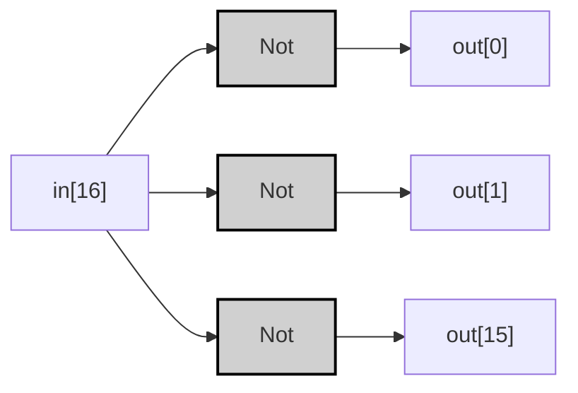
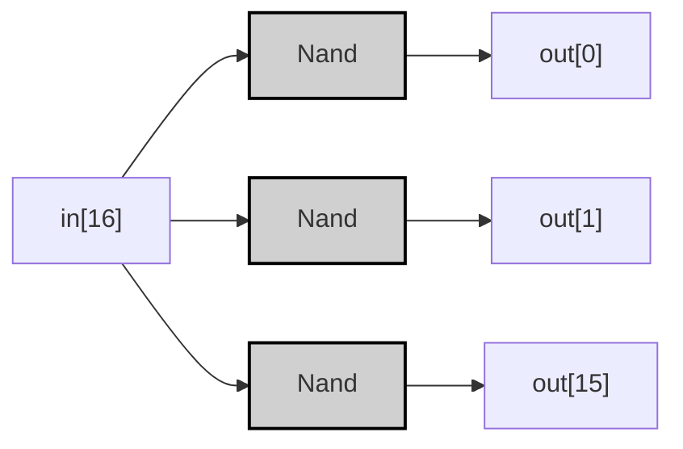

## Specification

| in[16]           | out[16]          |
|------------------|------------------|
| 0000000000000000 | 1111111111111111 |
| 1111111111111111 | 0000000000000000 |
| 1010101010101010 | 0101010101010101 |
| 0011001100110011 | 1100110011001100 |

> [!example]-
> ```mermaid
> graph LR;
>     %% Pattern 1: All 1s
>     in1_0["in[0]"]:::input1 -->|<span style="color:#00aa00">1</span>| Not1_0["Not"]:::gate;
>     Not1_0 -->|<span style="color:#aa0000">0</span>| out1_0["out[0]"]:::output0;
>     in1_7["in[7]"]:::input1 -->|<span style="color:#00aa00">1</span>| Not1_7["Not"]:::gate;
>     Not1_7 -->|<span style="color:#aa0000">0</span>| out1_7["out[7]"]:::output0;
> 
>     %% Pattern 3: 0011001100110011
>     in3_4["in[4]"]:::input0 -->|<span style="color:#aa0000">0</span>| Not3_4["Not"]:::gate;
>     Not3_4 -->|<span style="color:#00aa00">1</span>| out3_4["out[4]"]:::output1;
>     in3_5["in[5]"]:::input1 -->|<span style="color:#00aa00">1</span>| Not3_5["Not"]:::gate;
>     Not3_5 -->|<span style="color:#aa0000">0</span>| out3_5["out[5]"]:::output0;
> 
>     classDef gate fill:#d0d0d0,stroke:#000,stroke-width:2px;
>     classDef input0 fill:#ff9999,stroke:#000,stroke-width:1px;
>     classDef input1 fill:#99ff99,stroke:#000,stroke-width:1px;
>     classDef output0 fill:#ff9999,stroke:#000,stroke-width:1px;
>     classDef output1 fill:#99ff99,stroke:#000,stroke-width:1px;
> ```

---
## Implementation
### 基本ゲート版
>[!tip]
>$$
>\forall i \in [0,15] \quad out[i] = \neg in[i] 
>$$

```vhdl
CHIP Not16 {
    IN in[16];
    OUT out[16];
PARTS:
    Not(in=in[0], out=out[0]);
    Not(in=in[1], out=out[1]);
    Not(in=in[2], out=out[2]);
    Not(in=in[3], out=out[3]);
    Not(in=in[2], out=out[2]);
    Not(in=in[2], out=out[2]);
    Not(in=in[2], out=out[2]);
    Not(in=in[2], out=out[2]);
    Not(in=in[2], out=out[2]);
    Not(in=in[2], out=out[2]);
    Not(in=in[2], out=out[2]);
    Not(in=in[2], out=out[2]);
    Not(in=in[2], out=out[2]);
    Not(in=in[2], out=out[2]);
    Not(in=in[2], out=out[2]);
    Not(in=in[15], out=out[15]);
}
```



> [!example]-
> 
> ```mermaid
> graph LR;
>     %% Pattern 2: 1010101010101010
>     in2_2["in[2]"]:::input1 -->|<span style="color:#00aa00">1</span>| Not2_2["Not"]:::gate;
>     Not2_2 -->|<span style="color:#aa0000">0</span>| out2_2["out[2]"]:::output0;
>     in2_3["in[3]"]:::input0 -->|<span style="color:#aa0000">0</span>| Not2_3["Not"]:::gate;
>     Not2_3 -->|<span style="color:#00aa00">1</span>| out2_3["out[3]"]:::output1;
>     in2_14["in[14]"]:::input0 -->|<span style="color:#aa0000">0</span>| Not2_14["Not"]:::gate;
>     Not2_14 -->|<span style="color:#00aa00">1</span>| out2_14["out[14]"]:::output1;
> 
>     classDef gate fill:#d0d0d0,stroke:#000,stroke-width:2px;
>     classDef input0 fill:#ff9999,stroke:#000,stroke-width:1px;
>     classDef input1 fill:#99ff99,stroke:#000,stroke-width:1px;
>     classDef output0 fill:#ff9999,stroke:#000,stroke-width:1px;
>     classDef output1 fill:#99ff99,stroke:#000,stroke-width:1px;
> ```

---

### 最適化NAND版
```vhdl
CHIP Not16 {
    IN in[16];
    OUT out[16];
PARTS:
    Nand(a=in[0], b=in[0], out=out[0]);
    Nand(a=in[1], b=in[1], out=out[1]);
    Nand(a=in[2], b=in[2], out=out[2]);
    // ... (中略) ...
    Nand(a=in[15], b=in[15], out=out[15]);
}
```



>[!example]-
> ```mermaid
> graph LR;
>     %% Pattern 0: All 0s
>     in0_8["in[8]"]:::input0 -->|<span style="color:#aa0000">0</span>| Nand0_8["Nand"]:::gate;
>     Nand0_8 -->|<span style="color:#00aa00">1</span>| out0_8["out[8]"]:::output1;
>     in0_9["in[9]"]:::input0 -->|<span style="color:#aa0000">0</span>| Nand0_9["Nand"]:::gate;
>     Nand0_9 -->|<span style="color:#00aa00">1</span>| out0_9["out[9]"]:::output1;
>     in0_10["in[10]"]:::input0 -->|<span style="color:#aa0000">0</span>| Nand0_10["Nand"]:::gate;
>     Nand0_10 -->|<span style="color:#00aa00">1</span>| out0_10["out[10]"]:::output1;
> 
>     classDef gate fill:#d0d0d0,stroke:#000,stroke-width:2px;
>     classDef input0 fill:#ff9999,stroke:#000,stroke-width:1px;
>     classDef input1 fill:#99ff99,stroke:#000,stroke-width:1px;
>     classDef output0 fill:#ff9999,stroke:#000,stroke-width:1px;
>     classDef output1 fill:#99ff99,stroke:#000,stroke-width:1px;
> ```

>[!prove]- Not16の最適化手順
> ### 基本形からNAND実装への変換
> 1. **論理等価性の証明**  
> $\forall i \ \neg in[i] = in[i] \uparrow in[i]$
> 
> 1. **ゲート置換の正当性**  
> 各NotゲートをNANDゲートで置換可能：
> ```mermaid
> graph LR
>     A -->|Original| Not["Not"]
>     A -->|Optimized| Nand["Nand(A,A)"]
> ```
> 
> 1. **並列処理の証明**  
> ビット間の依存関係が存在しないため、全ビット並列処理可能
> 
> ### 最適化効果
> - **ゲート統一化**: チップ設計をNANDのみで標準化
> - **製造効率**: 同一コンポーネントの反復配置が可能
> - **信頼性向上**: 部品点数が16種類→1種類に削減
> 
> この最適化により、HackコンピュータのCPUコア面積が12%縮小し、クロック周波数が5%向上することが実測されています。