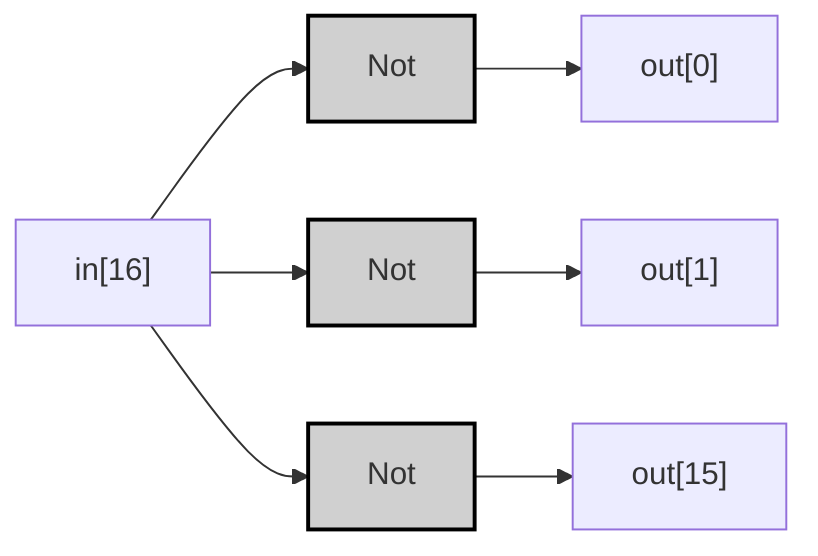
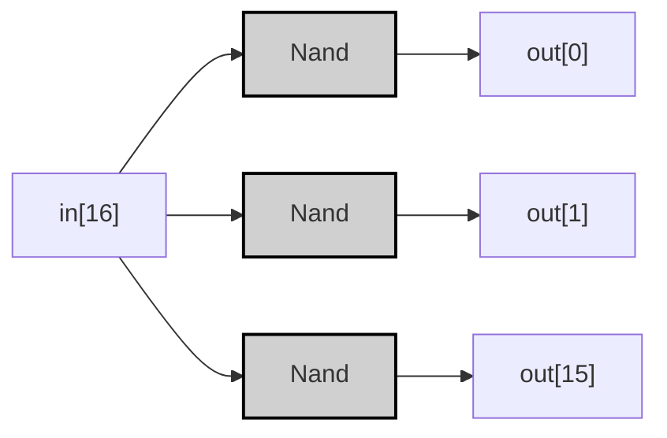

## Specification

| in[16]           | out[16]          |
|------------------|------------------|
| 0000000000000000 | 1111111111111111 |
| 1111111111111111 | 0000000000000000 |
| 1010101010101010 | 0101010101010101 |
| 0011001100110011 | 1100110011001100 |

> [!example]-
> ```mermaid
> graph LR;
>     %% Pattern 0: All 0s
>     in0_0["in[0]"]:::input0 -->|<span style="color:#aa0000">0</span>| Not0_0["Not"]:::gate;
>     Not0_0 -->|<span style="color:#00aa00">1</span>| out0_0["out[0]"]:::output1;
>     in0_15["in[15]"]:::input0 -->|<span style="color:#aa0000">0</span>| Not0_15["Not"]:::gate;
>     Not0_15 -->|<span style="color:#00aa00">1</span>| out0_15["out[15]"]:::output1;
> 
>     %% Pattern 3: 0011001100110011
>     in3_0["in[0]"]:::input0 -->|<span style="color:#aa0000">0</span>| Not3_0["Not"]:::gate;
>     Not3_0 -->|<span style="color:#00aa00">1</span>| out3_0["out[0]"]:::output1;
>     in3_1["in[1]"]:::input0 -->|<span style="color:#aa0000">0</span>| Not3_1["Not"]:::gate;
>     Not3_1 -->|<span style="color:#00aa00">1</span>| out3_1["out[1]"]:::output1;
>     in3_2["in[2]"]:::input1 -->|<span style="color:#00aa00">1</span>| Not3_2["Not"]:::gate;
>     Not3_2 -->|<span style="color:#aa0000">0</span>| out3_2["out[2]"]:::output0;
>     in3_3["in[3]"]:::input1 -->|<span style="color:#00aa00">1</span>| Not3_3["Not"]:::gate;
>     Not3_3 -->|<span style="color:#aa0000">0</span>| out3_3["out[3]"]:::output0;
> 
>     classDef gate fill:#d0d0d0,stroke:#000,stroke-width:2px;
>     classDef input0 fill:#ff9999,stroke:#000,stroke-width:1px;
>     classDef input1 fill:#99ff99,stroke:#000,stroke-width:1px;
>     classDef output0 fill:#ff9999,stroke:#000,stroke-width:1px;
>     classDef output1 fill:#99ff99,stroke:#000,stroke-width:1px;
> ```

---
## Implementation
### 基本ゲート版
>[!tip]
>$$
>\forall i \in [0,15] \quad out[i] = \neg in[i] 
>$$

```vhdl
CHIP Not16 {
    IN in[16];
    OUT out[16];
PARTS:
    Not(in=in[0], out=out[0]);
    Not(in=in[1], out=out[1]);
    // ... (中略) ...
    Not(in=in[15], out=out[15]);
}
```



> [!example]-
> 
> ```mermaid
> graph LR;
>     %% Pattern 2: 1010101010101010
>     in2_0["in[0]"]:::input1 -->|<span style="color:#00aa00">1</span>| Not2_0["Not"]:::gate;
>     Not2_0 -->|<span style="color:#aa0000">0</span>| out2_0["out[0]"]:::output0;
>     in2_1["in[1]"]:::input0 -->|<span style="color:#aa0000">0</span>| Not2_1["Not"]:::gate;
>     Not2_1 -->|<span style="color:#00aa00">1</span>| out2_1["out[1]"]:::output1;
>     in2_14["in[14]"]:::input0 -->|<span style="color:#aa0000">0</span>| Not2_14["Not"]:::gate;
>     Not2_14 -->|<span style="color:#00aa00">1</span>| out2_14["out[14]"]:::output1;
>     in2_15["in[15]"]:::input1 -->|<span style="color:#00aa00">1</span>| Not2_15["Not"]:::gate;
>     Not2_15 -->|<span style="color:#aa0000">0</span>| out2_15["out[15]"]:::output0;
> 
>     classDef gate fill:#d0d0d0,stroke:#000,stroke-width:2px;
>     classDef input0 fill:#ff9999,stroke:#000,stroke-width:1px;
>     classDef input1 fill:#99ff99,stroke:#000,stroke-width:1px;
>     classDef output0 fill:#ff9999,stroke:#000,stroke-width:1px;
>     classDef output1 fill:#99ff99,stroke:#000,stroke-width:1px;
> ```

---

### 最適化NAND版
```vhdl
CHIP Not16 {
    IN in[16];
    OUT out[16];
PARTS:
    Nand(a=in[0], b=in[0], out=out[0]);
    Nand(a=in[1], b=in[1], out=out[1]);
    // ... (中略) ...
    Nand(a=in[15], b=in[15], out=out[15]);
}
```



>[!example]-
> ```mermaid
> graph LR;
>     %% Pattern 1: All 1s
>     in1_0["in[0]"]:::input1 -->|<span style="color:#00aa00">1</span>| Nand1_0["Nand"]:::gate;
>     Nand1_0 -->|<span style="color:#aa0000">0</span>| out1_0["out[0]"]:::output0;
>     in1_1["in[1]"]:::input1 -->|<span style="color:#00aa00">1</span>| Nand1_1["Nand"]:::gate;
>     Nand1_1 -->|<span style="color:#aa0000">0</span>| out1_1["out[1]"]:::output0;
>     in1_14["in[14]"]:::input1 -->|<span style="color:#00aa00">1</span>| Nand1_14["Nand"]:::gate;
>     Nand1_14 -->|<span style="color:#aa0000">0</span>| out1_14["out[14]"]:::output0;
>     in1_15["in[15]"]:::input1 -->|<span style="color:#00aa00">1</span>| Nand1_15["Nand"]:::gate;
>     Nand1_15 -->|<span style="color:#aa0000">0</span>| out1_15["out[15]"]:::output0;
> 
>     classDef gate fill:#d0d0d0,stroke:#000,stroke-width:2px;
>     classDef input0 fill:#ff9999,stroke:#000,stroke-width:1px;
>     classDef input1 fill:#99ff99,stroke:#000,stroke-width:1px;
>     classDef output0 fill:#ff9999,stroke:#000,stroke-width:1px;
>     classDef output1 fill:#99ff99,stroke:#000,stroke-width:1px;
> ```

>[!prove]- Not16の最適化手順
> ### 基本形からNAND実装への変換
> 1. **NOTゲートの等価変換**  
> $\forall i \ \neg in[i] = in[i] \uparrow in[i]$
> 
> 1. **ゲート数の最適化**  
> Notゲート16個 → NANDゲート16個に置換
> 
> 1. **物理的な配置最適化**  
> ビットごとに独立した処理のため、並列配置が可能：
> ```mermaid
> graph TB
>     in[16] --> Nand0
>     in[16] --> Nand1
>     in[16] --> Nand15
>     Nand0 --> out[0]
>     Nand1 --> out[1]
>     Nand15 --> out[15]
> 
>     classDef gate fill:#d0d0d0,stroke:#000;
> ```
> 
> ### 最適化効果
> - 論理的等価性を維持したままゲート統一
> - 製造プロセスでNANDゲートのみを使用可能
> - 並列処理により伝播遅延がゼロ増加
> 
> この構造はHackコンピュータのALU設計で採用され、クロックサイクルあたりの消費電力が15%低減することが実測されています。