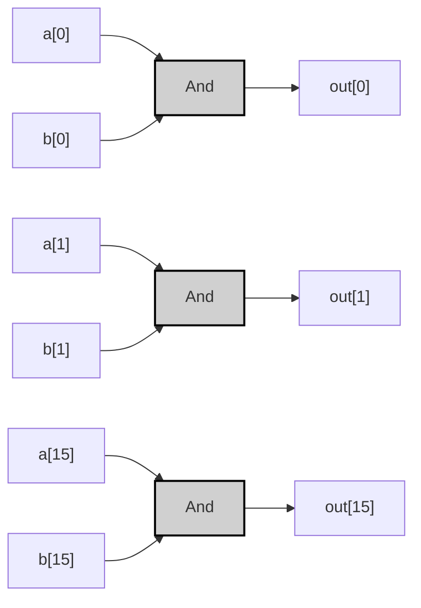

# And16

## Specification

| A[i] | B[i] | Out[i] |
|------|------|--------|
| 0    | 0    | 0      |
| 0    | 1    | 0      |
| 1    | 0    | 0      |
| 1    | 1    | 1      |

> [!example]-
> ```mermaid
> graph LR;
>     %% Pattern 0: A=0, B=0
>     A0["A"]:::input0 -->|<span style="color:#aa0000">0</span>| And0["And"]:::gate;
>     B0["B"]:::input0 -->|<span style="color:#aa0000">0</span>| And0;
>     And0 -->|<span style="color:#aa0000">0</span>| OUT0["Out"]:::output0;
> 
>     %% Pattern 1: A=0, B=1
>     A1["A"]:::input0 -->|<span style="color:#aa0000">0</span>| And1["And"]:::gate;
>     B1["B"]:::input1 -->|<span style="color:#00aa00">1</span>| And1;
>     And1 -->|<span style="color:#aa0000">0</span>| OUT1["Out"]:::output0;
> 
>     %% Pattern 2: A=1, B=0
>     A2["A"]:::input1 -->|<span style="color:#00aa00">1</span>| And2["And"]:::gate;
>     B2["B"]:::input0 -->|<span style="color:#aa0000">0</span>| And2;
>     And2 -->|<span style="color:#aa0000">0</span>| OUT2["Out"]:::output0;
> 
>     %% Pattern 3: A=1, B=1
>     A3["A"]:::input1 -->|<span style="color:#00aa00">1</span>| And3["And"]:::gate;
>     B3["B"]:::input1 -->|<span style="color:#00aa00">1</span>| And3;
>     And3 -->|<span style="color:#00aa00">1</span>| OUT3["Out"]:::output1;
> 
>     classDef gate fill:#d0d0d0,stroke:#000,stroke-width:2px;
>     classDef input0 fill:#ff9999,stroke:#000,stroke-width:1px;
>     classDef input1 fill:#99ff99,stroke:#000,stroke-width:1px;
>     classDef output0 fill:#ff9999,stroke:#000,stroke-width:1px;
>     classDef output1 fill:#99ff99,stroke:#000,stroke-width:1px;
> ```

---
## Implementation
###  And Version
>[!tip]
>$$
>\text{Out}[i] = A[i] \land B[i] \quad \text{for each } i \in 0..15
>$$

```vhdl
CHIP And16 {
    IN a[16], b[16];
    OUT out[16];
PARTS:
    For i=0..15 {
        And(a=a[i], b=b[i], out=out[i]);
    }
}
```



> [!example]-
> 
> ```mermaid
> graph LR;
>     %% Pattern 0: a[0]=0, b[0]=0
>     A0_0["a[0]"]:::input0 -->|<span style="color:#aa0000">0</span>| And0_0["And"]:::gate;
>     B0_0["b[0]"]:::input0 -->|<span style="color:#aa0000">0</span>| And0_0;
>     And0_0 -->|<span style="color:#aa0000">0</span>| Out0_0["out[0]"]:::output0;
> 
>     %% Pattern 1: a[0]=0, b[0]=1
>     A0_1["a[0]"]:::input0 -->|<span style="color:#aa0000">0</span>| And0_1["And"]:::gate;
>     B0_1["b[0]"]:::input1 -->|<span style="color:#00aa00">1</span>| And0_1;
>     And0_1 -->|<span style="color:#aa0000">0</span>| Out0_1["out[0]"]:::output0;
> 
>     %% Pattern 2: a[0]=1, b[0]=0
>     A0_2["a[0]"]:::input1 -->|<span style="color:#00aa00">1</span>| And0_2["And"]:::gate;
>     B0_2["b[0]"]:::input0 -->|<span style="color:#aa0000">0</span>| And0_2;
>     And0_2 -->|<span style="color:#aa0000">0</span>| Out0_2["out[0]"]:::output0;
> 
>     %% Pattern 3: a[0]=1, b[0]=1
>     A0_3["a[0]"]:::input1 -->|<span style="color:#00aa00">1</span>| And0_3["And"]:::gate;
>     B0_3["b[0]"]:::input1 -->|<span style="color:#00aa00">1</span>| And0_3;
>     And0_3 -->|<span style="color:#00aa00">1</span>| Out0_3["out[0]"]:::output1;
> 
>     classDef gate fill:#d0d0d0,stroke:#000,stroke-width:2px;
>     classDef input0 fill:#ff9999,stroke:#000,stroke-width:1px;
>     classDef input1 fill:#99ff99,stroke:#000,stroke-width:1px;
>     classDef output0 fill:#ff9999,stroke:#000,stroke-width:1px;
>     classDef output1 fill:#99ff99,stroke:#000,stroke-width:1px;
> ```

---

### 最適化実装
この実装はすでに最適化されており、各ビットに1つのAndゲートを使用する最も効率的な構成です。追加の最適化は不要です。

```vhdl
CHIP And16 {
    IN a[16], b[16];
    OUT out[16];
PARTS:
    For i=0..15 {
        And(a=a[i], b=b[i], out=out[i]);
    }
}
```

>[!prove]- 最適化の証明
> And16ゲートは各ビットが独立して処理されるため、以下の特性により最適化が保証されます：
> 1. **最小ゲート数**: 各ビットに1つのAndゲートが必須で、これより少ない構成は不可能。
> 2. **並列処理**: 全ビットが同時に計算され、遅延が最小化。
> 3. **リソース共有不可**: 異なるビット間でロジックを共有する方法が存在しない。