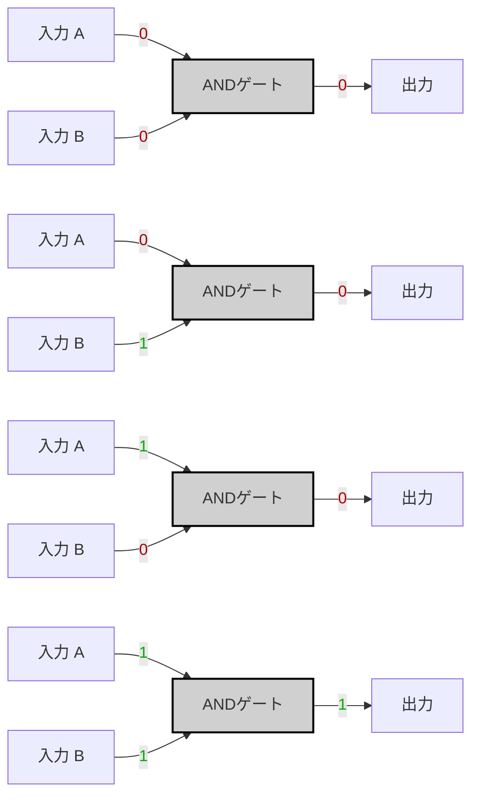
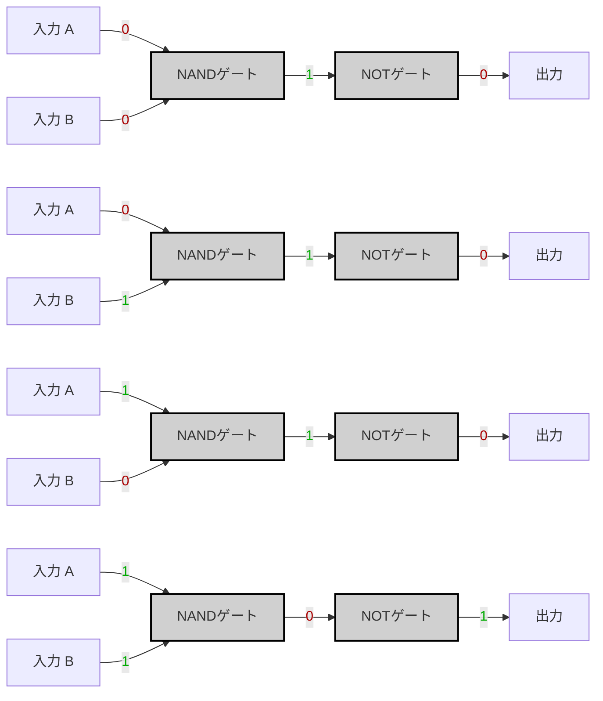

---
tags:
  - "#nand2tetris"
  - "#logic-gates"
  - "#nand-gate"
  - "#truth-table"
  - "#boolean-algebra"
  - "#logic-design"
---
# Specification

|A|B|A AND B|
|---|---|---|
|0|0|0|
|0|1|0|
|1|0|0|
|1|1|1|




---
# Imprementation

A _AND_ B = ~(A _NAND_ B)

```hdl
CHIP And {
	IN a, b;
	OUT out;
PARTS:
	Nand(a=a, b=b, out=nandOut);
	Not(in=nandOut, out=notOut);
}
```

