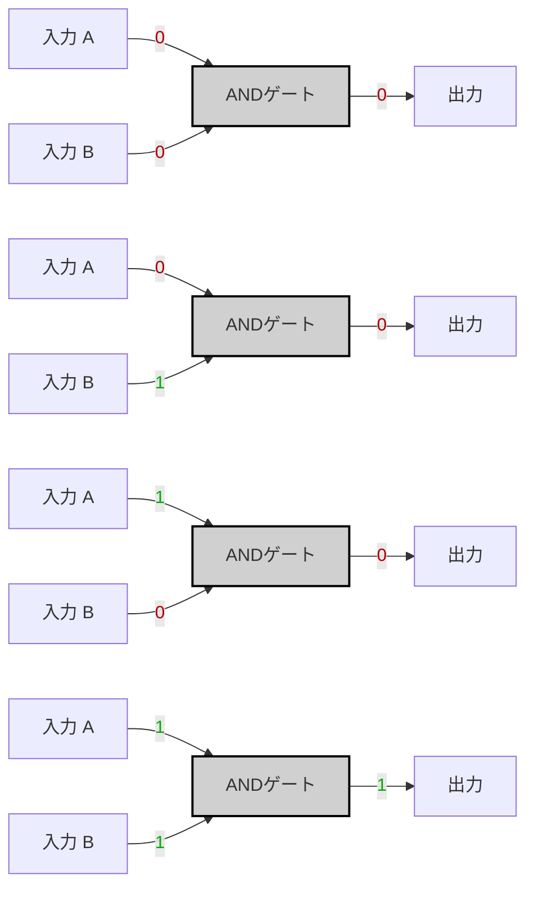

# Specification

|A|B|A AND B|
|---|---|---|
|0|0|0|
|0|1|0|
|1|0|0|
|1|1|1|




---
# Imprementation
## Logical Expressions

$ A \land B $

## Logical Expressions


```hdl
CHIP And {
	IN a, b;
	OUT out;
PARTS:
	Nand(a=a, b=b, out=nandOut);
	Not(in=nand
}
```