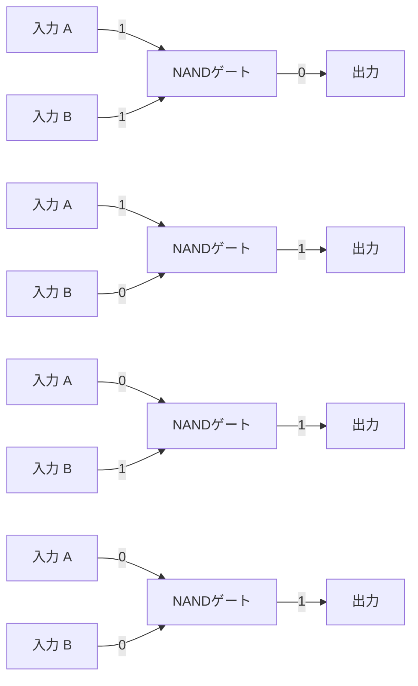

```mermaid
graph LR;
    A["入力 A"] -->|1| NAND1;
    B["入力 B"] -->|1| NAND1;
    NAND1["NANDゲート"] -->|0| OUT["出力"];
    
    A2["入力 A"] -->|1| NAND2;
    B2["入力 B"] -->|0| NAND2;
    NAND2["NANDゲート"] -->|1| OUT2["出力"];
    
    A3["入力 A"] -->|0| NAND3;
    B3["入力 B"] -->|1| NAND3;
    NAND3["NANDゲート"] -->|1| OUT3["出力"];
    
    A4["入力 A"] -->|0| NAND4;
    B4["入力 B"] -->|0| NAND4;
    NAND4["NANDゲート"] -->|1| OUT4["出力"];
```