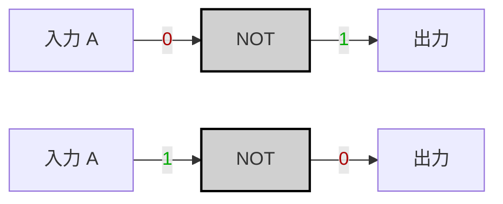
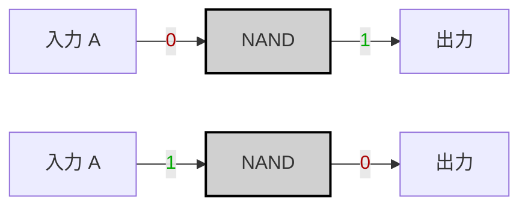

---
tags:
  - "#logic-gates"
  - "#nand2tetris"
  - "#nand-gate"
  - "#hardware-description-language"
  - "#logic-design"
  - "#truth-table"
  - "#boolean-algebra"
  - "#hardware-implementation"
---
# Specification

|A|NOT A|
|---|---|
|0|1|
|1|0|



---

# Imprementation

~A = A NAND A

```hdl
CHIP Not {
    IN in;
    OUT out;
    
    PARTS:
    Nand(a=in, b=in, out=out);
}
```



