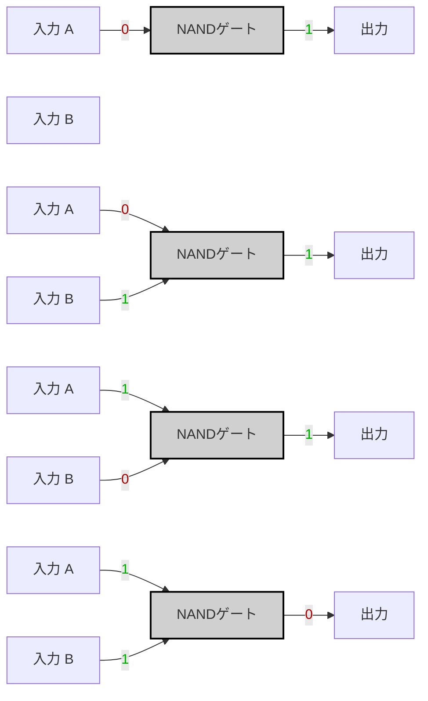

# Specification
|A| NOT A|
|---|---|
|0|1|
|1|0|

# Imprementation
Bは無視して良い

---

```mermaid
graph LR;
    A0["入力 A"] -->|<span style="color:#a00">0</span>| NAND0;
    B0["入力 B"] 
    NAND0["NANDゲート"]:::gate -->|<span style="color:#0a0">1</span>| OUT0["出力"];

    A1["入力 A"] -->|<span style="color:#a00">0</span>| NAND1;
    B1["入力 B"] -->|<span style="color:#0a0">1</span>| NAND1;
    NAND1["NANDゲート"]:::gate -->|<span style="color:#0a0">1</span>| OUT1["出力"];

    A2["入力 A"] -->|<span style="color:#0a0">1</span>| NAND2;
    B2["入力 B"] -->|<span style="color:#a00">0</span>| NAND2;
    NAND2["NANDゲート"]:::gate -->|<span style="color:#0a0">1</span>| OUT2["出力"];

    A3["入力 A"] -->|<span style="color:#0a0">1</span>| NAND3;
    B3["入力 B"] -->|<span style="color:#0a0">1</span>| NAND3;
    NAND3["NANDゲート"]:::gate -->|<span style="color:#a00">0</span>| OUT3["出力"];

    classDef gate fill:#d0d0d0,stroke:#000,stroke-width:2px;
```
---