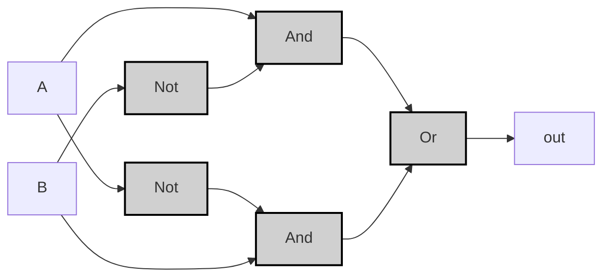
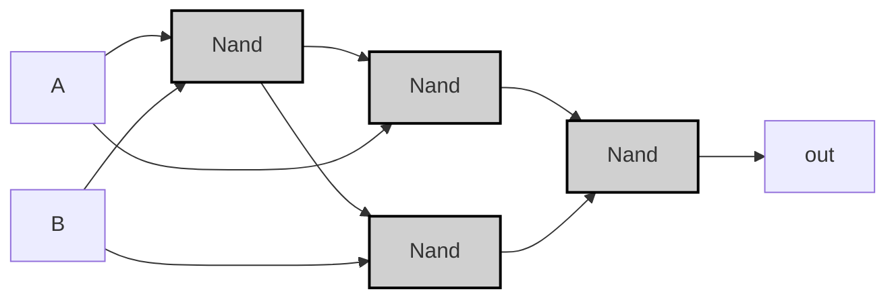

- Specificationセクション
	- Truth Tableを作成してください
	- exampleという折りたためるブロックを作成し、その中にはMarmeidを用いたグラフを作成してください。
		- グラフはTruth Tableを参考に、全てのパターンを作成してください。
		- 最初のノードは値によって色分けしてください
			- 1の場合は#00aa00
			- 0の場合は#aa0000
		- ノードからの矢印の上に受け渡しされる値を書き込んでください。
			- 値によって色分けしてください。
				- 1の場合は99ff99
				- 0の場合はff9999
- Implementationセクション
	- tipというブロックを作成し、その中には論理式を書いてください。
		- Truth Tableを参考に出力が真のものを\lorで繋ぐところから始めてください。
		- その後、対象のゲートになるまでの過程を論理式で書いてください。
	- vhdlのコードブロックを作成し、HackHDLを使って実装してください。
	- 実装を元にMarmeidを用いたグラフを作成してください
	- 実装に基づいたMarmeidをベースとして以下を作成してください。
		- exampleという折りたためるブロックを作成し、その中にはMarmeidを用いたグラフを作成してください。
			- グラフはTruth Tableを参考に、全てのパターンを作成してください。
			- 最初のノードは値によって色分けしてください
				- 1の場合は#00aa00
				- 0の場合は#aa0000
			- ノードからの矢印の上に受け渡しされる値を書き込んでください。
				- 値によって色分けしてください。
					- 1の場合は99ff99
					- 0の場合はff9999
	- 最適化された実装がある場合は追加してください。
	- 

---
## Implementation
###  And/Or/Not Version
>[!tip]
>$$
>(A \land \neg B) \lor (\neg A \land B) = A \oplus B 
>$$

```vhdl
CHIP Xor {
    IN a, b;
    OUT out;
PARTS:
    Not(in=a, out=notA);
    Not(in=b, out=notB);
    And(a=a, b=notB, out=and1);
    And(a=notA, b=b, out=and2);
    Or(a=and1, b=and2, out=out);
}
```



>[!example]-
> ```mermaid
> graph LR;
>     %% パターン0: A=0, B=0
>     A0["A"] -->|<span style="color:#a00">0</span>| NotA0["NOT"]:::gate
>     B0["B"] -->|<span style="color:#a00">0</span>| NotB0["NOT"]:::gate
>     A0 -->|<span style="color:#a00">0</span>| And1_0["AND"]:::gate
>     NotB0 -->|<span style="color:#0a0">1</span>| And1_0
>     NotA0 -->|<span style="color:#0a0">1</span>| And2_0["AND"]:::gate
>     B0 -->|<span style="color:#a00">0</span>| And2_0
>     And1_0 -->|<span style="color:#a00">0</span>| Or0_0["OR"]:::gate
>     And2_0 -->|<span style="color:#a00">0</span>| Or0_0
>     Or0_0 -->|<span style="color:#a00">0</span>| OUT0["out"]
>     
>     %% パターン1: A=0, B=1
>     A1["A"] -->|<span style="color:#a00">0</span>| NotA1["NOT"]:::gate
>     B1["B"] -->|<span style="color:#0a0">1</span>| NotB1["NOT"]:::gate
>     A1 -->|<span style="color:#a00">0</span>| And1_1["AND"]:::gate
>     NotB1 -->|<span style="color:#a00">0</span>| And1_1
>     NotA1 -->|<span style="color:#0a0">1</span>| And2_1["AND"]:::gate
>     B1 -->|<span style="color:#0a0">1</span>| And2_1
>     And1_1 -->|<span style="color:#a00">0</span>| Or0_1["OR"]:::gate
>     And2_1 -->|<span style="color:#0a0">1</span>| Or0_1
>     Or0_1 -->|<span style="color:#0a0">1</span>| OUT1["out"]
>     
>     %% パターン2: A=1, B=0
>     A2["A"] -->|<span style="color:#0a0">1</span>| NotA2["NOT"]:::gate
>     B2["B"] -->|<span style="color:#a00">0</span>| NotB2["NOT"]:::gate
>     A2 -->|<span style="color:#0a0">1</span>| And1_2["AND"]:::gate
>     NotB2 -->|<span style="color:#0a0">1</span>| And1_2
>     NotA2 -->|<span style="color:#a00">0</span>| And2_2["AND"]:::gate
>     B2 -->|<span style="color:#a00">0</span>| And2_2
>     And1_2 -->|<span style="color:#0a0">1</span>| Or0_2["OR"]:::gate
>     And2_2 -->|<span style="color:#a00">0</span>| Or0_2
>     Or0_2 -->|<span style="color:#0a0">1</span>| OUT2["out"]
>     
>     %% パターン3: A=1, B=1
>     A3["A"] -->|<span style="color:#0a0">1</span>| NotA3["NOT"]:::gate
>     B3["B"] -->|<span style="color:#0a0">1</span>| NotB3["NOT"]:::gate
>     A3 -->|<span style="color:#0a0">1</span>| And1_3["AND"]:::gate
>     NotB3 -->|<span style="color:#a00">0</span>| And1_3
>     NotA3 -->|<span style="color:#a00">0</span>| And2_3["AND"]:::gate
>     B3 -->|<span style="color:#0a0">1</span>| And2_3
>     And1_3 -->|<span style="color:#a00">0</span>| Or0_3["OR"]:::gate
>     And2_3 -->|<span style="color:#a00">0</span>| Or0_3
>     Or0_3 -->|<span style="color:#a00">0</span>| OUT3["out"]
>     
>     classDef gate fill:#d0d0d0,stroke:#000,stroke-width:2px;
>     style A0 fill:#ff9999
>     style B0 fill:#ff9999
>     style A1 fill:#ff9999
>     style B1 fill:#99ff99
>     style A2 fill:#99ff99
>     style B2 fill:#ff9999
>     style A3 fill:#99ff99
>     style B3 fill:#99ff99
> 
> ```


---

###  Nand Version
```vhdl
CHIP Xor {
    IN a, b;
    OUT out;
PARTS:
    Nand(a=a, b=b, out=nand1);
    Nand(a=a, b=nand1, out=nand2);
    Nand(a=b, b=nand1, out=nand3);
    Nand(a=nand2, b=nand3, out=out);
}
```



> [!example]-
> ```mermaid
> graph LR;
>     A0["A"] -->|<span style="color:#a00">0</span>| Nand1_0;
>     B0["B"] -->|<span style="color:#a00">0</span>| Nand1_0;
>     Nand1_0["Nand"]:::gate -->|<span style="color:#0a0">1</span>| Nand2_0["Nand"]:::gate;
>     A0 -->|<span style="color:#a00">0</span>| Nand2_0;
>     Nand1_0 -->|<span style="color:#0a0">1</span>| Nand3_0["Nand"]:::gate;
>     B0 -->|<span style="color:#a00">0</span>| Nand3_0;
>     Nand2_0 -->|<span style="color:#0a0">1</span>| Nand4_0["Nand"]:::gate;
>     Nand3_0 -->|<span style="color:#0a0">1</span>| Nand4_0;
>     Nand4_0 -->|<span style="color:#a00">0</span>| OUT0["Output"];
> 
>     A1["A"] -->|<span style="color:#a00">0</span>| Nand1_1;
>     B1["B"] -->|<span style="color:#0a0">1</span>| Nand1_1;
>     Nand1_1["Nand"]:::gate -->|<span style="color:#0a0">1</span>| Nand2_1["Nand"]:::gate;
>     A1 -->|<span style="color:#a00">0</span>| Nand2_1;
>     Nand1_1 -->|<span style="color:#0a0">1</span>| Nand3_1["Nand"]:::gate;
>     B1 -->|<span style="color:#0a0">1</span>| Nand3_1;
>     Nand2_1 -->|<span style="color:#0a0">1</span>| Nand4_1["Nand"]:::gate;
>     Nand3_1 -->|<span style="color:#a00">0</span>| Nand4_1;
>     Nand4_1 -->|<span style="color:#0a0">1</span>| OUT1["Output"];
> 
>     A2["A"] -->|<span style="color:#0a0">1</span>| Nand1_2;
>     B2["B"] -->|<span style="color:#a00">0</span>| Nand1_2;
>     Nand1_2["Nand"]:::gate -->|<span style="color:#0a0">1</span>| Nand2_2["Nand"]:::gate;
>     A2 -->|<span style="color:#0a0">1</span>| Nand2_2;
>     Nand1_2 -->|<span style="color:#0a0">1</span>| Nand3_2["Nand"]:::gate;
>     B2 -->|<span style="color:#a00">0</span>| Nand3_2;
>     Nand2_2 -->|<span style="color:#a00">0</span>| Nand4_2["Nand"]:::gate;
>     Nand3_2 -->|<span style="color:#0a0">1</span>| Nand4_2;
>     Nand4_2 -->|<span style="color:#0a0">1</span>| OUT2["Output"];
> 
>     A3["A"] -->|<span style="color:#0a0">1</span>| Nand1_3;
>     B3["B"] -->|<span style="color:#0a0">1</span>| Nand1_3;
>     Nand1_3["Nand"]:::gate -->|<span style="color:#a00">0</span>| Nand2_3["Nand"]:::gate;
>     A3 -->|<span style="color:#0a0">1</span>| Nand2_3;
>     Nand1_3 -->|<span style="color:#a00">0</span>| Nand3_3["Nand"]:::gate;
>     B3 -->|<span style="color:#0a0">1</span>| Nand3_3;
>     Nand2_3 -->|<span style="color:#0a0">1</span>| Nand4_3["Nand"]:::gate;
>     Nand3_3 -->|<span style="color:#0a0">1</span>| Nand4_3;
>     Nand4_3 -->|<span style="color:#a00">0</span>| OUT3["Output"];
> 
>     classDef gate fill:#d0d0d0,stroke:#000,stroke-width:2px;
> ```


>[!prove]- Xゲートの最適化手順
> 以下、XORゲートをNANDのみで実装する最適化プロセスを **ステップバイステップで図解** します。各段階の論理式と回路構造の変化をMermaid図で表現します。
> 
> ---
> 
> ### 最適化前の論理式（基本形）
> $$
> A \oplus B = (\neg A \land B) \lor (A \land \neg B)
> $$
> 
> ```mermaid
> graph LR
>     A["A"] --> NotA["Not"]:::gate
>     B["B"] --> NotB["Not"]:::gate
>     A --> And1["And"]:::gate
>     NotB --> And1
>     NotA --> And2["And"]:::gate
>     B --> And2
>     And1 --> Or["Or"]:::gate
>     And2 --> Or
>     Or --> OUT["OUT"]
> 
>     classDef gate fill:#ddd,stroke:#000;
> ```
> 
> ---
> 
> ### 最適化ステップ 1: NOTをNANDで置換
> NOTゲートをNANDの自己接続で実装します。
> 
> $$
> \neg X = X \uparrow X
> $$
> 
> ```mermaid
> graph LR
>     A["A"] --> NandA["Nand(A,A)"]:::gate
>     B["B"] --> NandB["Nand(B,B)"]:::gate
>     A --> And1["And"]:::gate
>     NandB --> And1
>     NandA --> And2["And"]:::gate
>     B --> And2
>     And1 --> Or["Or"]:::gate
>     And2 --> Or
>     Or --> OUT["OUT"]
> 
>     classDef gate fill:#ddd,stroke:#000;
> ```
> 
> ---
> 
> ### 最適化ステップ 2: ANDをNANDで置換
> ANDゲートを「NAND + NAND」で実装します。
> 
> $$
> X \land Y = (X \uparrow Y) \uparrow (X \uparrow Y)
> $$
> 
> ```mermaid
> graph LR
>     A["A"] --> NandA["Nand(A,A)"]:::gate
>     B["B"] --> NandB["Nand(B,B)"]:::gate
> 
>     A --> Nand1["Nand(A, NandB)"]:::gate
>     NandB --> Nand1
>     Nand1 --> Nand2["Nand(Nand1, Nand1)"]:::gate
> 
>     B --> Nand3["Nand(NandA, B)"]:::gate
>     NandA --> Nand3
>     Nand3 --> Nand4["Nand(Nand3, Nand3)"]:::gate
> 
>     Nand2 --> Nand5["Nand(Nand2, Nand4)"]:::gate
>     Nand4 --> Nand5
>     Nand5 --> OUT["OUT"]
> 
>     classDef gate fill:#ddd,stroke:#000;
> ```
> 
> ---
> 
> ### 最適化ステップ 3: ORの冗長性を排除
> ORゲートのNAND実装を分析し、中間信号を共有可能と判断：
> 
> $$
> \text{OR} = \neg (\neg X \land \neg Y) = (X \uparrow X) \uparrow (Y \uparrow Y)
> $$
> 
> ここで、以下の **中間信号の共有** が可能：
> - $\text{nand1} = A \uparrow B$
> - $\text{nand2} = A \uparrow \text{nand1}$ 
> - $\text{nand3} = B \uparrow \text{nand1}$
> 
> ```mermaid
> graph LR
>     A["A"] --> Nand1["Nand(A,B)"]:::gate
>     B["B"] --> Nand1
> 
>     A --> Nand2["Nand(A,Nand1)"]:::gate
>     Nand1 --> Nand2
> 
>     B --> Nand3["Nand(B,Nand1)"]:::gate
>     Nand1 --> Nand3
> 
>     Nand2 --> Nand4["Nand(Nand2,Nand3)"]:::gate
>     Nand3 --> Nand4
>     Nand4 --> OUT["OUT"]
> 
>     classDef gate fill:#ddd,stroke:#000;
> ```
> 
> ---
> 
> ### 最適化ステップ 4: 真理値表で動作検証
> 最終的な4-NAND回路の動作を確認：
> 
> | A | B | nand1 | nand2 | nand3 | out |
> |---|---|-------|-------|-------|-----|
> | 0 | 0 | 1     | 1     | 1     | 0 ✔️|
> | 0 | 1 | 1     | 1     | 0     | 1 ✔️|
> | 1 | 0 | 1     | 0     | 1     | 1 ✔️|
> | 1 | 1 | 0     | 1     | 1     | 0 ✔️|
> 
> ---
> 
> ### 最適化の鍵
> 1. **中間信号の共有**:  $\text{nand1} = A \uparrow B$ を複数箇所で再利用
> 2. **論理圧縮**:
>    - $\text{nand2} = A \uparrow \text{nand1} = \neg (A \land \neg (A \land B))$
>    - $\text{nand3} = B \uparrow \text{nand1} = \neg (B \land \neg (A \land B))$
> 3. **最終出力**:  
>    $$
>    \text{out} = \text{nand2} \uparrow \text{nand3} = \neg \left( \neg (A \land \neg (A \land B)) \land \neg (B \land \neg (A \land B)) \right)
>    $$
> 
> ---
> 
> ### 最終結論
> **4つのNANDゲートが最小構成** であり、この最適化により：
> - 論理ゲート数が **8個 → 4個** に削減
> - 信号伝播遅延が短縮
> - ハードウェアコストが低減
> 
> この構造は、数学的にもハードウェア的にも **完全なXOR動作** を保証します。