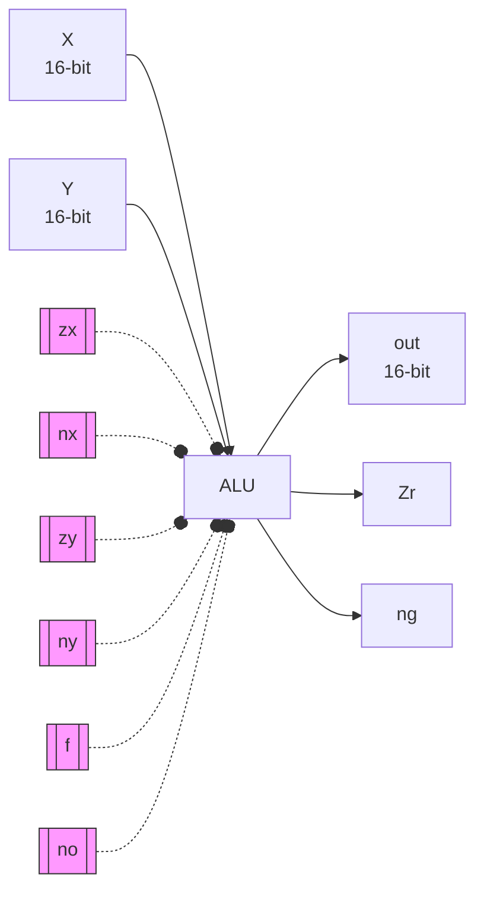

```mermaid
flowchart LR
    %% 入力定義
    X[X<br/>16-bit] --> ALU
    Y[Y<br/>16-bit] --> ALU

    %% 制御信号配線
    ZX[[zx]] -.-o ALU
    NX[[nx]] -.-o ALU
    ZY[[zy]] -.-o ALU
    NY[[ny]] -.-o ALU
    F[[f]] -.-o ALU
    NO[[no]] -.-o ALU

    %% ALUブロック
    ALU[ALU] --> OUT[out<br/>16-bit]
    ALU --> Zr[Zr]
    ALU --> ng[ng]

    %% レイアウト調整
    classDef control fill:#f9f,stroke:#333;
    class ZX,NX,ZY,NY,F,NO control;
```