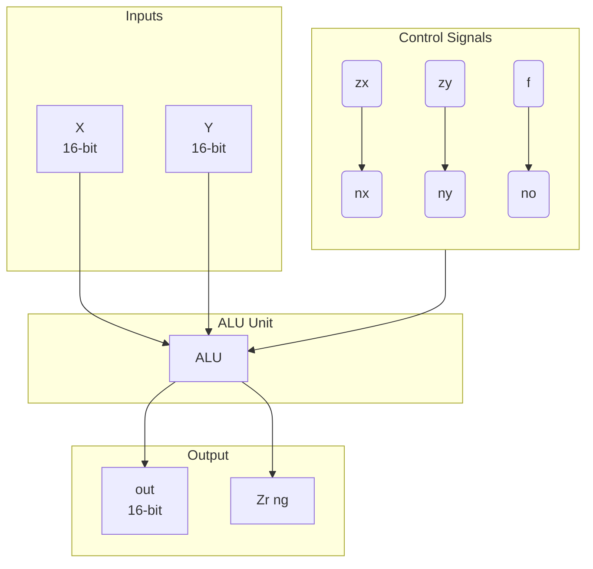

```mermaid
flowchart TB
    subgraph Inputs
        X[X<br/>16-bit]
        Y[Y<br/>16-bit]
    end

    subgraph Control[Control Signals]
        direction TB
        ZX(zx) --> NX(nx)
        ZY(zy) --> NY(ny)
        F(f) --> NO(no)
    end

    subgraph ALU[ALU Unit]
        A[ALU]
    end

    subgraph Output
        OUT[out<br/>16-bit]
        FLAGS[Zr ng]
    end

    X --> A
    Y --> A
    Control --> A
    A --> OUT
    A --> FLAGS
```