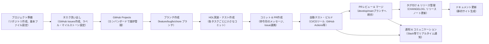

---
tags:
  - "#task-management"
  - "#version-control"
  - "#project-organization"
  - "#github"
  - "#devops-automation"
  - "#continuous-integration"
  - "#project-documentation"
---

## 1. GitHub Issues と Projects

### GitHub Issues

- **タスク管理:**  
    各章やサブタスクごとに Issue を作成し、タスクの内容、期限、担当者（個人の場合でも自分の ToDo として）を記述します。
- **ラベルの活用:**  
    「Chapter 01」「feature」「bugfix」など、ラベルを付けることで、どのタスクがどの章や種類の作業かを一目で把握できます。
- **連携:**  
    コミットメッセージやプルリクエストに「Fix #12」のように記述することで、タスクが完了した際に Issue を自動でクローズする仕組みが利用可能です。

### GitHub Projects (またはGitHubボード)

- **看板形式:**  
    カンバンボードを用いて、タスクの状態（ToDo、In Progress、Done）を視覚的に管理できます。
- **カード管理:**  
    各 Issue や独自のタスクカードを作成し、進捗状況に合わせてドラッグ＆ドロップで移動することで、全体の進行状況がひと目でわかります。
- **フィルタリング:**  
    章ごと、タスクの種類ごとにフィルターをかけたり、マイルストーンでまとめたりすることで、細かい進捗管理や優先順位の確認がしやすくなります。

---

## 2. CI/CD ツールの導入

### GitHub Actions

- **自動テスト:**  
    リポジトリ内の `scripts/` ディレクトリに配置したテストスクリプト（例: `run_tests.sh`）を GitHub Actions で自動実行し、各コミットやプルリクエスト時に HDL のシミュレーションやテストを実施します。
- **自動ビルド:**  
    各章の HDL コードや関連資料のビルド（ドキュメント生成など）を自動で行い、ビルドエラーを早期に検出できます。
- **通知:**  
    テスト結果やビルドステータスを Slack やメールで通知するように設定することで、作業の進捗や問題発生時の対応が迅速に行えます。

### Travis CI や CircleCI（代替ツール）

- GitHub Actions と同様に、自動テストやビルドを行うための CI/CD ツールとして利用可能です。
- リポジトリに設定ファイル（`.travis.yml` や `config.yml`）を用意することで、コミットごとのチェックを自動化できます。

---

## 3. スクリプト類（自動化ツール）

### `scripts/` ディレクトリの活用

- **run_tests.sh:**  
    各章ごとのテストスクリプトを一括で実行できるシェルスクリプトを用意します。  
    例:
    
    ```bash
    #!/bin/bash
    echo "Running tests for Chapter 01"
    sh chapters/01_Boolean_Logic/tests/run_nand_tests.sh
    # 他の章のテストも順次実行
    ```
    
- **build_all.sh:**  
    全体の HDL ファイルやドキュメントをまとめてビルド・シミュレーションするためのスクリプト。
- **フォーマッター／リンター:**  
    HDL や Markdown、コードの品質チェックに使えるツール（例えば、MarkdownLint など）を組み合わせ、リポジトリ全体の整合性を保ちます。

---

## 4. ドキュメント生成ツール

### 静的サイトジェネレーター

- **目的:**  
    プロジェクト全体のドキュメント（設計資料、タスク進捗、開発メモなど）をまとめ、Web上で閲覧可能な形にする。
- **例:**
    - **Jekyll, Hugo, MkDocs:**  
        これらのツールを利用して、`docs/` 内の Markdown ファイルから静的なドキュメントサイトを生成し、プロジェクトの経緯や進捗を可視化します。

### 自動更新

- GitHub Actions と連携して、リポジトリへの変更時に自動的にドキュメントサイトが再生成される仕組みを構築すれば、最新の情報を常に反映できます。

---

## 5. コミュニケーション・連携ツール

### チャットツールとの連携

- **Slack, Microsoft Teams:**  
    CI/CD ツールや GitHub Actions と連携し、プルリクエスト、テスト結果、ビルドステータス、Issue の更新などをリアルタイムに通知します。
- **メリット:**  
    作業中に情報がリアルタイムで共有されるため、個人開発でも気づかないミスや改善点を早期に把握でき、スムーズな作業進行が期待できます。

---

## 6. 補足ツールの活用まとめ

1. **GitHub Issues/Projects:**  
    タスク管理と進捗の視覚化により、各章・タスクの状態が明確に。
    
2. **CI/CD（GitHub Actions など）:**  
    自動テストやビルド、通知機能により、コード品質と進捗の一貫性を保つ。
    
3. **自動化スクリプト:**  
    `scripts/` による一括実行・ビルド、リンターによる整合性チェックで、手作業を軽減。
    
4. **ドキュメント生成ツール:**  
    プロジェクト全体の記録や設計資料を整然と管理し、後からの振り返りや共有に利用。
    
5. **コミュニケーションツール連携:**  
    作業状況やエラーをリアルタイムで通知し、迅速な対応や自己管理に役立てる。
    