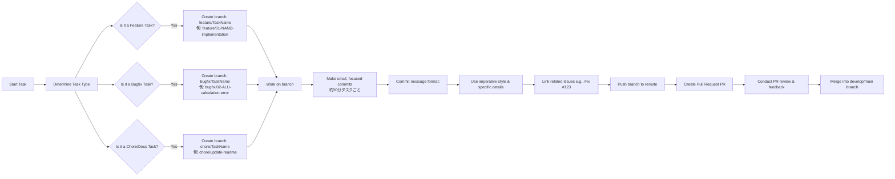

---
tags:
  - "#version-control"
  - "#project-organization"
  - "#task-management"
  - "#git-tagging"
  - "#version-control-workflow"
  - "#git-branching-strategy"
  - "#commit-message-convention"
---


## 1. ブランチ運用

### A. 基本のブランチ戦略

- **main（または master）ブランチ:**
    
    - 常に「安定」した状態のコードを保管します。
    - すべての機能が統合され、テスト済みで動作する状態のコミットのみをマージする。
- **develop ブランチ（任意）:**
    
    - main に統合する前の作業用ブランチとして使用する場合。
    - 複数の機能を並行して実装する際、各機能ブランチを統合するための中間ブランチとして利用可能。
- **feature ブランチ:**
    
    - 各章や各タスクなど、個別の作業ごとに新しいブランチを作成する。
    - ブランチ名の例:
        - `feature/01-NAND-implementation`
        - `feature/02-ALU-addition`
        - `feature/03-RAM-structure`
    - 作業が完了したら、**プルリクエスト（Pull Request）**を作成して、レビュー後に develop または main にマージする。
- **bugfix ブランチ:**
    
    - 既存のコードに対する修正作業専用。
    - 例: `bugfix/02-ALU-calculation-error`
- **chore ブランチ:**
    
    - ドキュメント更新、リファクタリング、テスト環境の整備など、機能追加以外の作業用。
    - 例: `chore/update-readme`

### B. ブランチ運用のコツ

- **小さな単位での分割:**
    
    - 各ブランチは一つの機能やタスクに焦点を合わせ、できるだけ短期間で完了できるようにする。
    - これによりレビューが容易になり、後のマージ時のコンフリクトも最小限に抑えられます。
- **命名規則の徹底:**
    
    - チーム全体でブランチ命名規則を統一することで、ブランチ名だけで内容や対象の章が把握できるようにします。
    - 例: `feature/章番号-タスク名`（`feature/01-NAND-gate` など）。
- **頻繁な統合:**
    
    - 作業が完了したら早めに develop または main にマージする。
    - 長期間ブランチが分岐したままだと、後で大規模なコンフリクトが発生する可能性があるため注意。

---

## 2. コミットルール

### A. コミットメッセージの書き方

- **一貫性のあるフォーマット:**
    
    - コミットメッセージは、どの変更が何のために行われたかを明確にするため、次のような構造を推奨します。
    
    ```
    <type>(<scope>): <短い説明>
    
    <詳細な説明（オプション）>
    
    <関連Issueやタグ（オプション）>
    ```
    
    **例:**
    
    - `feat(01_Boolean_Logic): NANDゲートのHDL実装を追加`  
        → 新機能追加の場合（`feat`）で、対象が「01_Boolean_Logic」フォルダ内の NAND ゲート実装であることを明示。
    - `fix(02_ALU): 加算器の桁上がりエラーを修正`  
        → バグ修正の場合（`fix`）の例。
    - `chore(docs): README.md の進捗状況を更新`  
        → ドキュメントや整備関連の場合（`chore`）の例。

### B. コミットメッセージのポイント

- **命令形で記述:**
    
    - 「追加した」「修正した」ではなく「Add」や「Fix」といった命令形で書く（例: `Add NAND gate simulation`）。
- **一つのコミットは一つの目的:**
    
    - 変更内容が複数ある場合、できるだけ複数のコミットに分割して、各コミットが独立した意味を持つようにする。
- **簡潔かつ具体的に:**
    
    - コミットメッセージは後から見返すときに内容がすぐに理解できるよう、どのファイルにどのような変更を加えたのかを記述する。
- **関連Issueとの連携:**
    
    - GitHub やその他の管理ツールと連動させる場合、コミットメッセージに「Fix #123」などと記述して、Issue との関連性を明示する。

### C. 具体例

- **例1:** 新しいタスク開始時のコミット
    
    ```bash
    git commit -m "feat(01_Boolean_Logic): Start implementation of NOT gate"
    ```
    
- **例2:** タスク完了後のコミット
    
    ```bash
    git commit -m "feat(01_Boolean_Logic): Complete implementation and test for NOT gate"
    ```
    
- **例3:** ドキュメントの更新
    
    ```bash
    git commit -m "chore(docs): Update tasks.md for Chapter 01 after NOT and AND gate completion"
    ```
    

### D. コミットの粒度

- **30分タスクに合わせたコミット:**
    - 各サブタスク（例: 「NOTゲート実装」）が30分程度で終わる粒度であるなら、そのタスクの完了ごとにコミットするのが理想的です。
    - これにより、どのタスクが完了しているか、またはどこで問題が発生したかを履歴から追跡しやすくなります。

---

## 3. 運用上のポイント

- **Pull Request (PR) を活用する:**
    
    - feature ブランチで作業を行い、一定の進捗（例えば章の一部が完成）ごとに PR を作成し、自己レビューまたはチームレビューを実施する。
    - PR の説明欄に、実施したタスクや影響範囲を詳細に記載しておくと、後からの振り返りやコードレビューがしやすくなります。
- **コミット履歴の整頓:**
    
    - 作業が散発的に行われた場合、後から `git rebase -i` などを利用して、コミット履歴を整理することも検討してください。
    - ただし、共有リポジトリにプッシュしたコミットの書き換えは避けるか、チーム全体で方針を統一することが重要です。
