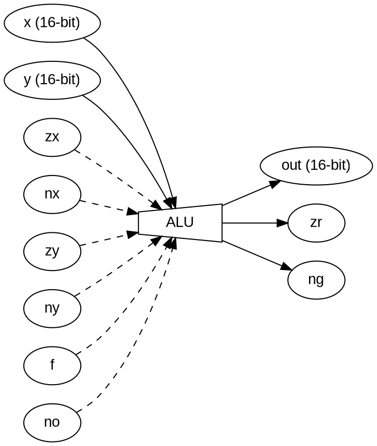

```dot
digraph ALUdiagram {  
    rankdir=LR;  /* 左->右にレイアウト */  
    node [fontname="Arial"];  
    ALU [label="ALU", shape=trapezium, orientation=90];  /* ALUを左辺が広い台形に */  
    x  [label="x (16-bit)"];  
    y  [label="y (16-bit)"];  
    out[label="out (16-bit)"];  
    zr [label="zr"];  
    ng [label="ng"];  
    /* エッジ定義（制御信号はスタイル破線） */  
    x  -> ALU;  
    y  -> ALU;  
    zx -> ALU [style=dashed];  
    nx -> ALU [style=dashed];  
    zy -> ALU [style=dashed];  
    ny -> ALU [style=dashed];  
    f  -> ALU [style=dashed];  
    no -> ALU [style=dashed];  
    ALU -> out;  
    ALU -> zr;  
    ALU -> ng;  
}  

```