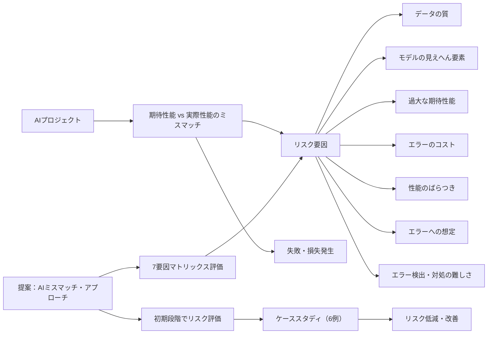

---

# 論文「AI Mismatches: Identifying Potential Algorithmic Harms Before AI Development」要約

## 1. ざっくりした要約（関西弁）

AIシステムは、めっちゃ期待されて導入されるけど、実際は「なんやイマイチやな…」って失敗することが多いんや。  
**ポイントは…**

- **AIミスマッチ：**  
    求められる性能と実際の性能のズレ（ミスマッチ）が、後になってから発覚すると対処が難しい。
    
- **提案手法：**  
    開発の初期段階からこのズレをチェックして、リスクを減らそうとするアプローチを提案してる。  
    実際、774件のAIトラブル事例を調査し、**7つの観点でリスクを見える化するマトリックス**を作成。  
    これで「このAIのアイデア、ほんま大丈夫か？」を事前に確認できるんや。
    

---

## 2. 技術的な詳細を含んだ要約（関西弁）

### 背景・問題意識

- **高い期待と現実のギャップ：**  
    近年、AIはあちこちで革新の期待を受けるもんやけど、実際にはプロジェクトの約85%が失敗する現実がある。  
    その大きな原因のひとつは、**「AIミスマッチ」**、つまり、求められる性能と実際の性能のズレやねん。
    
- **具体例：**
    
    - 最新AIでも、公開後に期待外れの性能で利用停止に追い込まれる（例：Meta社のGalactica）
    - ほんの小さなミスで大損失を招く（例：GoogleのBardのデモ失敗）

### 主要なリスク要因（7つの観点）

1. **データの質 (Data Quality):**  
    汚い・偏ったデータは、AIの性能を大きく落とす。
    
2. **モデルで観測できへん要素 (Model Unobservables):**  
    モデルには見えへん隠れた要因があって、これが性能ギャップの原因になる。
    
3. **期待される性能 (Expected Performance):**  
    開発者やユーザーが抱く過大な期待が、現実とのズレを大きくする。
    
4. **エラーのコスト (Cost of Errors):**  
    AIがミスした時の損害が大きいと、リスクが一層深刻になる。
    
5. **性能のばらつき (Disparate Performance):**  
    利用環境やユーザー属性によって、AIの性能が大きく変動する問題。
    
6. **エラーへの想定 (Expectation of Errors):**  
    ユーザーがどれくらいミスを許容するかによって、失敗のインパクトが変わる。
    
7. **エラーの発見と対処 (Error Detection & Mitigation):**  
    ミスを見つけたり修正する難しさが、問題を後手に回らせる要因になる。
    

### 提案するアプローチ

- **AIミスマッチ・アプローチ：**  
    「必要な性能」と「実際に期待できる性能」のギャップに着目し、開発前にチェックする手法。
    
- **7つのマトリックス評価：**  
    上記の7要因を軸に、各要因の組み合わせでリスクを評価するためのマトリックスを作成。  
    マトリックスでは、リスクが高い部分を赤色などで表示し、どこに問題が潜んでるかを一目でわかるようにしてる。
    
- **ケーススタディ：**  
    自動意思決定システム、生成AI、機械学習アプリケーションなど、異なる6つの事例でこの手法を検証。  
    その結果、コンセプト段階でリスクの兆候を捉え、「このまま開発するとあかんで！」と早期に対策が立てられることが示された。
    

### 結論・今後の展望

- **開発初期のリスク管理：**  
    この手法を使えば、AIの設計段階でリスク要因を洗い出し、将来的な失敗や事故を未然に防ぐことが可能になる。
    
- **価値を生むAIの実現：**  
    単に性能を追求するだけでなく、倫理や安全面も考慮したAI設計が促進されると期待される。
    
- **今後の研究：**  
    「中程度の性能で価値を生むAIのデザイン」など、さらなるリスク評価の深化と具体的な改善策の研究へと展開する余地がある。
    

---

このように、論文は**AI開発初期からリスクを可視化して、失敗を防ぐための新しい評価手法**を提案してるわけや。  
最初にしっかり現実を見据えたプランを立てることで、後々の大きな損失やトラブルを防げる、いう教訓を伝えてる研究やね。

---

ほな、まずざっくりした要約からいくで。 この論文は、AIのモデルをもっと効率的に学習させる新しい手法を提案しとる。特に、計算リソースを減らしつつも、高い精度をキープできるような工夫が盛り込まれとるんや。要は、より速く、より少ないデータで、より賢いAIを作る方法を考えとるってことやな。

ちょっと待ってや、技術的な詳細を含んだ要約も用意するさかい、もうちょい待っとってな。

**1. ざっくりした要約（関西弁）:**  
AIのシステムっちゅうのはな、めっちゃ期待されて導入されるんやけど、実際には「なんやイマイチやな…」って失敗することがようあるんや。せやから、期待しとったほどの働きができひんせいで、思わぬ困りごとや損失を生んでもうたり、せっかくのええ機会を逃してもうたりするんよ。研究チームは、そういう**AIの「ミスマッチ」**に注目しとるんやけど、このミスマッチっちゅうのは要するに「**欲しい性能と現実の性能のズレ**」のことやねん。このズレが開発始まってから見つかったら対処が難しいさかい、もっと早い段階で気ぃつけなあかんわけや。そこでこの論文やと、AI開発の初期からその「ズレ」（ミスマッチ）を見極めてリスクを減らそう、いうアプローチを提案してるんやで。研究チームは実際に世の中で起こった774件ものAIトラブルの事例をようさん調べて、「なんでそうなったんか」の共通点を洗い出したんや。それをもとに**7つの観点でリスクを見える化するマトリックス**っちゅう表を作りはってな、この表を使えば「このAIのアイデア、大丈夫かいな？ヤバないか？」てのを開発前にチェックしやすなるんやて。ほんで論文では、実際にいくつかのAI事例（自動で判断するシステムとか生成AIとか）でこの方法を試してみて、**開発前にリスクの芽を摘み取れる**ことを示しとったわ。要するに、「AIを作り始める前にほんまにうまくいくか？危ないとこあらへんか？」をちゃんと確かめて、失敗や事故を未然に防ごうっちゅう試みなんやね。ほんま、最初にきっちり確認しとけば後で「あかんやん！」てならんで済むさかいな。

**2. 技術的な詳細を含んだ要約（関西弁）:**  
この論文の背景には、近年AIがあちこちで革新的やいうて期待されまくっとる一方で、**AIプロジェクトの85%近くが失敗する**っちゅう現実があるんや ([[2502.18682] AI Mismatches: Identifying Potential Algorithmic Harms Before AI Development](https://ar5iv.org/html/2502.18682v1#:~:text=What%20sometimes%20gets%20lost%20in,of%20innovation%20and%20hype%20often)) ([[2502.18682] AI Mismatches: Identifying Potential Algorithmic Harms Before AI Development](https://ar5iv.org/html/2502.18682v1#:~:text=reports%20and%20social%20media%20activity,16%3B%20Dutta%20et%C2%A0al))。失敗の大きな原因の一つが、AIが本来必要とされる性能に届かんことで起こる思わぬ不具合や損害、いわゆる**「AIミスマッチ」**やねん ([[2502.18682] AI Mismatches: Identifying Potential Algorithmic Harms Before AI Development](https://ar5iv.org/html/2502.18682v1#:~:text=reports%20and%20social%20media%20activity,16%3B%20Dutta%20et%C2%A0al))。たとえば最新AIでも、試しに公開したら**期待外れの性能で利用停止に追い込まれたり（例：Meta社のGalactica）**、逆に**ほんの小さなミスで大損失を招いたり（例：GoogleのBardのデモ失敗で株価暴落）**するケースがあるんや ([[2502.18682] AI Mismatches: Identifying Potential Algorithmic Harms Before AI Development](https://ar5iv.org/html/2502.18682v1#:~:text=AI%20initiatives%20within%20organizations%20%2885,of%20innovation%20and%20hype%20often))。しかもこういう問題は、一旦システム作ってもうてから直そうとしても余計難しかったり、下手したら**後から継ぎ当てして悪化させてまう**ことすらあるんよ ([[2502.18682] AI Mismatches: Identifying Potential Algorithmic Harms Before AI Development](https://ar5iv.org/html/2502.18682v1#:~:text=achieved%20given%20factors%20such%20as,17%3B%20Passi%20and%20Barocas%2C%202019))。ほなから**AIの倫理的・安全上の問題は、開発の一番最初の企画段階で対処するのが肝心や**、て流れになってきとるわけや ([[2502.18682] AI Mismatches: Identifying Potential Algorithmic Harms Before AI Development](https://ar5iv.org/html/2502.18682v1#:~:text=and%20introduce%20new%20ethical%20harms%C2%A0,20))。実際、これまでもAI絡みのリスクを予測するための分類とかツールが色々考えられてきたんやけど ([[2502.18682] AI Mismatches: Identifying Potential Algorithmic Harms Before AI Development](https://ar5iv.org/html/2502.18682v1#:~:text=Recent%20RAI%20research%20maps%20out,can%20generally%20understand%20the%20text))、AIの失敗は**色んな要因が絡み合って起こる**さかい、単純なチェックリストや一方向からの評価やと見落としが出るんよ ([[2502.18682] AI Mismatches: Identifying Potential Algorithmic Harms Before AI Development](https://ar5iv.org/html/2502.18682v1#:~:text=In%20making%20the%20case%20for,major%20challenge%20for%20innovation%20teams))。特にデザインや企画する人らは、AIができることを過大評価しがちで「魔法の箱」みたいに思うてもうてる節もあって ([[2502.18682] AI Mismatches: Identifying Potential Algorithmic Harms Before AI Development](https://ar5iv.org/html/2502.18682v1#:~:text=that%20design%20teams%20often%20struggle,underestimate%20its%20costs%20and%20harms))、ほんまは難しい問題でも「AIならできるやろ！」て無茶振りしてまうことがあるんやね。

**ほな、この論文では何をしとるかいうたら**、そうした早期の**AIミスマッチを見抜くための「AIミスマッチ・アプローチ」**っちゅう手法を提案しとるんや ([[2502.18682] AI Mismatches: Identifying Potential Algorithmic Harms Before AI Development](https://ar5iv.org/html/2502.18682v1#:~:text=To%20address%20this%2C%20we%20developed,accuracy%2C%20we%20define%20model%20performance))。ポイントは、**「現実的に期待できるモデルの性能」と「そのタスクに本当に求められる性能」のギャップ**に着目することや ([[2502.18682] AI Mismatches: Identifying Potential Algorithmic Harms Before AI Development](https://ar5iv.org/html/2502.18682v1#:~:text=To%20address%20this%2C%20we%20developed,accuracy%2C%20we%20define%20model%20performance))。AIを作る前にそのギャップがデカすぎひんかチェックしようちゅうわけやな。研究チームはまず**実際に起きた774件ものアルゴリズムによる失敗事例**を徹底的に調べてな ([[2502.18682] AI Mismatches: Identifying Potential Algorithmic Harms Before AI Development](https://ar5iv.org/html/2502.18682v1#:~:text=mismatches%2C%20increasing%20the%20ability%20to,factors%20during%20the%20concept%20selection))、「このケースはデータが悪かった」「このケースはユーザーの期待が高すぎた」みたいに、失敗の裏にどんな**リスク要因**が潜んどったかを洗い出して分類していったんよ ([[2502.18682] AI Mismatches: Identifying Potential Algorithmic Harms Before AI Development](https://ar5iv.org/html/2502.18682v1#:~:text=contributing%20to%20AI%20Mismatches,to%20minimize%20the%20risk%20of))。悪意ある使い方（例えばディープフェイク悪用とか）は今回の趣旨とちゃうさかい省いて、**あくまでAIが善意で使われたけど性能面の問題で起こった事故**に焦点当てとる ([[2502.18682] AI Mismatches: Identifying Potential Algorithmic Harms Before AI Development](https://ar5iv.org/html/2502.18682v1#:~:text=match%20at%20L364%20Given%20our,where%20the%20system%20was%20used))。そうやって色々分析した結果、**AIミスマッチに影響する重要な要因を7つ**見つけたんや ([[2502.18682] AI Mismatches: Identifying Potential Algorithmic Harms Before AI Development](https://ar5iv.org/html/2502.18682v1#:~:text=match%20at%20L550%20Our%20synthesis,visualized%20the%20factors%20as%203x3))。それが以下の7つや:

- **データの質**（Data Quality）: モデルに使うデータが汚かったり偏ってたりしたら、そらAIの性能も落ちるし偏ってまうわな。
- **モデルで観測できへん要素**（Model Unobservables）: モデルには直接見られへん隠れた要因があると、そこでギャップや誤差が生まれてまうんよ。
- **期待される性能**（Expected Performance）: 作る側や使う側が「これぐらいできて当たり前やろ」とAIに期待しとる性能のことや。理想が高すぎると現実との落差にガッカリするリスクが高なる。
- **エラーのコスト**（Cost of Errors）: AIが間違えたときに生じる損害の大きさや。ミスったときの影響がでかいタスクやと、ちょっとした誤差でも命取りになってまうんやね。
- **性能のばらつき**（Disparate Performance）: AIの性能が利用者のグループや環境によって大きゅう変わるかどうかや。同じAIでもある人種・性別ではよう当たるけど他では外れまくる、みたいなんやと不公平で危ないわな。
- **エラーへの想定**（Expectation of Errors）: ユーザーがAIのミスをどの程度「まあ多少はあるやろ」と織り込んでるかっちゅうことや ([[2502.18682] AI Mismatches: Identifying Potential Algorithmic Harms Before AI Development](https://ar5iv.org/html/2502.18682v1#:~:text=The%20Expectation%20of%20Errors%20Matrix,an%20AI%20concept%E2%80%99s%20potential%20for))。みんなが多少ミスっても仕方あらへん思て使うてくれたらええけど、「AIやねんから完璧やろ」思われてると、小さいミスでも信用ガタ落ちで大問題になるんよ ([[2502.18682] AI Mismatches: Identifying Potential Algorithmic Harms Before AI Development](https://ar5iv.org/html/2502.18682v1#:~:text=The%20Expectation%20of%20Errors%20Matrix,an%20AI%20concept%E2%80%99s%20potential%20for))。
- **エラーの発見と対処**（Error Detection & Mitigation）: AIのエラーを見つけたり直したりしやすいかどうかや ([[2502.18682] AI Mismatches: Identifying Potential Algorithmic Harms Before AI Development](https://ar5iv.org/html/2502.18682v1#:~:text=likely%20to%20expect%20errors%2C%20the,may%20be%20due%20to%20errors))。簡単に検出・修正できるミスなら被害は最小限で済むけど、見つけにくいタイプのミスが潜んどったら、たとえ滅多に起こらんでもひとたび起きたら深刻な事態を招きかねへん ([[2502.18682] AI Mismatches: Identifying Potential Algorithmic Harms Before AI Development](https://ar5iv.org/html/2502.18682v1#:~:text=likely%20to%20expect%20errors%2C%20the,may%20be%20due%20to%20errors))。

この7つの要因を軸にして、研究チームは**7種類の「AIミスマッチ・マトリックス」**ちゅう評価表を作成したんや ([[2502.18682] AI Mismatches: Identifying Potential Algorithmic Harms Before AI Development](https://ar5iv.org/html/2502.18682v1#:~:text=reviewed%20774%20case%20studies%20of,phase%20of%20an%20innovation%20process)) ([[2502.18682] AI Mismatches: Identifying Potential Algorithmic Harms Before AI Development](https://ar5iv.org/html/2502.18682v1#:~:text=The%20previous%20section%20,framework%20uses%203x3%20matrices%20to))。**マトリックス**言うのは縦横の軸で要因同士の関係をマス目状に表した図表のことで、各マトリックスでは2つの要因を縦軸・横軸にとって組み合わせ、リスクが高い組み合わせのところが一目で赤くわかるようになっとる ([[2502.18682] AI Mismatches: Identifying Potential Algorithmic Harms Before AI Development](https://ar5iv.org/html/2502.18682v1#:~:text=The%20matrices%20use%20a%20color,to%20mitigating%20potential%20negative%20impacts))（色は赤が一番リスク高で、ピンク・黄とリスクが下がって、色なしが安全域や ([[2502.18682] AI Mismatches: Identifying Potential Algorithmic Harms Before AI Development](https://ar5iv.org/html/2502.18682v1#:~:text=The%20matrices%20use%20a%20color,to%20mitigating%20potential%20negative%20impacts))）。たとえば**「必要な性能」と「予想できるモデル性能」のマトリックス**では、「このタスクに最低これくらい要るで」という性能と、「このAIならまあこれくらいやろな」という性能のギャップがどれくらいかを示して、ギャップ大きい領域は真っ赤っかになるんや ([[2502.18682] AI Mismatches: Identifying Potential Algorithmic Harms Before AI Development](https://ar5iv.org/html/2502.18682v1#:~:text=structure%20and%20purpose,potential%20mismatches%20in%20AI%20systems)) ([[2502.18682] AI Mismatches: Identifying Potential Algorithmic Harms Before AI Development](https://ar5iv.org/html/2502.18682v1#:~:text=Image%3A%20Refer%20to%20caption))。開発チームはこういう表を使って、自分らのAIのアイデアがどの辺に位置しとるか確認するんよ。**できるだけ色の付いてへん安全なゾーンにアイデアが収まるのが理想**やし、もし赤い危険ゾーンに踏み込むようやったら「ほんまにこれ大丈夫か？他の方法ないか？」て早めに対策考えなあかん、てわけや ([[2502.18682] AI Mismatches: Identifying Potential Algorithmic Harms Before AI Development](https://ar5iv.org/html/2502.18682v1#:~:text=risk%2C%20and%20uncolored%20areas%20represent,to%20mitigating%20potential%20negative%20impacts))。これらのマトリックスは技術者だけやのうて倫理の専門家やデザイナーも一緒になってチェックできるように工夫されてて ([[2502.18682] AI Mismatches: Identifying Potential Algorithmic Harms Before AI Development](https://ar5iv.org/html/2502.18682v1#:~:text=These%20matrices%20are%20meant%20to,ensuring%20AI%20Mismatches%20are%20detected))、開発初期にチームみんなで「あれ、ここ危ないんとちゃう？」と**インターディシプリナリー（多分野横断）に議論**できるツールになっとるんよ ([[2502.18682] AI Mismatches: Identifying Potential Algorithmic Harms Before AI Development](https://ar5iv.org/html/2502.18682v1#:~:text=These%20matrices%20are%20meant%20to,detected%20as%20early%20as%20possible))。要はこの仕組みで、**AIのコンセプト段階から多角的にリスクを炙り出して、ヤバい企画は作る前に止めたり路線変更したりできる**ようになるっちゅう寸法や ([[2502.18682] AI Mismatches: Identifying Potential Algorithmic Harms Before AI Development](https://ar5iv.org/html/2502.18682v1#:~:text=process%20by%20analyzing%20six%20case,phase%20of%20an%20innovation%20process))。

ほんで、提案したこのAIミスマッチ・アプローチを**実際に試してみるために6つのケーススタディ**をやってはる ([[2502.18682] AI Mismatches: Identifying Potential Algorithmic Harms Before AI Development](https://ar5iv.org/html/2502.18682v1#:~:text=created%20a%20set%20of%20seven,phase%20of%20an%20innovation%20process))。取り上げたんは、自動意思決定システムとか生成AIとか機械学習アプリケーションとか、ジャンルの違う実例や ([[2502.18682] AI Mismatches: Identifying Potential Algorithmic Harms Before AI Development](https://ar5iv.org/html/2502.18682v1#:~:text=process%20by%20analyzing%20six%20case,phase%20of%20an%20innovation%20process))。それぞれのケースで、このマトリックスを使うとどんなリスク要因が見えてくるか、コンセプトの段階でどんな判断ができるかを検証したんやね。結果として、この手法を使えば**AIの能力とタスクの要求のギャップ（ミスマッチ）がどこにあるかハッキリわかって** ([[2502.18682] AI Mismatches: Identifying Potential Algorithmic Harms Before AI Development](https://ar5iv.org/html/2502.18682v1#:~:text=possible,design%20for%20moderate%20model%20performance))、「このまま作ったらまずいで」というポイントを事前に指摘できることを示せたんよ。比較対象のケースを並べて分析することで、なんで片方はうまくいってもう片方はあかんかったんか、とか**キーとなる要因の違い**も説明できたんや ([[2502.18682] AI Mismatches: Identifying Potential Algorithmic Harms Before AI Development](https://ar5iv.org/html/2502.18682v1#:~:text=steering%20their%20concepts%20toward%20%E2%80%98safer%E2%80%99,design%20for%20moderate%20model%20performance))。要するに、このアプローチは**AIアイデアの実現可能性を人間中心の視点で評価して、リスクを減らす**新しい方法やということやね ([[2502.18682] AI Mismatches: Identifying Potential Algorithmic Harms Before AI Development](https://ar5iv.org/html/2502.18682v1#:~:text=This%20paper%20makes%20four%20contributions,of%20comparative%20case%20studies%20where))。

**結論として**、この論文では初期段階からAIのリスク要因を多面的に洗い出す一歩を示したんや ([[2502.18682] AI Mismatches: Identifying Potential Algorithmic Harms Before AI Development](https://ar5iv.org/html/2502.18682v1#:~:text=This%20paper%20makes%20four%20contributions,of%20comparative%20case%20studies%20where))。提案されたマトリックスを使えば、あるAIコンセプトが**「ちゃんと価値を生みつつ害を最小限にして実現できるか」**を直感的に分析できるようになってる ([[2502.18682] AI Mismatches: Identifying Potential Algorithmic Harms Before AI Development](https://ar5iv.org/html/2502.18682v1#:~:text=This%20paper%20makes%20four%20contributions,achieve%20and%20what%20is%20realistically))。チームはその結果を踏まえて、「ほなもうちょい安全寄りのやり方に変えよか」みたいに**アイデアを調整する指針**も立てやすうなるやろ、と述べとるわ ([[2502.18682] AI Mismatches: Identifying Potential Algorithmic Harms Before AI Development](https://ar5iv.org/html/2502.18682v1#:~:text=matrices%20serve%20as%20an%20example,Finally%2C%20this%20paper%20identifies))。ケーススタディからも、提案手法が**AIの能力と課題の要求のズレを事前に明らかにしてくれる**ことが示されて、開発の序盤で方向転換する助けになるいうことやね ([[2502.18682] AI Mismatches: Identifying Potential Algorithmic Harms Before AI Development](https://ar5iv.org/html/2502.18682v1#:~:text=possible,design%20for%20moderate%20model%20performance))。著者らはまた、「**中程度の性能で価値を生むAIのデザイン**」いうテーマとか、今回見つかった課題をもっと深う研究する余地があるで、と今後の展望を語ってはった。せやから、この研究は**AI開発の失敗を減らすための新しい考え方を提案した**もんやと言えるやろね。開発の最初によう考えてチェックしとけば、「こんなん作ったらあかんかったんや！」て後から気づいて青くなるリスクがグッと減るわけや。AI活用を夢見る企業にとっても、耳の痛い話かもしれへんけど、**最初にしっかり現実見てプラン練らなあかんで**、ちゅう教訓を与えてくれる研究やと思うわ。